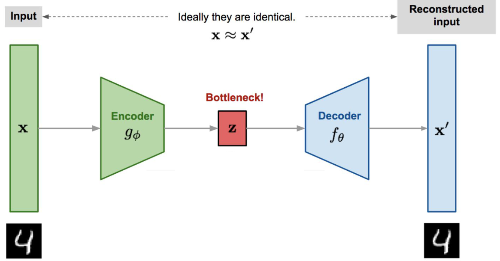
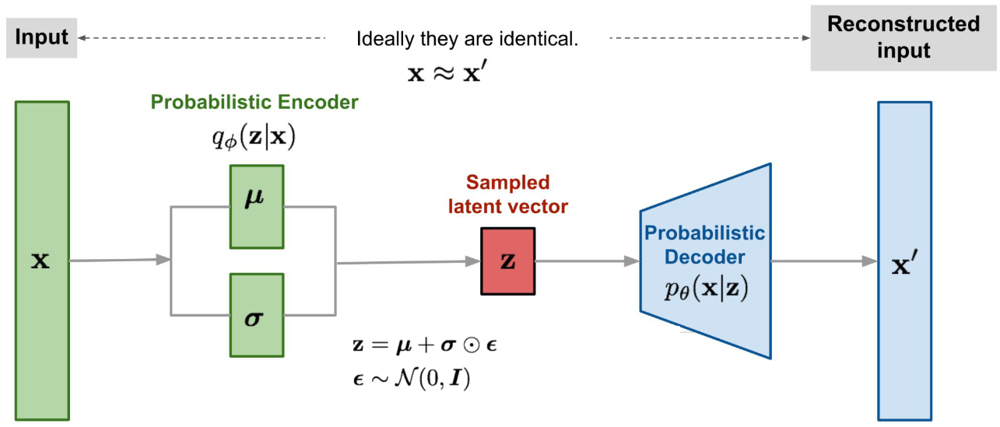
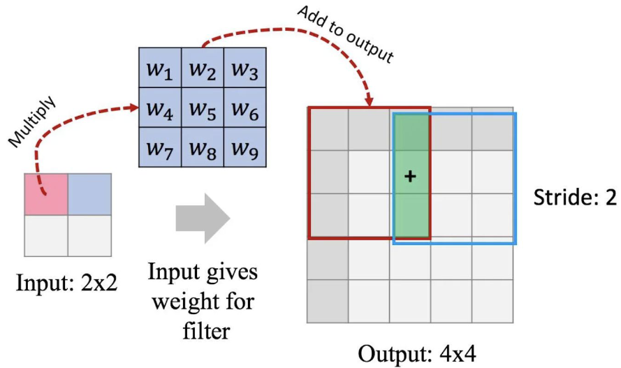
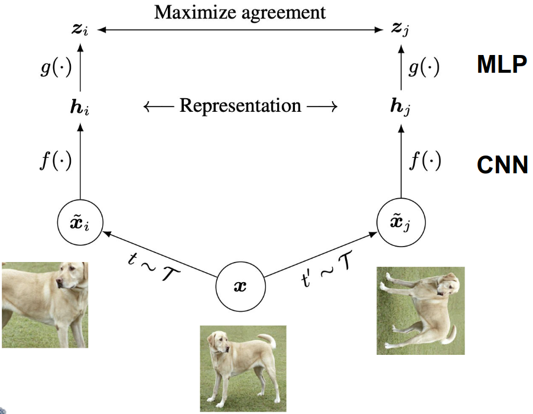

# Lecture 6, Feb 12, 2024

## Unsupervised Learning

* Supervised learning requires large amounts of labelled data, which is expensive to obtain
* In *unsupervised learning*, we look for patterns in the data without being explicitly provided labels
	* e.g. clustering, probability density estimation, dimensionality reduction
* With *self-supervised learning*, the labels are generated automatically form the data
	* e.g. masking out a part of an image and getting the model to fill it in
* With *semi-supervised learning* the data mostly consists of unlabelled samples, but a small subset is labelled

## Autoencoders

* Autoencoders aim to find efficient representations of the input that contains enough information to reconstruct it
* Consists of two components:
	* *Encoder*: converts the input to an internal *embedding*, i.e. a lower dimension representation
		* Performs dimensionality reduction
	* *Decoder*: converts the embedding back to the same dimensionality as the input
		* This is a generative task
* The network has a sideways hourglass shape, with layers getting progressively smaller until we reach the *bottleneck layer*, and then getting bigger until we match the input dimension
	* All the information from the input is squeezed through the low-dimensional bottleneck layer
	* By introducing this low-dimensional layer, the model is forced to learn only the most important parts of the input and drop unnecessary features
	* The choice of the number of neurons in this layer is an important parameter
	* If the bottleneck layer is too small, not enough information will be retained to reconstruct the input
	* Autoencoders are often symmetric, but this is not a requirement

{width=70%}

* To train these models, we use an MSE loss (`nn.MSELoss`) and compare the output against the input
* Common applications:
	* Feature extraction
	* Unsupervised pre-training
		* The encoder brings the data into a (more) separable form
		* Using the encoder and attaching a classifier to it for classification tasks
	* Dimensionality reduction
	* Generating new data
		* Sampling in the latent space and using the decoder to generate data
	* Anomaly detection
		* Autoencoders are bad at reconstructing outliers
		* If the autoencoder generates nonsensical output, there's a high chance the input is an outlier
* Compare the input and its reconstruction generated by the model to assess the model performance
	* Perfect reconstruction can be a sign of overfitting
* We can add noise to the input image and make the model reconstruct the image without noise
	* This forces the model to only learn useful features
	* This prevents the autoencoder to simply copy its inputs, so it helps with overfitting
* We can explicit the structure in the embedding space and sample from it in order to generate new data
	* This relies on the network mapping similar inputs to similar embeddings
	* The simplest way to do this is to interpolate between the embeddings of two known inputs
		* e.g. passing two numbers through the encoders, interpolating between the embeddings and passing this through the decoder to obtain an image between the two numbers
* However, if we just sample a random point in the embedding space, we will likely get a nonsensical result
	* The embedding space can become disjoint and non-continuous

### Variational Autoencoders (VAEs)

* Addresses the issues with generating nonsensical results by imposing a constraint on the latent space so that it becomes smooth
	* Can be thought of as an autoencoder that is trained so that the latent space is regular enough for data generation
* Instead of a fixed embedding the encoder generates a normal distribution with some mean and standard deviation, from which the embedding is randomly sampled; the decoder then takes the embedding sampled from the distribution given by the encoder and tries to reconstruct the input
	* Mathematically the encoder provides a prior distribution $p(z | x)$ for embeddings $z$ conditioned in input $x$; then embeddings are sampled from this distribution and reconstructed by the decoder
	* The encoder will give a mean vector and covariance matrix as its output, which encodes the distribution
	* Practically to obtain the input to the decoder, we sample a deviation $\bm\epsilon \sim \mathcal N(0, \bm 1)$, scale this up by the variance, and add it to the mean to produce a sample from the latent space
	* This allows us to compute the gradient by regarding $\bm\epsilon$ as a constant

{width=70%}

* We want the latent space to be *regular*: continuous (points that are close should generate outputs that are similar) and complete (points should not generate meaningless data)
	* The model can overfit and reduce to a simple autoencoder in 2 ways, either by giving very low variances (so the output is essentially a fixed point), or having very different means (so regions corresponding to different inputs are very far apart); both will lead to an irregular latent space
	* Therefore we want to force the priors generated by the encoder to have a certain variance and have means that are close together
	* To do this, we add a regularization term in the loss function that compares the prior against a standard normal distribution
		* Use *Kullback-Leibler (KL) divergence*: $D_{KL}(P \parallel Q) = \sum _{x \in \mathcal X} p(x) \log\left(\frac{p(x)}{q(x)}\right)$
		* For a multivariate Gaussian and standard normal: $\frac{1}{2}\sum _{i = 1}^N \left(\mu _i^2 + \sigma _i^2 - (1 + \log(\sigma _i^2))\right)$
* The total loss is the sum of the reconstruction loss and the DL divergence (regularization) term
	* These are two conflicting goals that together prevent overfitting
* The variances in the output of the encoder give us bounds for sampling the latent space, so that our generated results will look a certain way (e.g. a certain digit instead of a merge of two digits)

### Convolutional Autoencoders

* For convolutional networks, we now have the problem of going from the embedding back to the image and undoing our convolutions
	* This is the problem of upsampling
	* We could simply not use convolutions and just have ANN layers, but this has the same downsides as an ANN vs CNN
* *Transposed convolutions* are the inverse of convolutions and can map 1 pixel to $k \times k$ pixels
	* For each pixel, the entire kernel is multiplied by the pixel value and added to the output image; when outputs overlap they are summed
		* Similar to using a stamp
* The output dimension is given by $o = s(i - 1) + (k - 1) - 2p + p_o + 1$ where $p_o$ is the output padding
	* Padding works in the opposite way; since the output of transposed convolution is larger than the input, a positive padding will chop off the edges of the output and reduce its size
	* The output size could be ambiguous for $s > 1$, so the output padding resolves this by effectively increasing the output shape on one side
		* e.g. for a normal convolution, both $7 \times 7$ and $8 \times 8$ gives a $3 \times 3$ output for $k = 3, s = 2$; when going backwards, output padding allows us to determine which output size to pick
		* Used to determine output shape only (doesn't actually pad zeros to the output)
	* This allows us to get the exact same size back by applying a convolution and then a transposed convolution
* In PyTorch this is performed using `nn.ConvTranspose2d(in_channels, out_channels, kernel_size)`
	* For the same parameters, passing the result of `nn.Conv2d()` to `nn.ConvTranspose2d()` or vice versa will give back the same shape

{width=35%}

### Pre-Training with Autoencoders

* We can first train the autoencoder on unlabelled data, then take only the encoder, attach an ANN, and use it to train a classification problem
* The encoder portion is used as a feature detector like in the case of transfer learning with CNNs
* During the supervised classification problem training the weights in the encoder are further fine-tuned
	* After this, it can be reinserted back into the autoencoder for better performance
* This allows for semi-supervised learning; use the unlabelled data to train the autoencoder, and then use the labelled data to train the classifier
	* Since the classifier is smaller and will have access to the pre-trained encoder, it will require far less data to train

### Self-Supervised Learning

* *Proxy-supervised tasks* are tasks such that the labels can be generated automatically for free and solving the task requires the model to "understand" the content
	* We want to devise the tasks such that the model is forced to learn robust representations
	* e.g. rotating an image and having the network guess how much the image was rotated from the original (RotNet)
		* For this task, the network needs to learn the concepts of the objects in the images to see that they have been rotated
* In *contrastive learning* we have pairs of samples that are fed to the network, and the loss is computed in latent space, with the embeddings expected to be equal
	* We train the network so that "similar" input results in similar embeddings and different inputs result in embeddings that are far apart
	* The other samples are generated through data augmentation methods from the original samples, e.g. inverting the image, rotating it, etc
	* This forces the model to learn patterns of the input that stayed the same despite the augmentations
* Encoder layers trained through self-supervised learning can be used in transfer learning

{width=50%}

