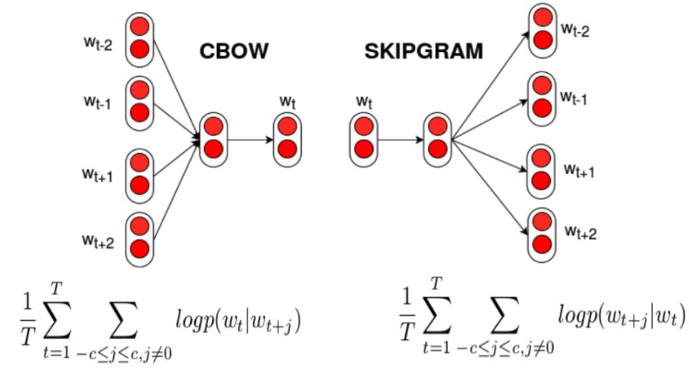
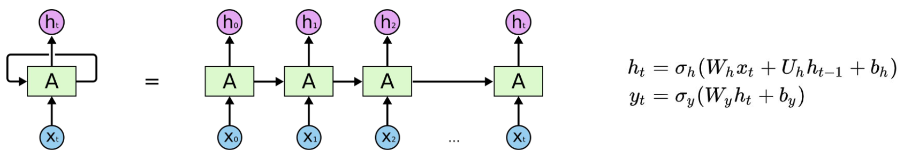

# Lecture 7, Mar 4, 2024

## Processing Words

* We want to convert words/symbols into structured embedding space, such that similar words are close together
* Input words to a model can be encoded with one-hot encoding, with one dimension for each possible word
	* This leads to very large input vectors but is better than a one-dimensional encoding
	* Using one dimension and assigning a number to each word would not work well because:
		* Number assignments are arbitrary and introduces bias
		* Network is bottlenecked to a 1 dimensional representation, limiting its capacity to learn
	* The embedding space will have a much smaller dimensionality so we can actually capture meaning
* Given a word we want to find its embedding in latent space, such that similar words are close together, and math operations can be performed over embedding vectors such that the result is meaningful
	* We can't simply use an autoencoder to reconstruct the input because we don't accomplish anything
	* Important to note that the meaning of a word comes from its context
	* word2vec and GloVe are two commonly used models
* word2vec is a family of two architectures: skipgram and CBOW (continuous bag of words)
	* Skipgram takes a word (or multiple words) and tries to predict its surrounding context, e.g. given the centre word, find 2 words that could appear before it and 2 words that could appear after
		* Training data is drawn from lots of existing text
		* The one-hot encoded input word vector passes through hidden layers and goes to an output layer
		* Output is softmax, essentially giving a probability to find each word
		* Note the input and output are both a single word (not multiple at a time)
		* Advantages:
			* Works well with smaller datasets
			* Better semantic relationships (e.g. relating "cat" and "dog")
				* This is because surrounding context is based on the meaning of words
			* Better representation of words that appear less frequently
	* CBOW does the opposite and predicts the centre word(s) from context
		* In this case the input is multiple words
		* Advantages:
			* Trains faster since the task is simpler
			* Better syntactic relationships (e.g. relating "cat" and "cats")
				* This is because possible centre words are based on syntactic information from its context
			* Better representation of words that appear more frequently
	* In both architectures we use a sliding window over the text; this doesn't have to move continuously (we can put the window in random places)
	* The output layer is used only for training; we discard it after because we only care about the internal embedding

{width=50%}

* GloVe is another common model that encodes global information into embeddings
	* GloVe computes co-occurrence frequency counts for each words; the number of times word $i$ appears in the context of word $j$ is stored in a matrix as $X_{ij}$
	* When training this basically adds a term to the loss function for the correlations
* To compare similarity of word embeddings, we have 2 common choices of distance measure:
	* Euclidean distance: L2 norm of difference of embeddings
		* $\sqrt{\sum _{i = 1}^d (x_i - y_i)^2}$
		* Use `torch.norm(a - b)`
	* Cosine similarity: cosine of the angle between embeddings (equivalent to dot product of the embeddings divided by product of their magnitudes)
		* $\frac{\sum _{i = 1}^d x_iy_i}{\sqrt{\sum _{i = 1}^d x_i^2}\sqrt{\sum _{i = 1}^d y_i^2}}$
		* Use `torch.cosine_similarity(a.unsqueeze(0), b.unsqueeze(0))` (since cosine similarity expects matrices, we need to add an extra dimension)
* As with transfer learning, we often use pre-trained models to generate embeddings
	* `torchtext` contains pre-trained GloVe embedding
	* The 6B model was trained on the 2014 Wikipedia corpus
	* Pretrained models with different embedding sizes are available

## Recurrent Neural Networks (RNNs)

* Processing text is difficult because the input size is variable
	* Once we have the embeddings for each word, we still need a way to pass entire sentences to the network at a time
	* Simply concatenating all the embeddings leads to very large inputs, wasted space and bias
	* Using a convolutional filter won't be able to capture long-term dependence or global information
	* We need an architecture that allows us to remember previous information through memory
* In an RNN layer, the output is determined by the input in addition to a hidden state (i.e. a memory)
	* This hidden state is updated each time a forward pass is performed
	* Previous input data can affect later output through the hidden state
	* The size of the hidden state are possibly different, but after transformation by the weight matrices, they should be the same size
* Words are passed in one at a time to the RNN
	* Hidden state tracks the context
	* Output from the final word is the final prediction, which is affected by all previous word inputs
	* Hidden states are initialized to zero before the first word input

{width=80%}

* In PyTorch, use `nn.RNN(input_size, hidden_size, batch_first=True)`
	* Calling the RNN layer requires us to pass an initial hidden state, which we can just pass as all zeros
		* Generating can be done with `torch.zeroes(1, x.size(0), hidden_size)`
		* The first dimension is the number of layers, the second is the batch size, the third is the hidden size
	* Look up embeddings using `nn.Embedding.from_pretrained(glove.vectors)` (call the resulting object as a function)
	* The output returns a tuple, where the first element is all the outputs and the second is the final hidden state
	* The output's middle dimension are all the outputs, including intermediate ones, so we only take the last one, with `output[:, -1, :]`
		* The first dimension is the batch size; the last dimension is the hidden size
	* Note that this will give us the raw hidden state outputs, so we need to pass it through additional fully connected layers to extract the output

