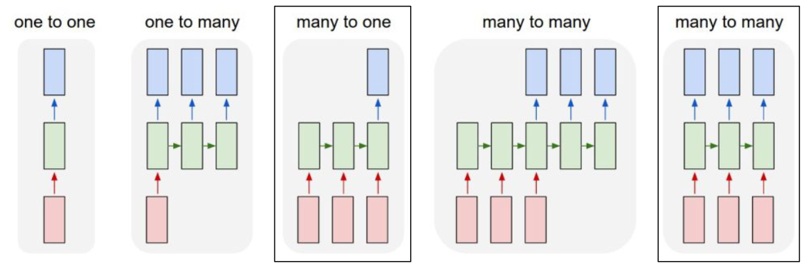
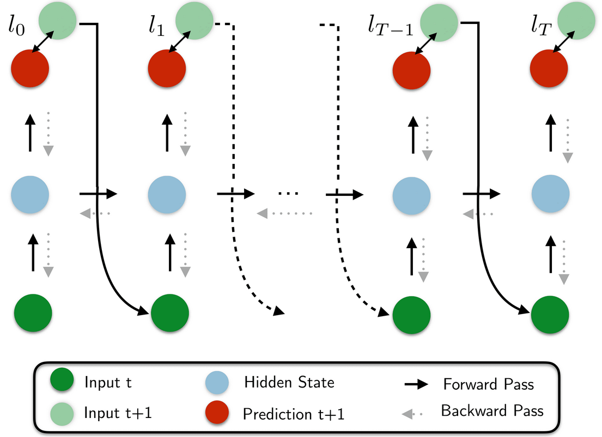
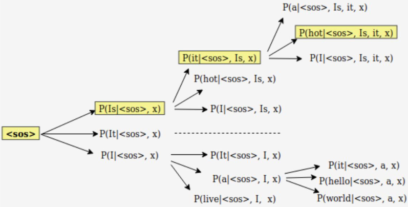

# Lecture 8, Mar 11, 2024

## Vanilla RNNs

{width=40%}

* RNN update equations:
	* $h_t = \sigma _h(W_hx_t + U_hh_{t - 1} + b_h)$
	* $y_t = \sigma _y(W_yh_t + b_y)$
		* This part can be any network to perform additional processing to turn hidden state into output
	* $x_t$ is the input, $y_t$ is the output and $h_t$ is the hidden state at time $t$
	* Each unit contains multiple sets of weights for different purposes
	* $\sigma _h, \sigma _y$ are activation functions for the hidden state and output (sigmoid and tanh are used often)
* Notice that the hidden state is updated before the output is computed, so the output is computed based on the current hidden state
	* The input is used to update the hidden state only
* If we concatenate the input and hidden state, and concatenate the output and hidden state, and make these our new input/output, then this behaves simply as a fully-connected NN
	* For gradient computation, this type of "unrolling" is done
* Since RNNs are unrolled into very long sequences, it is susceptible to a number of problems such as *memory loss*, and vanishing/exploding gradients due to extreme depth
	* Exploding gradient can be addressed with gradient clipping, but this damages the gradient
	* Using skip connections to address vanishing gradient would require us to keep too many previous states, which is too expensive

## RNN Variations

### LSTMs and GRUs

* Skip connections to all previous states can be approximated by weighing previous states differently (varying what to forget and what to remember)
* *Gates* can be used to update the context selectively
	* For a matrix $\bm X$, we can control how much of $\bm X$ passes through by multiplying elementwise by some weight matrix
	* The weights are generated from $\bm X$ itself through some activation function, or we can train another neural network to turn $\bm X$ into weights

{width=70%}

* LSTMs (*Long Short-Term Memory*) consists of both a long-term memory (*cell state* $C_t$) and short-term memory (context or hidden state $h_t$)
* 3 gates are used to update memory:
	* Forget gate (long-term): past short-term memory contributing to long-term memory
	* Input gate (long-term): current input contributing to long-term memory
	* Output gate (short-term): updated long-term memory contributing to the new short-term memory
* In LSTM, the past short-term memory and current input are first used to update the long-term memory, then new short-term memory is derived from the new long-term memory, and output comes from the short-term memory
	* The long-term memory only has things added to it; since we're not multiplying it by a weight matrix each time, this addresses the vanishing and exploding gradient problem
	* There are 4 sets of weights

{width=80%}

{width=50%}

{width=60%}

* GRUs combine the forget and input gates into an update gate, and cell state and hidden state are merged
	* The short and long-term memory are combined into one
	* This is more efficient than LSTM while having a similar performance
* GRUs and LSTMs can handle longer sequences better and are generally easier to train with better performance
	* Only 3 sets of weights are needed
* In PyTorch, for GRU simply use `nn.GRU` instead of `nn.RNN` as a drop-in replacement
* For LSTM, use `nn.LSTM`; note in the constructor use a tuple of ints to specify both the long and short-term memory sizes, and pass both the short-term and long-term memories to the layer in `forward()`

### Deep & Bidirectional RNNs

{width=50%}

* A typical state in an RNN relies on only the past and present
* A bidirectional RNN uses 2 unidirectional RNN layers in opposite directions
	* One of the layers will receive the input tokens in forward order while the other in reverse order
	* The overall output is the result of concatenating or adding the corresponding outputs of the two layers
		* Concatenation typically works better but increases the size
	* Works especially well for applications that require context such as translation
* RNNs can also be stacked to form deep RNN architectures
	* As with CNNs, this is useful for more abstract representations
	* The first layers are better for syntactic (grammar) tasks
	* Later layers are better for semantic (meaning) tasks

{width=40%}

* In PyTorch, all the RNN classes mentioned above take `bidirectional` and `num_layers` arguments
	* If `bidirectional` is true, it doubles the output size for some fields
	* To create the initial hidden state for forward passes, we need a tensor with 3 dimensions, the first is the number of layers (doubled for bidirectional), second is batch size, third is hidden size
	* The first element in the tuple of the output has 3 dimensions; the first is the batch size, the second is the input length, the third is the hidden length (doubled for bidirectional)
		* This corresponds to the blue highlight in the figure, and are the final outputs (only consisting of the last layer)
	* The second element in the output tuple has 3 dimensions; the first is the number of layers (doubled for bidirectional), the second is batch size, the third is the output size
		* This corresponds to the red highlight in the figure, and are the final hidden states

## Inference Using RNNs

{width=70%}

* So far we have focused on many-to-one tasks and many-to-many tasks where the output is the same length
	* Other tasks might require slightly different RNN setups, e.g. translation, image captioning, etc
	* There are also one-to-one, one-to-many, and many-to-many tasks with different output lengths
* The contents of hidden states are different whether we're using an RNN for prediction or generation
	* For prediction we have an encoder-like structure; tokens are processed one at a time, the hidden state represents context of all tokens read so far
	* For generation we have a decoder-like structure; tokens are generated one at a time, and the hidden state represents all the tokens to be generated
* We need to know when to start or stop a generated sequence (since the generated sequence will be of a different length than our input)
	* For this we use dedicated control symbols to denote beginning of sequence and end of sequence (BOS/EOS)
	* Once the model is given BOS, it will start generating
	* Once the model outputs EOS, we know it's done
	* The ground truth output would need to be pre-processed to include the EOS symbol
* During training, the RNN is trained to generate one particular sequence in the training set at a time
	* BOS is fed to the model and we compare the output with the first word that we want (cross entropy)
	* Then the output from the previous step is fed as the new input, and we compare output to the expected second word and so on, until EOS
	* Instead of feeding in the previously generated output, we can instead feed in the ground truth label, so even if the model got it wrong, it still starts the second word with the correct input
		* This is known as *teacher forcing* and helps the model train faster

{width=60%}

* At each point in the output sequence, the model gives us an output distribution; how do we pick what word to pick from the distribution?
	* Greedy search: simply select the token with the highest probability at each step
		* Maximize $p(t_1)p(t_2) \cdots p(t_n)$
		* This doesn't work very well and creates many grammatical errors
		* Very cheap to compute since at each step we just need a single output
	* Beam search: search for a sequence of tokens with the highest probability within a window
		* Maximize $p(t_1)p(t_2|t_1)\cdots p(t_n|t_{n - 1}, \cdots, t_1)$
		* Very expensive because we need to create a tree of possible inputs/outputs, which grows exponentially with window size
		* Within the tree of possible input/output choices, we pick the one that has the highest overall probability
		* Doing so within all possible words in the vocabulary would be too expensive, so we often only build the tree by branching into the top few words with the highest probabilities

{width=50%}

* During inference, we don't always want to always select the highest probability output (we don't want output to always be the same), but we cannot have too much diversity or else there would be grammatical errors
	* Softmax temperature scaling: scale the input logits to the softmax by a temperature $\tau$, and then pick the word probabilistically
	* $\frac{e^{z_i/\tau}}{\sum e^{z_i/\tau}}$ where $\tau$ is the temperature, a hyperparameter
		* A higher temperature spreads out the distribution
	* At lower temperature, the logits are larger and the model is more confident (distribution is more concentrated)
		* This results in higher quality samples but less variety
	* At higher temperature, the logits are smaller and the model is less confident (distribution is more spread out)
		* This results in lower quality samples with more variety
* For training, we can try to match batches with similar input sizes, so that we reduce the amount of padding (as all inputs are padded to the same length)
	* Use `torchtext.legacy.data.BucketIterator()` with `sort_key=lambda x: len(x.text)`
* The training data will have BOS and EOS added to it, so we remove the BOS from the target and EOS from the input

