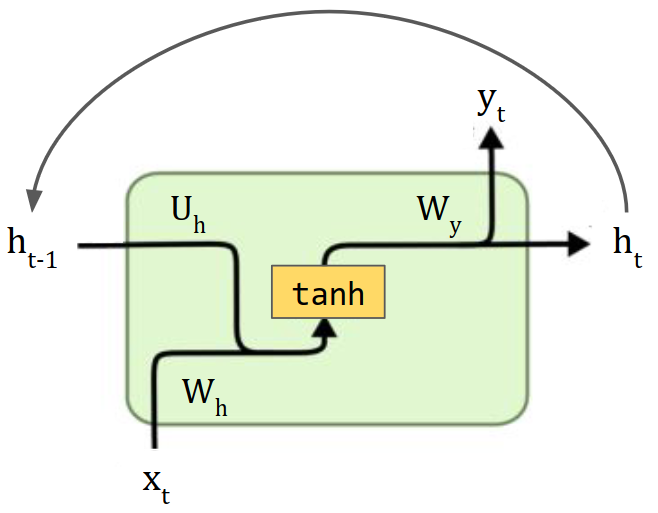
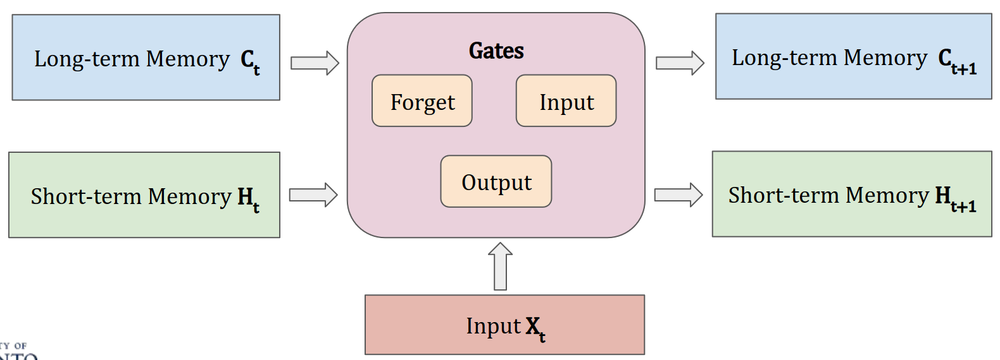
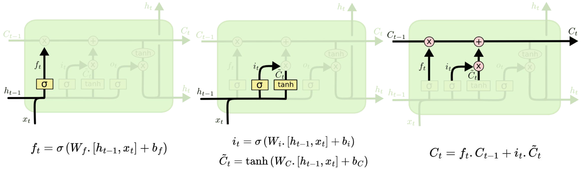
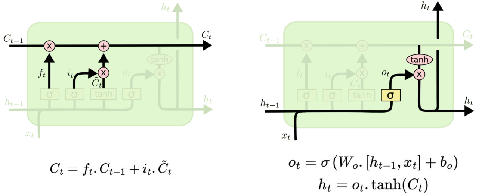
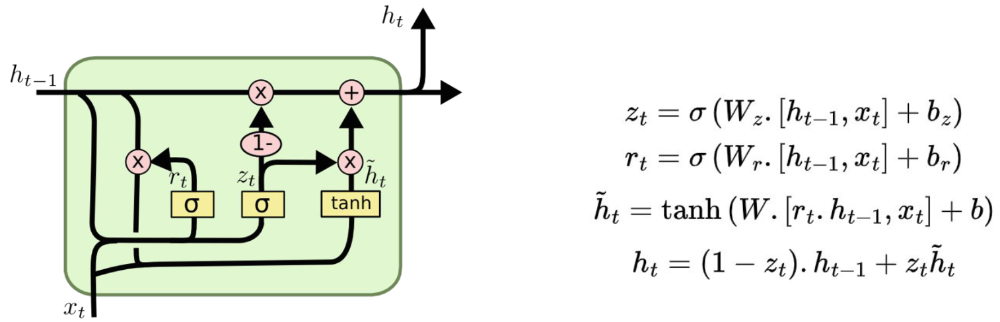
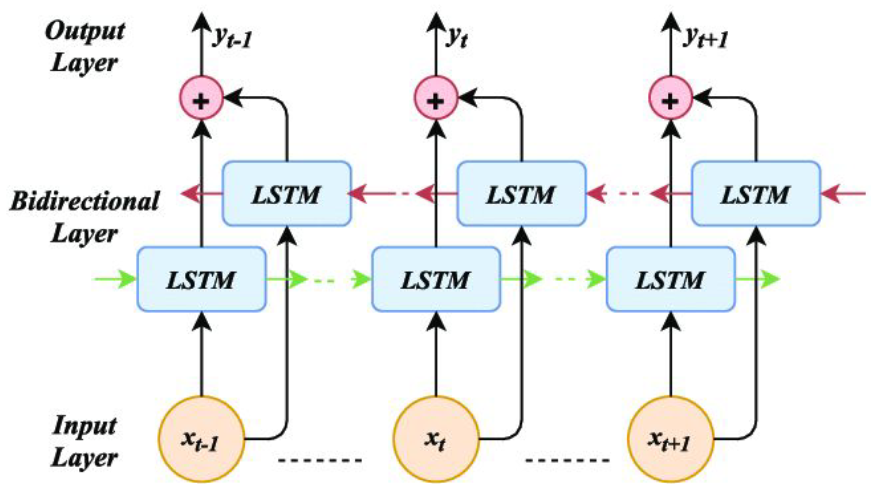
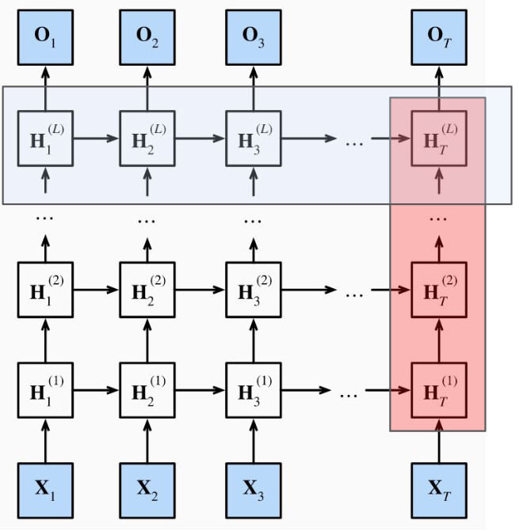

# Lecture 8, Mar 11, 2024

## Vanilla RNNs

{width=40%}

* RNN update equations:
	* $h_t = \sigma _h(W_hx_t + U_hh_{t - 1} + b_h)$
	* $y_t = \sigma _y(W_yh_t + b_y)$
		* This part can be any network to perform additional processing to turn hidden state into output
	* $x_t$ is the input, $y_t$ is the output and $h_t$ is the hidden state at time $t$
	* Each unit contains multiple sets of weights for different purposes
	* $\sigma _h, \sigma _y$ are activation functions for the hidden state and output (sigmoid and tanh are used often)
* Notice that the hidden state is updated before the output is computed, so the output is computed based on the current hidden state
	* The input is used to update the hidden state only
* If we concatenate the input and hidden state, and concatenate the output and hidden state, and make these our new input/output, then this behaves simply as a fully-connected NN
	* For gradient computation, this type of "unrolling" is done
* Since RNNs are unrolled into very long sequences, it is susceptible to a number of problems such as *memory loss*, and vanishing/exploding gradients due to extreme depth
	* Exploding gradient can be addressed with gradient clipping, but this damages the gradient
	* Using skip connections to address vanishing gradient would require us to keep too many previous states, which is too expensive

## RNN Variations

### LSTMs and GRUs

* Skip connections to all previous states can be approximated by weighing previous states differently (varying what to forget and what to remember)
* *Gates* can be used to update the context selectively
	* For a matrix $\bm X$, we can control how much of $\bm X$ passes through by multiplying elementwise by some weight matrix
	* The weights are generated from $\bm X$ itself through some activation function, or we can train another neural network to turn $\bm X$ into weights

{width=70%}

* LSTMs (*Long Short-Term Memory*) consists of both a long-term memory (*cell state* $C_t$) and short-term memory (context or hidden state $h_t$)
* 3 gates are used to update memory:
	* Forget gate (long-term): past short-term memory contributing to long-term memory
	* Input gate (long-term): current input contributing to long-term memory
	* Output gate (short-term): updated long-term memory contributing to the new short-term memory
* In LSTM, the past short-term memory and current input are first used to update the long-term memory, then new short-term memory is derived from the new long-term memory, and output comes from the short-term memory
	* The long-term memory only has things added to it; since we're not multiplying it by a weight matrix each time, this addresses the vanishing and exploding gradient problem
	* There are 4 sets of weights

{width=80%}

{width=50%}

{width=60%}

* GRUs combine the forget and input gates into an update gate, and cell state and hidden state are merged
	* The short and long-term memory are combined into one
	* This is more efficient than LSTM while having a similar performance
* GRUs and LSTMs can handle longer sequences better and are generally easier to train with better performance
	* Only 3 sets of weights are needed
* In PyTorch, for GRU simply use `nn.GRU` instead of `nn.RNN` as a drop-in replacement
* For LSTM, use `nn.LSTM`; note in the constructor use a tuple of ints to specify both the long and short-term memory sizes, and pass both the short-term and long-term memories to the layer in `forward()`

### Deep & Bidirectional RNNs

{width=50%}

* A typical state in an RNN relies on only the past and present
* A bidirectional RNN uses 2 unidirectional RNN layers in opposite directions
	* One of the layers will receive the input tokens in forward order while the other in reverse order
	* The overall output is the result of concatenating or adding the corresponding outputs of the two layers
		* Concatenation typically works better but increases the size
	* Works especially well for applications that require context such as translation
* RNNs can also be stacked to form deep RNN architectures
	* As with CNNs, this is useful for more abstract representations
	* The first layers are better for syntactic (grammar) tasks
	* Later layers are better for semantic (meaning) tasks

{width=40%}

* In PyTorch, all the RNN classes mentioned above take `bidirectional` and `num_layers` arguments
	* If `bidirectional` is true, it doubles the output size for some fields
	* To create the initial hidden state for forward passes, we need a tensor with 3 dimensions, the first is the number of layers (doubled for bidirectional), second is batch size, third is hidden size
	* The first element in the tuple of the output has 3 dimensions; the first is the batch size, the second is the input length, the third is the hidden length (doubled for bidirectional)
		* This corresponds to the blue highlight in the figure, and are the final outputs (only consisting of the last layer)
	* The second element in the output tuple has 3 dimensions; the first is the number of layers (doubled for bidirectional), the second is batch size, the third is the output size
		* This corresponds to the red highlight in the figure, and are the final hidden states

