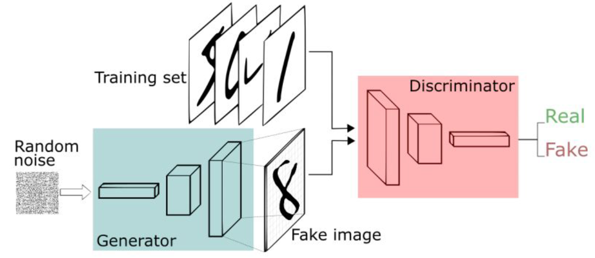
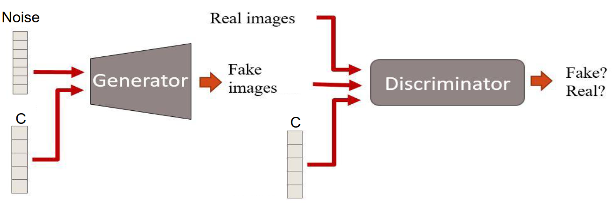
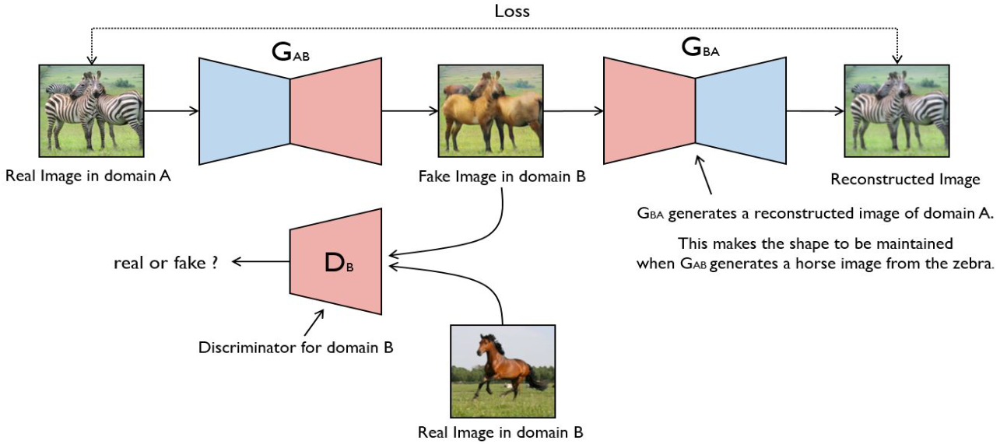

# Lecture 9, Mar 18, 2024

## Generative Adversarial Networks (GANs)

* There are a number of different families of deep generative models:
	* Autoregressive models (i.e. RNNs)
	* Variational autoencoders (VAEs)
	* Generative adversarial networks (GANs)
	* Flow-based generative models
	* Diffusion models
* Autoencoders are not great at tasks such as generating faces
	* Autoencoders try to eliminate noise, so they apply a kind of averaging, so the output is often blurry
	* Could we do better by defining a better loss function?
* In a GAN there are 2 competing models: a *generative model* and a *discriminative model*
	* The generative model takes an embedding and tries to generate an output matching something in the dataset
		* This is (often) an unsupervised task since there isn't a ground truth
		* The model learns to approximate $p(x)$, the probability distribution of the samples
		* Generative models can be *unconditional* or *conditional*
			* Unconditional models take random noise or a fixed token as input; there is no control over what category they generate
			* Conditional models take as input an encoding of the target (e.g. one-hot encoding of the category) and random noise, or an embedding from another model (e.g. CNN); we have control over the category to be generated
	* The discriminative model takes some input and determines whether it is real (from a training dataset) or fake
		* This is a supervised task since the output is a real/fake label
			* The output is a binary true/false so the output layer is always a single neuron
		* The model learns to approximate $p(y | x)$, the probability that a sample is real given the sample
		* Fed with either a real sample from the training dataset or a fake sample generated by the generative model
* The generator tries to fool the discriminator by generating realistic samples, while the discriminator learns the difference between real and fake samples
	* The models are trained at the same time and learn off of each other
	* Since the goal of the generator is to fool the discriminator, its loss is defined based on the discriminator

{width=70%}

### GAN Training

* The discriminator loss is simply binary cross-entropy; for a real image, we expect a real output, while for a generated image we expect a fake output
* The generator loss is also binary cross entropy, but on the discriminator output
	* The discriminator will be fed a generator output; as the generator, we expect the output to be real, since we're trying to fool the discriminator
	* The gradient is backpropagated through the discriminator first, and then the generator
	* The discriminator weights are frozen while the generator is being trained
* To train, alternative between training the discriminator and generator
	* First train the discriminator for $k$ times:
		* Sample $m$ noise samples, pass them through the generator to obtain generated samples, and then input to the discriminator
			* For these, the ground truth label is false
		* Sample $m$ samples from the training dataset, input into the discriminator
			* For these, ground truth is true
		* Use BCE loss function to compute gradients
	* Then train the generator for one time:
		* Sample $m$ noise samples, pass through generator and discriminator
		* Use BCE to compute gradients, with ground truth label being true (real)
		* Update generator weights according to the gradient, but do not update the discriminator (since this would make it worse)
	* $k$ is a hyperparameter used to balance the training between generator and discriminator
* Since the generator loss uses the discriminator, if the discriminator is too good then small changes in the generator weights won't change the discriminator output
	* This leads to a vanishing gradient problem
* If the discriminator gets trapped in a local optimum, it cannot adapt to the generator so the generator can fool it by only generating one type of data
	* This leads to *mode collapse* where the generator only generates one class of data (e.g. only a single type of digit in the MNIST dataset)
	* Mode collapse can transfer to a different mode
* Since there are 2 competing processes, GANs are very hard to train and take very long
	* Difficult to see whether there is progress -- training curve doesn't help much
* To speed up we can use leaky ReLU, batch normalization, and regularizing the discriminator weights and adding noise to discriminator inputs

### Architecture Variations

* To control the class that we generate, we can use a conditional GAN
	* The generator is passed the noise and the condition, which can be e.g. a one-hot encoding of the category
	* The discriminator is passed the same condition

{width=60%}

* *Style transfer* is a technique using GANs to transform an image into a different domain
	* The generator input is an image that we want to do style transfer on
	* Using a conventional GAN architecture without the feedback cycle, the generator will simply treat the input as random noise and generate an image in the style desired, but without characteristics of the original input
* CycleGAN is an architecture that can be used for style transfer
	* Introduce an additional model, which transforms the images back into the original domain
	* Reconstruction loss between the resulting image and the original image is added to the loss
	* This is similar to an autoencoder; the image with style transferred is the embedding

{width=80%}

### Adversarial Attacks

* Goal: choose a small perturbation $\epsilon$ on an image $x$ such that a neural network $f$ misclassifies $x + \epsilon$
* These attacks can often be very effective; the amount of noise added is often unnoticeable to a human, but completely changes the model's output
* To do this we optimize $\epsilon$ as a parameter and apply backpropagation; we want to minimize the probability that the network classifies the image with noise added as the correct class
	* This can be targeted or non-targeted
	* For non-targeted attacks we minimize the probability that $x + \epsilon$ is classified correctly
	* For targeted attacks we maximize the probability that $x + \epsilon$ is a certain target class
* In a *white-box attack* we know the model already, so we can use the architectures and weights to optimize $\epsilon$
* In *black-box attacks* we do not know the architectures and weights of the network
	* A substitute model mimicking the target model can be used
	* Adversarial attacks often transfer across models if they are using the same dataset
* Defence against adversarial attacks is an active area of research; failed defences include adding noise at training time or test time, averaging models, weight decay, dropout, or adding adversarial noise at training time

