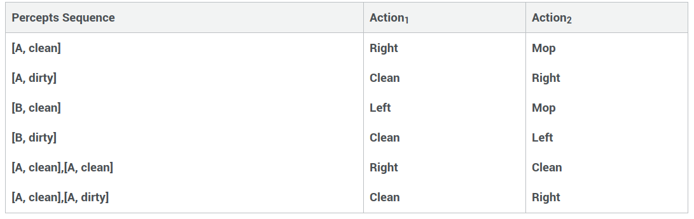
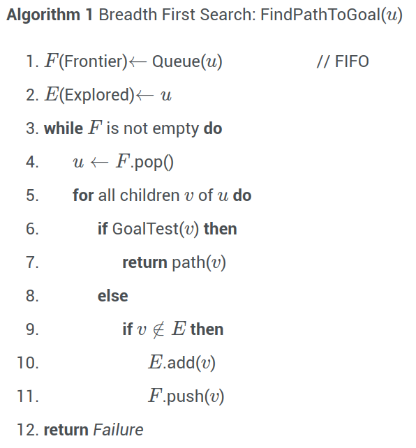
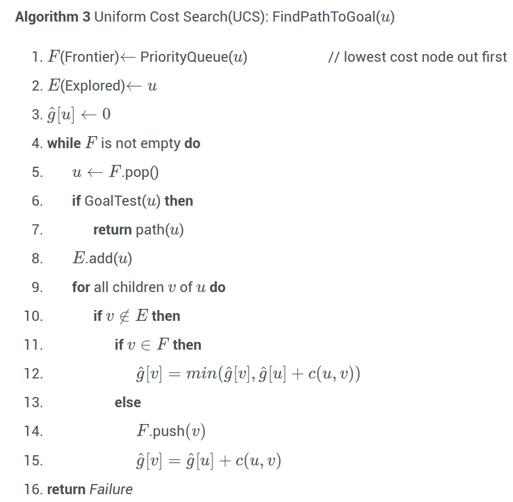
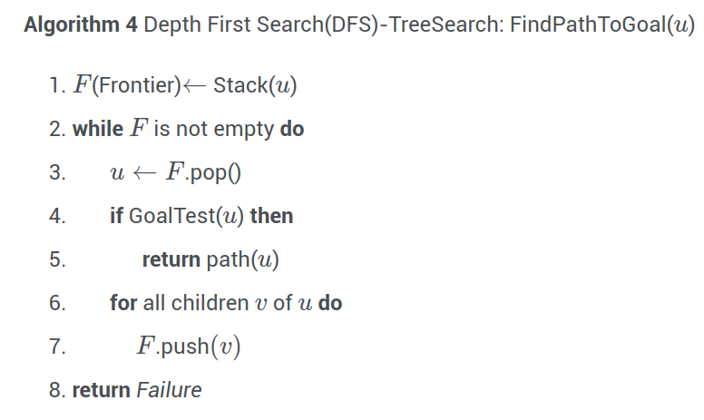
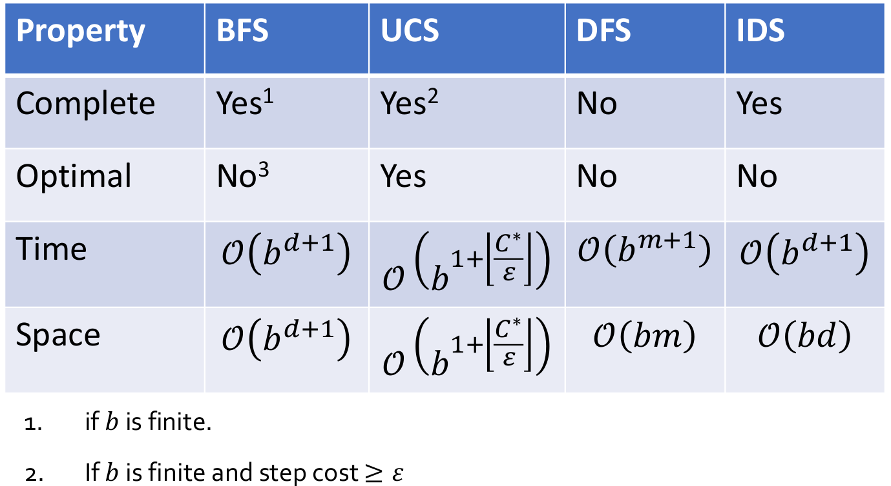

# Lecture 1, Jan 9, 2024

## Rational Agents

* An *agent* is anything that perceives the *environment* through *sensors* and acts upon the environment through *actuators*; e.g. humans and robots are both agents
	* The *agent function* maps from percept histories/sequences to actions: $f \colon P^* \mapsto A$
	* The agent *program* runs on the physical *architecture* to perform $f$
	* The *transition model* is a function $s' = T(s, a)$ that maps the current state and an action to the next state
	* Example: for a robot that mops the room:
		* Environment: the location of the robot and the status of each location (clean and dirty)
		* Percept: current location and the status of the location
		* Actions: move around and mop the current location
		* The agent's function would map sequences of percepts to actions, as in the figure below

{width=70%}

* A *rational* agent is an agent that does the "right thing", based on all the information it has access to
	* Rational agents are not omniscient; the "right thing" is conditioned on the information and resources the agent can access
	* To define this, we define some *performance measure*, an objective criterion for measuring the success of the agent's behaviour
* Properties of task environments:
	* A task is *fully observable* if sensors provide access to the complete state of the environment at all times; otherwise it is *partially observable*
	* A task is *deterministic* if the next state of the environment is completely determined by the current state and the agent's action; otherwise it is *stochastic*
	* A task is *dynamic* if the environment can change while the agent is deliberating; otherwise it is *dynamic*
	* A task is *discrete* if the number of states, percepts, actions is finite; otherwise it is *continuous*
	* A task is *single-agent* if the agent operates by itself; otherwise it is *multi-agent*
* Types of agent programs:
	* *Simple reflex*: actions only depend on percept
	* *Model-based reflex*: action depend on internal state (based on percept history), model of the world, and percept
	* *Goal-based*: action depends on current state, percepts, model of the world, and tries to achieve a desired goal
	* *Utility-based*: tries to achieve multiple conflicting goals; uses a weighted combination of goals

### Goal-Based Agents

* Example: finding the shortest route between two locations
	* States: locations
	* Actions: moving between locations
	* Transition model: taking current location and direction that we move in, outputting the new location
	* Goal test: whether we are at the location we want to go
	* Cost function: length of route
	* In general, we want to keep the action simple, and restrict what we can do in the transition model

## Search Algorithms

* Many problems can be modelled as having an initial node, a successor function $S(x)$ giving the set of new nodes from a node $x$ in a single action, the goal test function $G(x)$, and the action cost function $C(x; a; y)$ giving the cost of moving from $x$ to $y$ using action $a$
	* A state represents a physical configuration, while a node is a part of a search tree
	* Each node includes the state, parent node, action, and path cost
	* Two different nodes are allowed to represent the same state!
	* In most settings, representing the entire graph in memory is impractical, so implicit representations that only keep a part of the graph at a time are used
* To solve this problem, we can start at the initial node and keep searching until we reach a goal node
	* The *frontier* is the set of all nodes that we have seen but haven't explored
		* At initialization this is just the initial node
	* At each iteration we can choose a node from the frontier, explore it, and add its neighbours to the frontier
	* *Tree search algorithm* don't store information about visited states, so can end up in cycles
	* *Graph search algorithms* keep track of visited nodes so explored nodes are not revisited (aka cycle checking)
* How do we evaluate an algorithm?
	* *Completeness*: whether the algorithm always finds a solution, if one exists
	* *Optimality*: is the solution least-cost?
	* *Time complexity*: how long does it take to find a solution?
	* *Space complexity*: how many nodes do we need to store in memory?
* To quantify the problem we use the following parameters:
	* Branch width $b$: maximum number of successors on each node
	* Depth $d$: depth of shallowest goal node
	* Max depth $m$: max depth of any node from the start node
* Note worst-case scenario analysis does not capture the graph structure; performance in the real world is often highly problem-dependent, so the best algorithm will also be
* *Uninformed* search algorithms use only the problem input; no domain information is used
	* The problem is represented either explicitly or implicitly as graphs
	* Includes BFS, DFS, uniform-cost search

### Breadth First Search

{width=35%}

* Explores nodes in order of their discovery, using a FIFO queue
* Completeness: yes; even for infinitely large graphs, as long as $b$ and $d$ are finite, the goal will eventually be reached
* Time complexity: $O(b^{d + 1})$
	* At each node we explore at most $b$ new nodes
* Space complexity: $O(b^{d + 1})$
	* This is the max size of the frontier
* Optimality: no; the result is not optimal in cost, but it is optimal in the number of state transitions
	* Note simply replacing the queue by a priority queue based on cost would not work by itself since the algorithm still returns too early and does not update node costs
	* Making the appropriate modifications, we have uniform cost search

### Uniform Cost Search

{width=45%}

* Explores nodes in order of cost
* Completeness: yes, if $b$ is finite and if all edge weights are greater than equal to some positive $\epsilon$
* Optimality: yes; every time we pop some node $u$, we can guarantee that the path we found to $u$ is optimal, provided weights are positive
	* This can be proven by induction
* Time complexity: $O(b^{1 + \frac{C^*}{\epsilon}})$ where $C^*$ is the optimal cost
	* Since the optimal cost is $C^*$ and the cost so far increases by at least $\epsilon$ at every step, we take at most $\frac{C^*}{\epsilon} + 1$ steps
* Space complexity: $O(b^{1 + \frac{C^*}{\epsilon}})$ by the same logic

### Depth First Search

{width=40%}

* Explores the deepest discovered but unexplored node first
* To minimize memory usage, we don't store the set of explored nodes (i.e. use a tree search)
* Completeness: only if the search space is finite
* Optimality: no
* Time complexity: $O(b^{m + 1})$
* Space complexity: $O(bm)$
* How do we remedy the loss of completeness?
	* Depth limited search (DLS): restricting the depth of the search to a certain cutoff
		* This is complete only if $d$ is less than or equal to the cutoff
		* But we don't know $d$ beforehand
	* Iterative deepening search (IDS): iteratively increasing the cutoff depth, if a complete search is performed and no goal is found

{width=70%}

