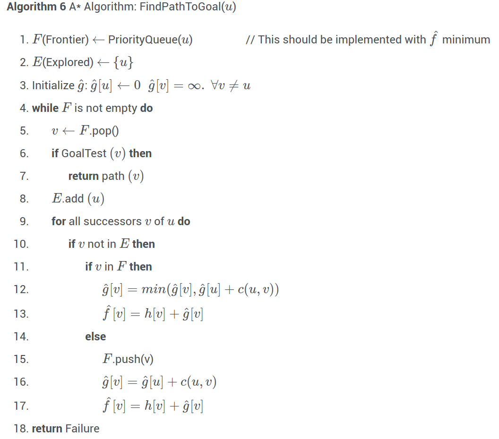

# Lecture 2, Jan 16, 2024

## Informed Algorithms -- $A^*$ Search Algorithm

* Suppose that we have some kind of knowledge about the system, in the form of an evaluation/heuristic function $h(u)$ which gives an estimate of the distance of the goal from $u$; we can use this in UCS to speed up the algorithm
	* In the priority queue, instead of using $\hat g(u)$ as the pop order, use $\hat f(u) = \hat g(u) + h(u)$
	* This will help the algorithm always choose nodes in the direction of the goal and not explore unnecessary nodes
* This modified algorithm is the $A^*$ search algorithm

{width=60%}

* Is this still optimal?
	* In our proof of optimality, we relied on having $g(u) \leq \cdots \leq g(v_{k - 1}) \leq g(v_k) \leq g(w)$ for a path to the goal of $u, v_1, \dots, v_k, w$
	* We need to show that if $i < j$, then $f(v_i) \leq f(v_j) \iff g(v_i) + h(v_i) \leq g(v_j) + h(v_j)$
	* Note $c(v_i, v_j) \geq g(v_j) - g(v_i)$ where $c$ is the cost
		* This means a sufficient condition is $h(v_i) \leq h(v_j) + c(v_i, v_j)$
* This property is known as *consistency*: $\forall v_i, v_j, h(v_i) \leq h(v_j) + c(v_i, v_j)$ where $v_j$ is a successor of $v_i$
	* If $h$ is consistent, then $A^*$ is optimal; we can prove this in the same way that we proved UCS optimal
* $h$ is *admissible* if it satisfies $\forall v_i, h(v_i) \leq C^*(v_i)$ where $C^*(v) = g(w) - g(v)$ which is the true cost to reach the goal from $v$
	* Admissibility is generally a weaker property than consistency
	* Theorem: if $h$ is admissible, then $A^*$ with tree search (i.e. no cycle checking) is optimal
		* Note this only works with tree search because of it possibly searching the same node multiple times
	* Lemma: if $h(w) = 0$, then consistency implies admissibility
* Now we have requirements for $h$, how do we choose one?
	* Euclidean distance (L2 norm) is one option
		* Since it satisfies the triangle inequality, it is admissible and consistent
	* Manhattan distance (L1 norm) can be used in the case of certain movement restrictions
		* This is admissible with restrictions that we can only move along the axes
* A problem with fewer restrictions on the actions is a *relaxed problem*
	* The cost of an optimal solution to a relaxed problem is an admissible heuristic for the original problem
	* We can always ignore certain constraints so that the problem is easily solvable, and use this as the heuristic
	* Example: the 8-puzzle
		* Tiles can only move into neighbouring tiles if that tile is empty -- this is the restriction that makes it hard
		* In one relaxed problem we can move a tile to an adjacent tile always
			* We can select $h_1(n)$ to be the number of misplaced tiles
		* In another relaxed problem we can move any tile to any other tile
			* We can select $h_2(n)$ to be the total Manhattan distance between the current configuration and the desired configuration
* Unfortunately, there is no recipe to generate consistent heuristics
	* This is one reason to prefer tree search
* What if the priority queue is based on $h$ instead of $f$?
	* This is called greedy best-first search and it is no longer optimal
	* However, this is faster

