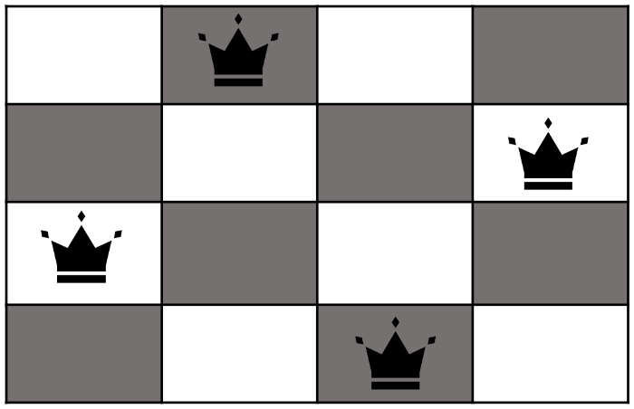
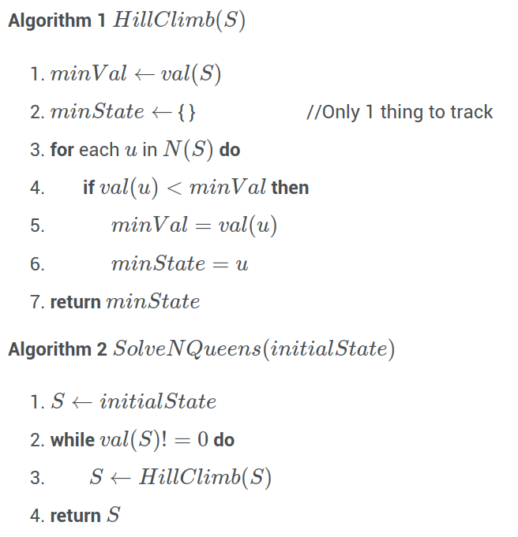
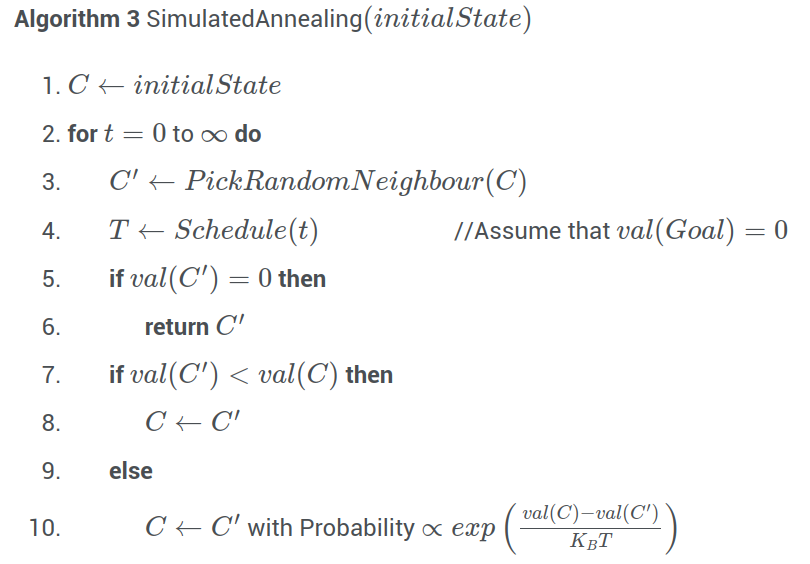

# Lecture 3, Jan 23, 2024

## Local Search and Optimization

* So far we have looked at problems where we want to find the minimum cost path to the goal; the goal itself may be known and the path is the desired solution
* In some situations the path we take is irrelevant, and we just want to find the goal

{width=25%}

* Example: the $N$-queens problem: place $N$ chess queens on an $N \times N$ chessboard such that no two queens can attack each other (i.e. no two queens share the same row, column, or diagonal)
* Every column must have exactly one queen, so we place one queen in each column and only move queens along columns
	* In general, we start from some random position and try to move to a better position
* For all such problems we define the following:
	* $S$: set of all states
	* $N(s)$: neighbours of the state $s \in S$ (i.e. all states reachable from $s$ in one step)
	* $\operatorname{Val}(s)$: value of the state $s \in S$
		* This should reflect the "quality" of the state, i.e. how close it is to the goal
		* For the $N$-queens problem, this could be the number of pairs of queens that can attack each other
		* We want $\operatorname{Val}(w) = 0$ where $w$ is the goal, so the problem becomes minimizing $\operatorname{Val}(s)$ until we reach 0

### Hill Climb Algorithm

* A simple strategy would be to always take steps that improve the value of the state in hopes of eventually reaching the goal; this leads to the *hill climb* algorithm
	* This is a type of *local search*, since at each step we aim to improve the local situation we're in

{width=40%}

* The hill climb algorithm is very simple and uses a minimal amount of memory since it only keeps track of the current state
	* However, hill climb is susceptible to getting stuck in local minima
	* Since it only allows moves to better positions, if the goal is locked behind a worse position, it will never be reached
	* We want an algorithm that allows making a "mistake" (moving to a state with higher value) but still stays mostly on track to the goal

### Simulated Annealing

* We can use the *simulated annealing* algorithm, where transitions to states that raise the value are allowed, and the probability of such transitions is dependent on the difference in value

{width=50%}

* At each step, we pick a random neighbour $C'$ and look at its value; if the value is lower, then the transition is always allowed; if the value is higher, then the transition is allowed with probability $e^{-\frac{\operatorname{Val}(C') - \operatorname{Val}(C)}{kT}}$
	* This is inspired by the annealing process in material physics
	* Transitions to states that raise the value are allowed, but the more the value is raised, the less likely the transition is to occur
	* $T$ is a function of time, known as the *cooling schedule*, typically a decreasing function
		* Initially, the "temperature" is high, so the probability remains high regardless of the value difference, so the state can freely jump around
		* As time goes on we lower the temperature, making transitions to worse states increasingly unlikely
		* The cooling schedule is application dependent
	* The algorithm terminates when we reach $\operatorname{Val}(C) = 0$; for some problems the value of the optimum might not be known, in which case we terminate when $T = 0$
* Simulated annealing does not always reach the solution (i.e. it is incomplete), but it is often effective for a variety of problems
	

