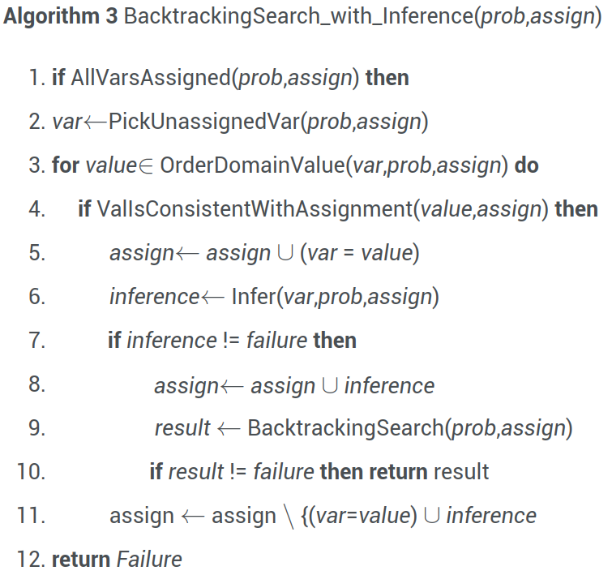

# Lecture 4, Jan 30, 2024

## Constraint Satisfaction Problems (CSPs)

\noteDefn{\textit{Constraint Satisfaction Problem}: A \textit{CSP} comprises of 3 components:
\begin{enumerate}
	\item A set of variables $X = \set{x_1, x_2, \dots, x_n}$
	\item A set of domains for each variable: $D \colon \set{D_{x_1}, D_{x_2}, \dots, D_{x_3}}$
	\item A set of constraints $C$ relating the variables
\end{enumerate}
The problem is to find a value for each of the variables in its domain that satisfies all the constraints.}

* Example: For the 4-queens problem:
	* Variables: $\set{x_1, x_2, x_3, x_4}$
	* Domain: for each variable: $D_{x_i} = \set{1, 2, 3, 4}$
	* Constraint: $\operatorname{NoAttack}(x_i, x_j)$ (true if queen $x_i$ can attack $x_j$)
		* We can express this in a table, giving the value of $\operatorname{NoAttack}$  for every combination of $x_i, x_j$
* In general CSPs are NP-hard -- no polynomial time solution exists
* But we can use heuristics to do better in a lot of the problems that arise in real life

### Backtracking Search

* Assign each of the variables some value, and then check if the constraints are satisfied
* If the constraints are not satisfied, revert the last variable that we assigned -- this is the process of *backtracking*
* If no value of the last variable works, then we go back one more variable and pick another value for that one, and so on
* This is essentially a brute force search if we pick values for the variables sequentially
	* However we can also use heuristics to aid our search

{width=40%}

* The pseudocode above is a template for the backtracking search algorithm
	* Each level of the recursion picks a variable to set, goes through all values of that variable and checks if any of them work
	* We can specify different implementations for $\operatorname{PickUnassignedVariable}$ and $\operatorname{OrderDomain}$
* One simple improvement we can make is to only assign variables to values that satisfy all the constraints
	* Otherwise we would do a lot of meaningless searches when we pick a value that violates a constraint and keeps assigning others
	* e.g. for $N$-queens, check that the new queen cannot attack any previous queens before placing it

{width=40%}

* Can we do better and reduce our backtracks even more?
	* Every time we assign a variable, it reduces the domain that the other variables can take based on constraints
	* The domain reduction (restrictions) on the other variables can propagate to even more variables
	* Every time we do an assignment, we call the inference function, which restricts the domain further based on the constraints and the new variable value
		* This can look at multiple constraints at the same time but often we stick to just 1

{width=40%}

