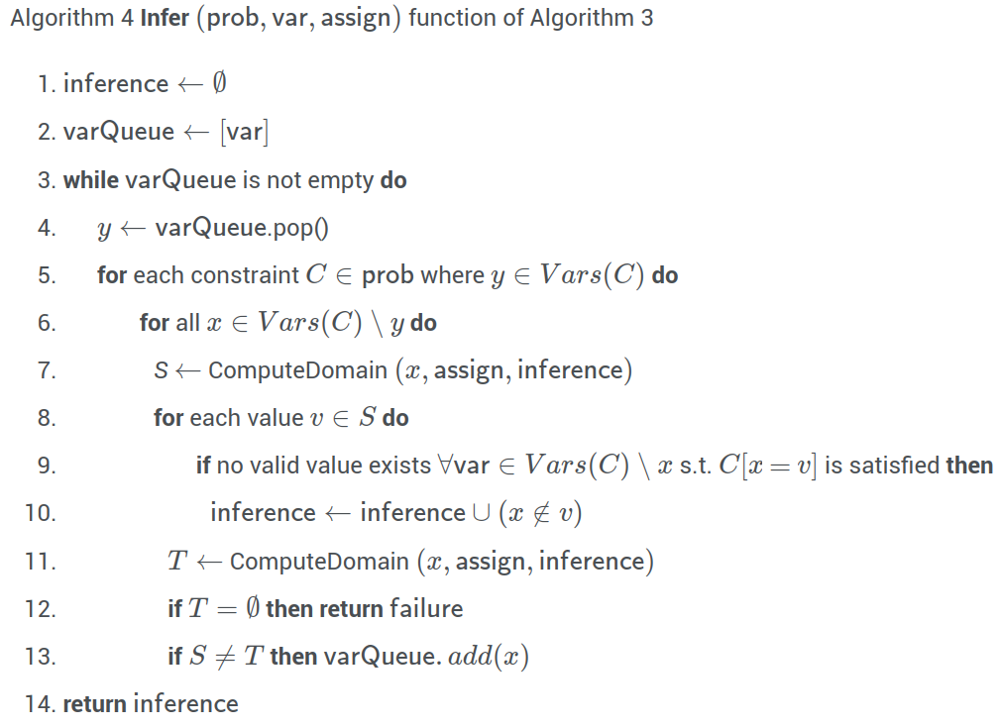

# Lecture 5, Feb 6, 2024

## Inference and Heuristics for CSPs

* What data structures should we use for infer and assign in the algorithm?
	* For the inference use unordered list of tuples of the form $(x \notin S)$
	* For the assignments use unordered list of tuples of the form $(x = v)$ or $(x \notin S)$
* The $\operatorname{ComputeDomain}(x, \text{assign}, \text{inference})$ returns a set $S$ such that the effective domain of $x$ is $S$, i.e. $x$ can only be in $S$
	* This just simply looks at whether $x$ has already been assigned a value (if so, return that value), otherwise it looks at the inference for $x$ and gives all values that $x$ is not forbidden to have
* The basic idea of infer is: for a certain value of the current variable, compute the effective domains of all other variables that would satisfy all constraints relating to this variable, and if any of the domains are empty, then the current variable cannot be this value
	* We need to go over each constraint where the current variable appears to limit the effective domains of all other variables
	* If the effective domain of any variable becomes empty, fail immediately
	* Every single time the effective domain of any variable changes, we need to examine all other variables and restrict their domains based on constraints relating to the variable whose domain changed

{width=65%}

* There are many places in the above algorithm where we can insert heuristics etc to improve the runtime
* Infer is very expensive to run, so we might want to limit the depth of the inference to reduce the overall computational cost
* In *forward checking*, we only check the effect of assigning the current variable
	* Delete line 13/14 so we don't add anything to the queue
	* For many problems, this is not effective enough -- we want to infer something more
* Another heuristics is to find inference for variables that only have one valid value in their domain
	* On line 13 change the test to $\abs{T} = 1$
	* This can be extended to any value depending on the problem, e.g. only inferring if $\abs{T} < n$
* There are 2 more places where we can introduce heuristics:
	* $\operatorname{PickUnassignedVar}$
		* Minimum remaining value heuristic: pick the unassigned variable with the smallest effective domain size, so we backtrack quickly if it fails
	* $\operatorname{OrderDomainValue}$
		* Least constraining value heuristic: pick a value for the variable that rules out the least domain for other variables
* A special variant of CSP is the *boolean satisfiability problem* (B-SAT) where all the variables can only be 0 or 1
	* In the case of 3-SAT, all constraints specify relations between 3 variables
		* This can be expressed in terms of a logical expression over the 3 variables that must be true
	* For SAT, the only way we can infer is when all variables except one in a constraint has an assigned value
	* 3-SAT and above are NP-complete
* Another variant is the *binary CSP* where every constraint is defined over two variables
	* This is also in general NP-complete
* The 2-SAT problem is a combination of the two where every variable can only be 2 values, and every constraint is over two variables
	* This is one of the only variants of the problem that has a polynomial time solution

