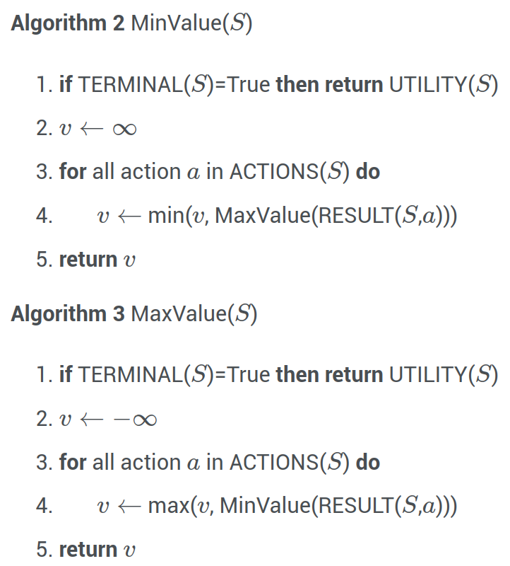
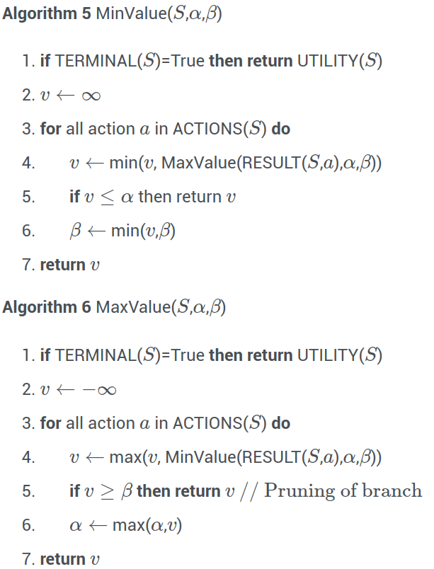

# Lecture 6, Feb 13, 2024

## Adversarial Games

* Consider an adversarial game where two players take turns, with one player trying to maximize the value of the final state of the game while the other tries to minimize it
	* The value of a game state, known as the *utility*, is not known until we reach a terminal state
	* All possible outcomes of the game can be modelled as a *game tree*
		* At each level, each possible action the player may take leads to a new subtree, until the terminal states as leaves
	* At each step the MAX player will try to take an action to maximize the value of the next state, while the MIN player will try to minimize it
	* If we assume that both players are playing optimally, then we can recursively assign a value to each state:
		* If it is a terminal state, take its utility
		* If the MAX player is playing, take the maximum of the values of the next states
		* If the MIN player is playing, take the minimum of the values of the next state
	* Then at each step, we simply take make the move that leads to the max or min value of the next state, depending on the player
	* This is the *minimax* algorithm
* $\operatorname{MiniMax}(s) = \threecond{\operatorname{Utility}(s)}{s\text{ is a terminal state}}{\max _{a \in A} \operatorname{MiniMax}(\operatorname{Result}(s, a))}{\text{MAX player}}{\min _{a \in A} \operatorname{MiniMax}(\operatorname{Result}(s, a))}{\text{MIN player}}$

{width=40%}

* However, this requires that we recursively search the entire game tree to calculate the value of a state
	* The number of states grows exponentially as the game gets longer
	* This is usually impractical, e.g. in chess there are on the order of $10^{120}$ states
* We can optimize the search and prune subtrees that can't possibly give us a better result
	* As the max player, after we've searched one of the successor states, we have a lower bound for the value of the current state
	* We can pass this lower bound to the next level of the search, which will be the min player
	* Now as the min player, searching a successor state will give an upper bound for the current state's value
	* If this upper bound is lower than the lower bound from the max player, then there's no more point searching this state any further -- the value of this state will always end up being lower than the previous states searched in the max layer, so this move will never be taken
* The above intuition gives the *alpha-beta pruning* algorithm:
	* Let $\alpha$ be the highest value of all searched successors so far, from the MAX player's perspective
	* Let $\beta$ be the lowest value of all searched successors so far, from the MIN player's perspective
	* Initialize $\alpha = -\infty$ and $\beta = \infty$
	* For the MIN player, if the value of any successor state is less than $\alpha$, then we can stop searching (since this state will always have less value than $\alpha$, so the MAX player will never consider it)
	* For the MAX player, if the value of any successor state is more than $\beta$, then we can stop searching (since this state will always have greater value than $\beta$, so the MIN player will never consider it)

{width=40%}

* Plain minimax explores all $O(b^d)$ states
	* With $\alpha$-$\beta$ pruning we explore $O(b^\frac{d}{2})$ in the best case, but still $O(b^d)$ in the worst case
	* For randomized evaluation of states we get $O(b^{\frac{3}{4}d})$ on average
* This can make a huge difference but is still not enough in many cases
	* e.g. for chess we would still have $10^{60}$ states to check in the best case of $\alpha$-$\beta$ pruning
* For many games, we can create heuristics to estimate the value of a non-terminal game state, so we don't have to search until the end of the tree
	* We can construct a heuristic as $h(s) = w_1f_1(s) + w_2f_2(s) + \dots + w_nf_n(s)$ where the $w_i$ are weights and $f_i(s)$ are certain features of the game state
		* e.g. for chess features can be the number of pieces each side has left
	* We only search until a certain depth, and then we compute the heuristic if we haven't yet reached the terminal state
	* Today heuristics can be created using machine learning methods
	* A good heuristic should:
		* Evaluate terminal states in the same way as the true utility function would
		* Not take too long to compute
		* Favour states highly correlated with the chances of winning, for non-terminal states

