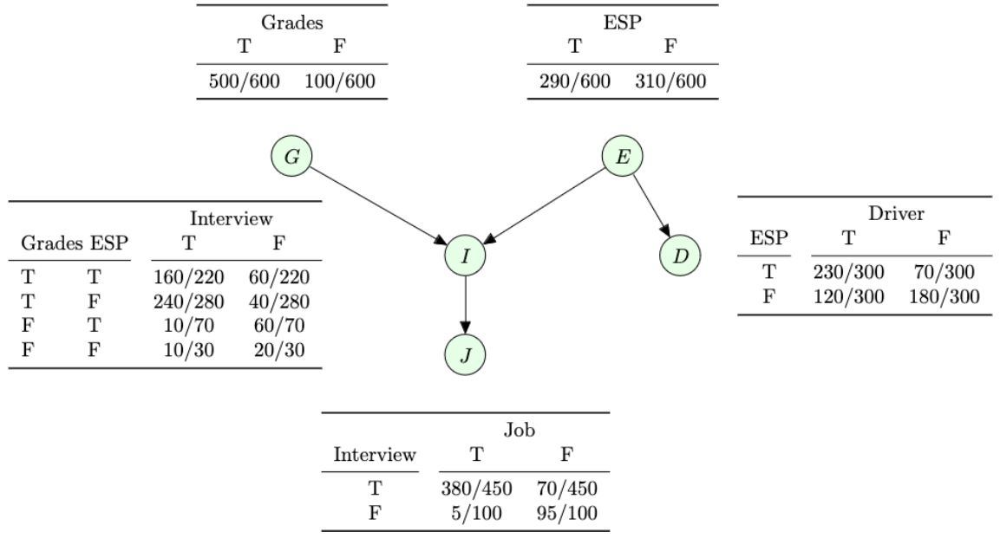
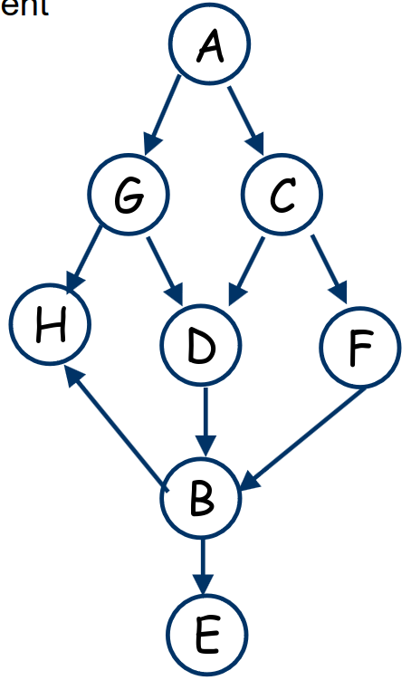

# Lecture 7, Feb 27, 2024

## Bayesian Networks

* So far we have only discussed deterministic, fully observable task environments
* Partially observable or stochastic environments can be modelled with probability
* Often we have multiple models of our state, and then based on evidence, we classify which model is correct (or which one we're most likely to be in)
* How can we store conditional probabilities efficiently?
	* If we have $n$ variables each taking 2 values, to store the conditional probability over all combinations of variables we'd need $2^n$ entries
	* Not all variables may be dependent on each other; how can we take advantage of this?
* A *Bayesian network* is a probabilistic graphical model representing a set of variables and their conditional dependence via a directed acyclic graph (DAG)
	* In the DAG, an edge $A \to B$ denotes that $B$ is conditionally dependent on $A$
	* Traversing the DAG gives us a chain of dependence between events
	* Often human intuition is used to determine which events have a causal relationship
	* At each node, we store a conditional probability table for the probability of the event at the node, given all its parents
		* The table has an entry for every combination of its parents' values
	* If a node has no parents, we simply store the absolute probability of that event (not conditioned on anything)
* We don't need to collect data about every possible event from the same sample, i.e. we may compute probabilities separately, using different datasets, for different nodes
	* However we always assume that whatever sample we take is representative of the population
	* This means we can combine different studies
* Bayesian networks allow compact representation of probability distributions
	* For a network over $n$ nodes, if a node has at max $q$ parents, then the space complexity is $O(n \cdot 2^q)$, which is often significantly less than $2^n$

{width=70%}

* The crucial assumption of Bayesian networks is the *Bayesian Network Law*: for any node, given its parents, its probability is completely independent of its non-descendants; i.e. nothing that came before it matters except for its parents
	* Note: $v$ is a descendant of $u$ if there is a directed path from $u$ to $v$
	* Note that the probability of a node can still depend on its descendants
	* This also works even if we don't give the direct parents, as long as the probability of all the direct parents can be computed from the grandparents given
	* e.g. in the above graph, $P(I | G, E, D) = P(I | G, E)$ since $I$ is not a descendant of $D$
* Example: in the graph below:
	* A and E are not independent
	* A and E, given B, are independent
	* A and E, given G, C, are independent
	* A and E, given G only, are not independent

{width=20%}

* For any set of events, $\alignedeqntwo[t]{P(x_1, x_2, \dots, x_n)}{\prod _{i = 1}^n P(x_i | x_{i + 1}, \dots, x_n)}{P(x_1 | x_2, \dots, x_n)P(x_2 | x_3, \dots, x_n)\dots P(x_{n - 1} | x_n)P(x_n)}$
	* Given the Bayesian network law, we can simplify these terms significantly by taking out all the variables except for the direct parents
	* e.g. $\alignedeqntwo[t]{P(G, I, J, E, D)}{P(J, I, G, D, E)}{P(J | I, G, D, E)P(I | G, D, E)P(G | D, E)P(D | E)P(E)}{P(J | I)P(I | G, E)P(G)P(D|E)P(E)}$
	* This means that we can always compute $P(x_1, \dots, x_n)$ just by looking at the conditional probabilities stored in the network
		* There are multiple ways to expand this joint probability, but there will always be one order that works
		* The order that works is determined by the topological sorting of the graph
	* To compute the joint probability over all the events in the network, compute the product of each event conditioned on its immediate parents
		* Always guaranteed to work due to the existence of a topological sort as above
* Using Bayesian networks, we can compute the probability of $2^n$ events using only $n \cdot 2^q$ entries

