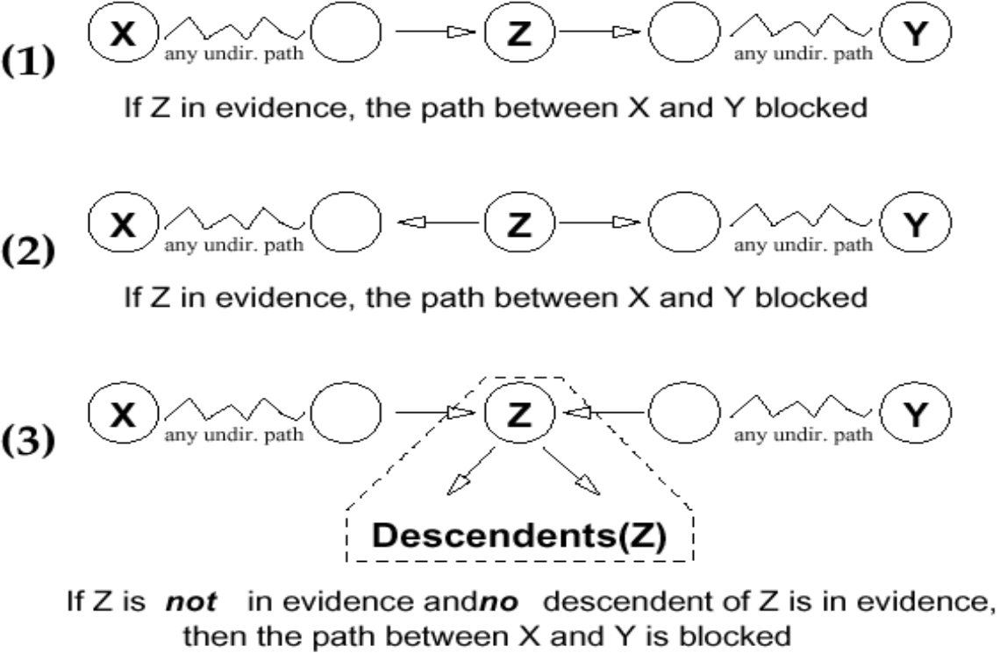

# Lecture 8, Mar 5, 2024

## Independence in Bayesian Networks

* Given a Bayesian network, how can we tell if there exists a dependence between variables, given some other variable?
* Example: in the DAG from the previous lecture, is $P(E | A, G, C) = P(E | G, C)$? (i.e. given $G, C$, is $E$ independent of $A$?)
	* We only know that given all direct parents, a node is independent of its non-descendants
	* Use the law of total probability to bring in the direct parents, and then use Bayes rule to "move" variables from the left of the conditional to the right of the conditional
	* Assume that all variables have binary values, e.g. $A$ can take values of $a$ or $-a$
	* $\alignedeqntwo[t]{P(E | A, G, C)}{\sum _B P(E, B | A, G, C)}{\sum _B P(E | B, A, G, C)P(B | G, A, C)}{\sum _B P(E | B)P(B | G, A, C)}{\sum _B P(E | B)\sum _{D, F} P(B, D, F | G, A, C)}{\sum _B P(E | B)\sum _{D, F} P(B | D, F, G, A, C)P(D, F | G, A, C)}{\sum _B P(E | B)\sum _{D, F} P(B | D, F)P(D, F | G, C)}{\sum _B P(E | B)P(B | G, C)}{P(E | G, C)}$
* General rule: if all paths from one node to another have to pass through at least one of the given nodes, then these two nodes are independent, given the other nodes
	* i.e. remove all given nodes from the graph, if there no longer exists a path between two nodes, then they are independent
	* This only holds if the given nodes are descendants of only one of the nodes given
	* e.g. $P(B | E, D, F A) \neq P(B | E, D, F)$, because $E$ is a descendant of $B$ and $A$
* More formally, a set of variables $\mathcal E$ d-separates $X$ and $Y$ if it blocks every undirected path in the network between $X$ and $Y$; given this, $X$ and $Y$ are independent
	* Every path from $X$ to $Y$ must pass through a variable in the set
	* Let $\mathcal P$ be any undirected path from $X$ to $Y$ in the network; $\mathcal E$ blocks $\mathcal P$ iff there is some node $Z \in \mathcal P$ such that one of the following is true:
		1. $Z \in \mathcal E$ and one arc on $\mathcal P$ enters $Z$ and another leaves $Z$
		2. $Z \in \mathcal E$ and both arcs on $\mathcal P$ leave $Z$
		3. Both arcs on $\mathcal P$ enter $Z$ and neither $Z$, nor any of its descendants, are in $\mathcal E$

{width=50%}

## Variable Elimination

* To compute the joint probability of all the variables, we can keep applying Bayes rule to express it as a sum of probabilities in the tables
* The conditional probability can be obtained using Bayes rule, by dividing the joint probability of all the variables by the joint probability of the variables being conditioned on
* If we don't want all variables, use the law of total probability over all the variables that the expression does not involve
	* However, to sum over all the different combinations of the variables not involved, we would need an exponential number of terms
	* Expand out the joint probability using the product rule, and then break apart the sum as much as possible
	* Start from the innermost sum, and if we're able to complete it without depending on any of the outer sum variables, we can factor it out
	* If the inner sum depends on a variable from an outer sum, the value of the sum will be a function
		* Compute the value of the inner sum for all possible values of that variable
		* The result is another conditional probability table, like the ones we started with
* *Factors* are these probability tables, from either the original conditional probabilities in the expression, or the functions produced as a result of the above
	* Each factor is a function over some variables, e.g. $f(A, C)$ denotes a factor over $A$ and $C$, which could be $P(C | A)$
		* However, the factors aren't necessarily probabilities; they don't always sum to 1
		* Factors don't always have a probabilistic interpretation
	* Factors have the following operations:
		* Product: if $f(X, Y)$ and $g(Y, Z)$ with $Y$ in common, then the product $h = f * g$ is a factor $h(X, Y, Z) = f(X, Y) \cdot g(Y, Z)$
			* We look at the column that's the same between the two tables and multiply corresponding entries
			* Like a database join
		* Summing out: if $f(X, Y)$, summing out $X$ from $f$ produces the new factor $h = \sum _X f$, where $h(Y) = \sum _X f(X, Y)$
		* Restricting: if $f(X, Y)$, restricting $f$ to $X = a$ produces $h = f_{X = a}$ where $h(Y) = f(a, Y)$
	* The summing and restricting operations may produce a factor over no variables, which is a constant that we can take out
* The variable elimination algorithm: given query variable(s) $Q$, evidence (i.e. given) variables $\mathcal E$, remaining variables $\mathcal Z$, form the original set of terms $\mathcal F$
	1. Replace all factors $f \in \mathcal F$ that mention variables in $\mathcal E$ with its restriction (i.e. set the known values)
	2. For each $Z_j \in \mathcal Z$, eliminate it by:
		1. Find all factors $f_i \in \mathcal F$ that include $Z_j$
		2. Compute the new factor $g_j = \sum _{Z_j} f_1 * f_2 * \dots * f_k$ (i.e. take their product and sum out $Z_j$)
		3. Remove all $f_i$ from $\mathcal F$ and add $g_j$ to $\mathcal F$
	3. Take the product of the remaining factors (which should refer only to $Q$) and normalize to produce $P(Q | \mathcal E)$
		* The resulting factor is unnormalized, i.e. $f(Q) + f(\bar Q) \neq 1$, so we need to compute the normalization factor so they sum to 1

