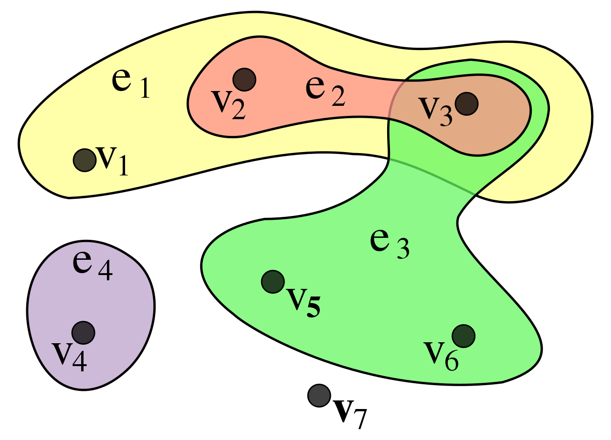
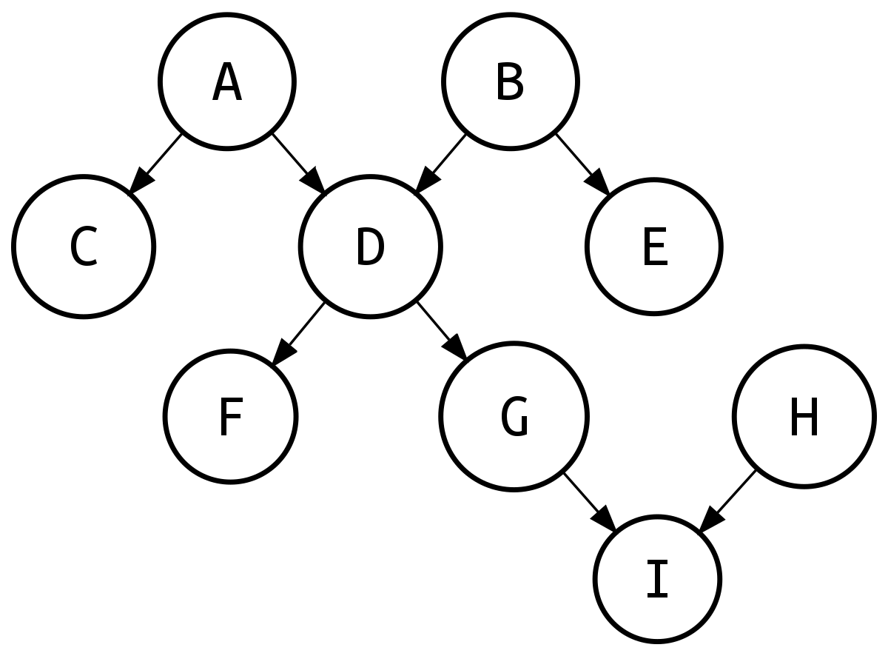

# Lecture 9, Mar 12, 2024

## Variable Elimination Complexity

* As we perform variable elimination, we may end up with factors that had more variables than they began with, due to multiplication of factors
	* If each variable is binary, then a factor with $k$ variables takes $2^k$ space and time to compute/store
	* Can we put a bound on this?
* A *hypergraph* is a set of vertices like an ordinary graph, but instead of edges connecting two vertices, it has *hyperedges* connecting multiple vertices
	* Each hyperedge is a set of vertices

{width=50%}

* For a Bayesian network we start initially with a hypergraph where the vertices correspond to each variable and the hyperedges are the factors
* When we try to eliminate a variable $C$, we remove all the factors where the variable appears and add a new factor
	* We remove the hyperedges that $C$ appears in and add a new hyperedge, containing all the variables that $C$ was once connected to
	* The size of the hyperedges can grow or reduce
* Given an ordering of the variables and an instal hypergraph $\mathcal H$, eliminating the variable yields a sequence of hypergraphs $\mathcal H_0, \dots, \mathcal H_n$
	* The *elimination width* $k$ of $\pi$ is the maximum size of any hyperedge in any of the hypergraphs
		* The elimination width of $\mathcal H$ is the minimum elimination width of any of the $n!$ different orderings of the variables
	* The complexity is $O(2^k)$ in both time and space (since a table with $2^k$ entries needs to be computed and stored)
	* In the worst case $k$ can be equal to the number of variables
* We can try to find the best order of elimination that gives the smallest $k$, but this is an NP-hard problem
	* Heuristics can be used to find orderings with low elimination widths
	* In practice, we don't often encounter graphs that force a very high elimination width
* A *polytree* is a singly connected Bayesian network, i.e. there is only a single path between any pair of nodes
	* Eliminating a singly connected node (i.e. node connected to only one other node) will not increase the size of the hypergraph
	* Having a polytree ensures that at every step in elimination, there is always at least one singly connected node
	* Therefore the elimination width is simply the size of the largest input conditional probability table
* On a polytree, variable elimination can run in linear time in the size of the network (not necessarily linearly in the number of variables)
	* There always exists a good variable elimination order, but not every order is good

{width=50%}

* One effective heuristic for VE is to always eliminate the variable that creates the smallest sized factor
	* This is the *min-fill heuristic*
	* For polytrees, this guarantees linear time

## Bayesian Model Selection

* Based on the data we have, we can come up with a number of different models; how do we select which one is the best?
* We can randomly leave out a part of the data as the validation set, and make the model on the training set
* The model to keep is the one that makes the validation data more likely
	* Use Bayesian hypothesis testing/likelihood ratio test
	* $\frac{P(\mathcal E | M_1)P(M_1)}{P(\mathcal E | M_2)P(M_2)} \GtrLess ^{M_1}_{M_2} 1$ where $\mathcal E$ is a set of evidence in the validation set
* We can improve models with local search, or start with a random model and build it using local search
	* Define a neighbourhood around the model, e.g. by removing or adding some edges
	* Now check everything around the neighbourhood of a model and compare it with the model using the likelihood ratio
	* Use the new model if it's better and repeat with the local search, or use simulated annealing

