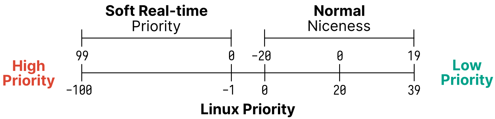
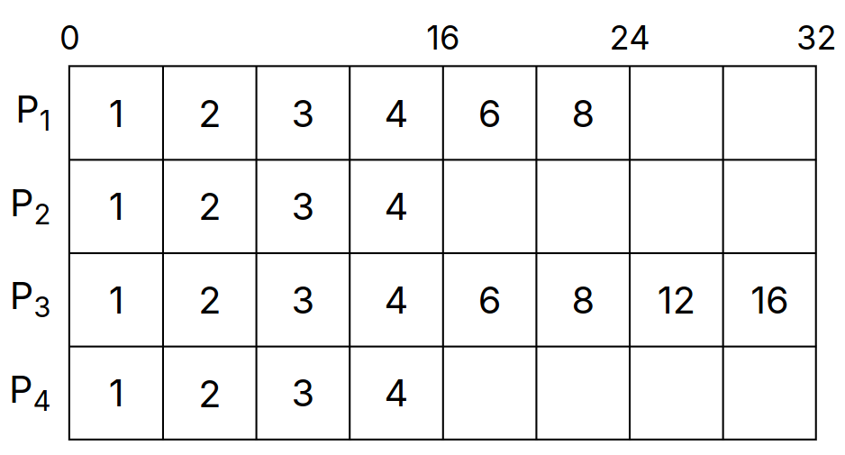

# Lecture 10, Jan 30, 2024

## Advanced Scheduling

* Sometimes we want to favour some processes over others, so we can assign a priority to each process
	* Processes with higher priority will run first, and equal priority processes use round-robin
	* Can be preemptive or non-preemptive
	* e.g. on Linux the priority ranges from -20 (highest) to 19 (lowest)
* If there are lots of higher priority processes this can lead to starvation
	* We can have the OS dynamically change the priority
	* Increase the priority of processes that haven't been executed for a long time and then restore it after it runs
* In *priority inheritance* a process inherits the highest priority of the waiting processes, and is reverted back to the original priority after the dependency is resolved
* Processes can be *foreground* (receives input and interacting with the user) or *background*
	* Foreground processes need better response time since the user is interacting with it
	* Background processes would have a group ID that is different from its terminal group ID
	* This is harder to determine today as systems have gotten more complex
* To address this we can use different queues for foreground and background processes, e.g. RR for foreground and FCFS for background processes
	* To decide which queue runs, we can use a further layer of RR between the queues and have priorities for each queue
* In general scheduling involves a series of tradeoffs and heuristics instead of one right answer

### Multiprocessor Scheduling

* Assume every core is a symmetric multiprocessing (SMP) system, i.e. all CPUs have the same physical memory but each have their own private cache
* We can use the same scheduling system (global scheduler) and just keep running processes as long as CPUs are available
	* This is not scalable since there is only a single scheduler and each CPU needs to wait for the same global scheduler
	* Also poor cache locality as processes are swapped between cores
	* Approach in Linux 2.4
* Each CPU can use its own scheduler; new processes are assigned to some CPU and after that each CPU manages its own scheduling
	* Can assign to the CPU with the lowest number of processes
	* This avoids the scalability issue (no blocking on resources) and cache locality issue
	* Can lead to load imbalance, as we don't know how long each task will run, so some CPUs may end up with fewer or less intensive processes
* We can use a compromise between the two approaches and use a global scheduler that can re-balance per-CPU queues
	* If a CPU is idle, we can take a process from another CPU; this is known as *work stealing*
	* Use *processor affinity* (preference of a process to stay on the same core) to decide which processes can switch CPUs
	* This is a simplified version of the $O(1)$ scheduler in Linux 2.6
* Sometimes we want to schedule multiple processes simultaneously as a group (*gang scheduling* or *coscheduling*)
	* The processes may have dependences; occurs mostly in high-performance computing
	* Each process should run on its own core all at the same time to maximize performance
	* This requires a global context-switch across all CPUs as each CPU can't be independent

### Real-Time Scheduling

* In real-time systems, processes have time constraints for either deadlines or rates
	* e.g. audio output, autopilot
* *Hard real-time* systems guarantee that a task completes within a certain amount of time
	* Each instruction will be counted so we know exactly how long each process is running for
	* This is often the case on simple embedded systems
* *Soft real-time* systems just assign a higher priority to critical processes
	* The deadline is met in practice
	* Most general-purpose operating systems are soft real-time since we have little control over what the user does and modern systems are very complex
	* e.g. Linux

### Scheduling on Linux

* Linux uses FCFS and RR scheduling
	* Processes with the same priority use a multilevel queue
	* For soft real-time processes, the highest priority process is always scheduled first
	* For normal processes it adjusts the priority based on aging and available CPU time
* Real-time processes are always prioritized in Linux
	* They will either be scheduled using FCFS (`SCHED_FIFO`) or RR (`SCHED_RR`)
	* There are 100 static priority levels (0 - 99)
* Normal processes use normal scheduling policies
	* Priority ranges from -20 to 19 with higher numbers being lower priority
	* By default the priority is 0
* Priories can be set with the `nice` and `sched_setscheduler` syscalls
	* The "nicer" a process is, the lower its priority and it'll use up less of the CPU
* Linux maps niceness and soft real-time priority to an internal priority where lower numbers are always higher priority as shown in the figure below

{width=60%}

### Completely Fair Scheduler

* Modern versions of Linux (past 2.6.23) use the completely fair scheduler (CFS) instead of the $O(1)$ per-CPU scheduler
* The $O(1)$ scheduler had fairness issues for different priority processes
* If context switching had no cost, then we'd have an infinitely small timeslice and all processes would be running at the same time and get the same amount of CPU time

{width=50%}

* In CFS, each runnable process has a "virtual runtime" in nanoseconds
* At each scheduling point where the process runs for time $t$, the virtual runtime of the process is increased by $t$ multiplied by a weight, which is based on priority
	* Higher priority processes have lower weight, so their virtual runtime increase slowly and as a result they get scheduled more
	* Virtual runtime only increases
* The scheduler will always select the process with the lowest virtual runtime and computes its dynamic time slice based on the IFS
* CFS uses a red-black tree with virtual runtime as the key
* CFS favours I/O bound processes by default (processes that spend the most time waiting)

