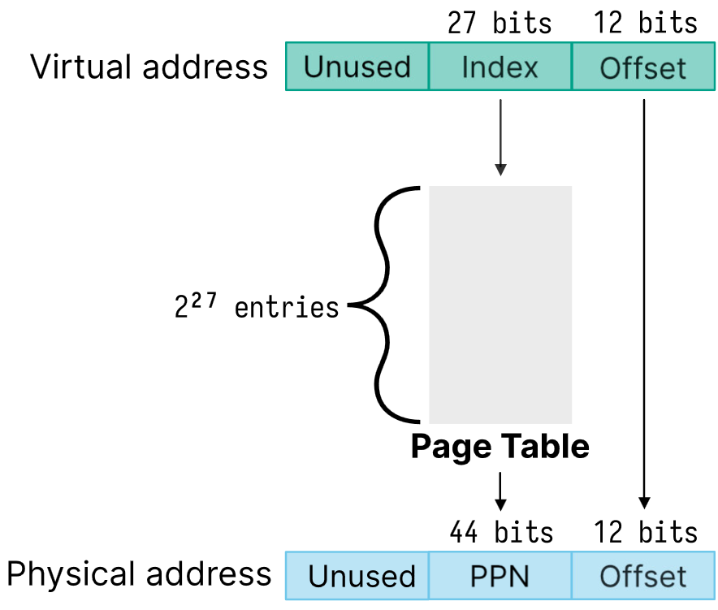

# Lecture 11, Jan 31, 2024

## Virtual Memory

* We need virtual memory to satisfy the following goals:
	* Multiple processes must be able to co-exist -- the same virtual address can map to different physical addresses
	* Processes should not be aware that they are sharing physical memory
	* Processes cannot access another process' memory (unless explicitly allowed)
	* Performance close to directly using physical memory
	* Limit fragmentation (wasted memory)
* The *memory management unit* (MMU) is the hardware responsible for memory mapping and permission checks
	* Memory is divided into fixed size *pages* (typically 4096 bytes)
	* Pages in virtual memory are pages, while pages in physical memory are called *frames*
	* A page is the smallest possible unit of memory that the kernel can allocate
* Virtual memory used to be implemented with *segmentation*, which is no longer used
	* Virtual address space is divided into segments for code, data, stack and heap which can all be resized
	* Segments are costly to relocate and leads to fragmentation
	* Each segment contains a base address, limit, and permissions
	* When accessing memory, the MMU checks that the offset is within the limit, and then checks for permissions before giving access
* Usually the more virtual memory we map, the more expensive it will be
	* For most systems we use a 39-bit virtual address space, which gives 512 GiB of addressable memory to each process
* Mapping is usually implemented using a page table (a lookup table), indexed by the virtual page number (VPN) and gives the physical page number (PPN)
	* The kernel sets up the page table and the MMU indexes it
	* The least significant 12 bits are the offset (4096 possible values to match our page size) and the other 27 are used to index the page table
	* The number of bits used for the PPN can be different than the VPN
	* Each entry in the page table has a structure shown in the figure below

{width=40%}

{width=60%}

* Example: given an 8-bit virtual address, 10-bit physical address, 64 byte pages:
	* How many virtual pages are there?
		* Each page is 64 bytes so offset is 6 bits
		* This leaves 2 bits for the VPN, which gives 4 virtual pages
	* How many physical pages are there?
		* $10 - 6 = 4$ bits for the PPN gives 16 physical pages
	* How many entries are in the page table?
		* 4 entries since there are 4 virtual pages
	* Given the page table `[0x2, 0x5, 0x1, 0x8]` what is the physical address of `0xF1`?
		* `0xF1 = 0b1111'0001`
		* Offset is `0b11'0001`
		* VPN is `0b11` (page 3) so PPN is `0x8 = 0b1000`
		* Final address is `0b10'0011'0001 = 0x231`
* Each process has its own page table, which is managed in software
	* When a process is `fork()`ed, the page table is copied from the parent
	* The kernel implements copy-on-write for `fork()`ed programs -- the memory is shared until a process tries to write to it, at which point it is copied
		* The write permission bit is turned off initially before memory is copied
	* We can use the `vfork()` syscall to fork but do not copy the page tables
		* If any memory is modified by the child, the behaviour is technically undefined since the memory is shared with the parent
		* Use only for performance sensitive programs or when we `exec()` immediately after `fork()`
* Next time on ECE353: The page table has $2^{27}$ bits which would take an entire gigabyte, so how do we give each process its own copy?

