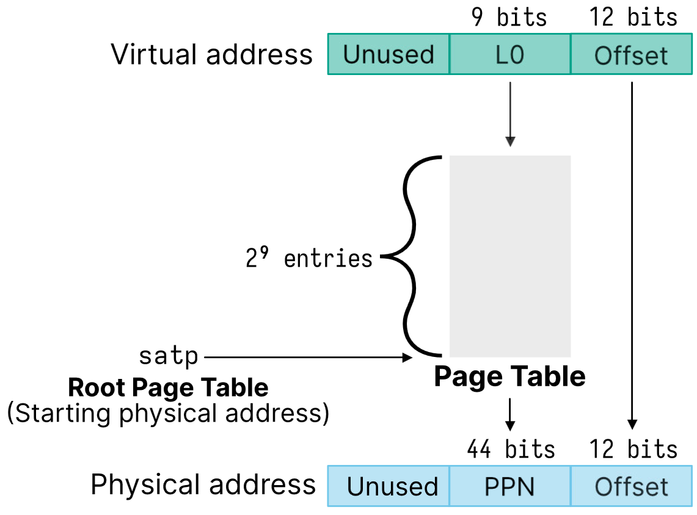
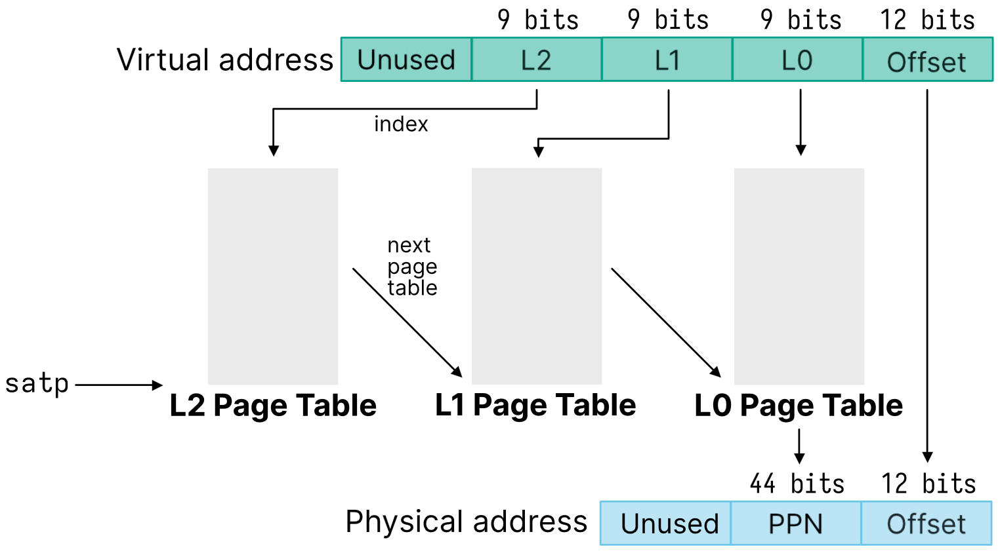

# Lecture 12, Feb 2, 2024

## Page Tables

* If each process' page table contained entries for the entire memory space, they would take up too much space
* Most processes don't use all the virtual memory space, so we can make the page tables smaller
* We will make the page table fit on a single page

{width=40%}

{width=45%}

* Multi-level page tables are how we save space for programs that don't use a lot of addresses
	* Virtual addresses are split into 9-bit sections, each corresponding to a different level (`L2`, `L1`, `L0`)
		* We still have the same 27-bit VPN but now it's split into 3 sections of 9 bits each
		* Each entry is 8 bytes (64 bits), which means we need 512 entries or 9 bits for the address in each level
	* Instead of giving the PPN of the physical memory, the higher level page tables instead give the PPN of the next lower level's page table, to look up the next address and so on, until `L0` stores the PPN of the actual memory that the virtual address maps to
	* e.g. first look up the PPN of the `L1` page table in the `L2` page table, then look up the PPN of the `L0` page table in the `L1` page table, and then look up the actual page number of the memory in the `L0` page table
	* The `satp` stores the *root page table* (i.e. the PPN of the `L2` page table)
* Each process will start with only 3 pages of page tables (1 for each `L2` to `L0`) which is enough for all the VPNs
	* If a process ends up using more memory, then the OS will allocate more pages to the page table
	* For smaller programs this saves a lot of space
	* If we use all of the virtual memory this would end up using more space, but not that much
* The kernel maintains a linked list of all the free physical pages (a free list)
	* When allocating memory the kernel simply removes it from the list and allocates it to the program
* Example: consider the virtual address `0x3FFFF008` with 30-bit virtual addresses and 4096 byte page sizes
	* In this case we have an 18-bit VPN so we only need `L1` and `L0` page tables
	* Split this into `0b111111111'111111111'000000001000`
	* First we would use the `satp` to look up the address of the `L1` table
	* The `L1` page table index would be 511, which stores, e.g. a PPN of `0x8`
	* Then we look up the `L0` page table, at address `0x8000`, and index it with 511, which stores, e.g. `0xCAFE`
	* The final physical address would be `0xCAFE008`
* Example: if we have a program that uses 512 pages, what is the minimum number of page tables we need and what is the maximum?
	* Minimum: 512 pages fits into a single `L0` page table, so we only need 3 tables (`L2`, `L1`, `L0`)
	* Maximum: each page has its own `L0` table, which has its own `L1` table, but with a shared `L2` (since `L2` is always unique); in this case we need 1025 tables
* Example: assume a 32-bit virtual address with a page size of 4096 bytes and a PTE size of 4 bytes
	* To have each page table fit into a single page, we need $4096/4 = 1024$ PTEs on a single page
	* To index each page table we need 10 bits
	* Each virtual address has 12 bits dedicated to the offset (for the page table size of 4096), so 20 bits are left for the VPN
	* Therefore we need 2 levels since each level gives 10 bits
	* The number of levels can be found by taking the virtual address bits, subtracting the offset bits and dividing by the number of bits to index each table (ceil if not an integer)
* Next time on ECE353: Now we have to do 3 memory accesses to look up an address, so this is 4 times slower than accessing physical memory directly; how do we make this faster?

