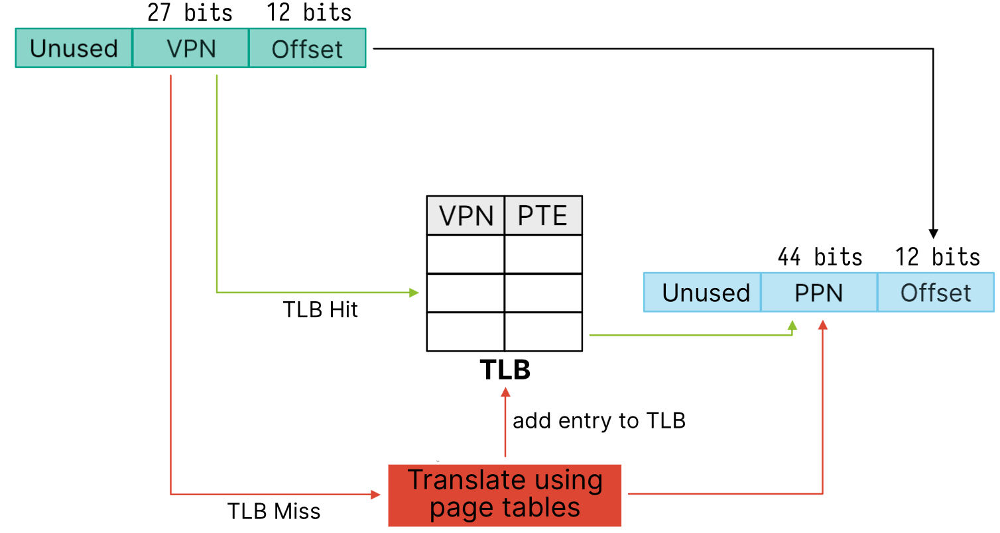
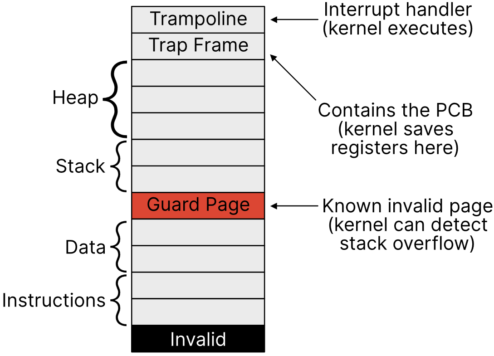

# Lecture 13, Feb 6, 2024

## Page Table Implementations

* How do we make page tables faster?
	* We'll likely access the same page multiple times in succession
	* A process may only need a few page mappings at a time
	* To speed up memory accesses, we use *caching*
* The *translation look-aside buffer* (TLB) caches page table entries
	* When a process accesses memory, it would be first looked up in the TLB, and only translated in the case of a TLB miss
	* On a hit, the time taken to access memory is the TLB search time plus memory access time; on miss the time is the TLB search time, plus memory access time and PPN lookup time
	* We can calculate the *effective access time* (EAT, the expected value of access time) by taking a weighted average using $\alpha$, the TLB hit rate

{width=60%}

* Note since each process has its own virtual memory mapping, we need to handle the TLB when context switching
	* Most implementations flush the TLB on context switch
	* Some implementations attach process IDs to the TLB
* Because of the TLB, programs run faster if they use memory continuously and access the same pages most of the time
* The `sbrk` syscall is used for userspace page allocation
	* This grows or shrinks the heap
	* Memory allocators use `mmap` to bring in large blocks of memory

{width=40%}

* The kernel can also map its memory directly to processes' virtual memory as a fixed virtual address, so the process can make syscalls without actually doing a syscall
	* e.g. `clock_gettime()`

