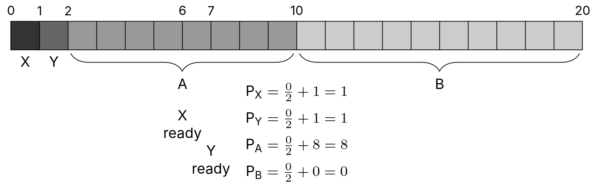
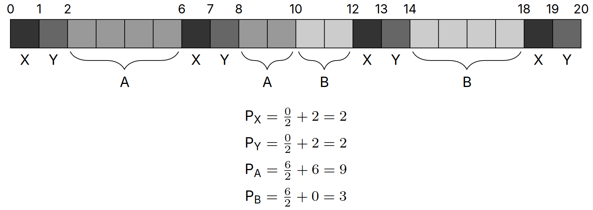

# Lecture 14, Feb 7, 2024

## Dynamic Priority Scheduling

* Feedback scheduling is a scheme where the scheduler itself manages the priories of the processes
	* Processes that don't use their time slice has their priority increased, while priorities that do use their full time slice has their priority decreased
	* Each process starts with some priority $P_n$
	* The scheduler always picks the lowest priority number to schedule
		* If the process yields (gives up execution, e.g. due to I/O), switch to another process
		* If another process with lower priority becomes ready, switch to that process and preempt the original one
	* The time each process executes for during the time slice is recorded as $C_n$
	* At the end of the time slice, the priority of the process is updated as $P_n \gets \frac{P_n}{2} + C_n$, and then $C_n \gets 0$
		* Note priorities are only updated at the end of time slices
		* When a process with lower priority is ready, we compare the current priorities without updating first

{width=%}

{width=%}

## Memory Mapping

* The `void *mmap(void *addr, size_t length, int prot, int flags, int fd, off_t offset);` syscall is used to map files to a process' virtual memory space
	* This allows us to map a file's contents to memory, so instead of reading from the file, we can read from the virtual addresses
		* Note writing back to the virtual address doesn't write back to the file
		* The contents of the file are copied into memory on-demand
	* Arguments:
		* `addr`: suggested virtual address to map to (`NULL` will let the kernel pick)
		* `length`: number of bytes to map
		* `prot`: protection (permission) flags (read/write/execute)
		* `flags`: mapping flags (shared/private/anonymous)
			* This specifies the behaviour when the process gets forked
			* Private means the child process can't access the same virtual addresses; shared means both processes will share the memory
			* Shared memory mapping is a way to implement IPC
			* Anonymous means there is no underlying file (use memory)
		* `fd`: file descriptor to map
			* If this is set to -1 (in conduction with using the anonymous flag) this will be mapped to memory instead of a file
		* `offset`: offset in the file to start the mapping at
			* This needs to be a multiple of the page size for alignment reasons
	* Use `int munmap(void *addr, size_t length);` to undo the mapping
* `mmap` calls are lazy and only sets up page tables
	* The newly created PTE is invalid, so on first access, the MMU triggers a page fault, the kernel detects this and copies over the page
	* Only the parts that get used get read
* `mmap` can be useful for random access of a file and to only read parts of the file that we actually need instead of reading in the entire file

