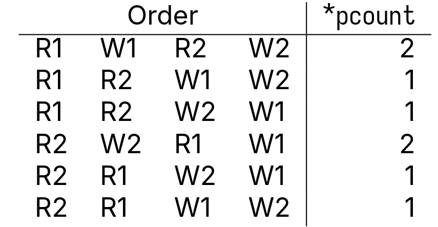

# Lecture 19, Feb 28, 2024

## Locks

* When two concurrent threads access the same variable and at least one of them writes to it, a *data race* can occur
	* When this happens, we can get an inconsistent view of memory
* An *atomic* operation is an indivisible operation that cannot be interrupted
	* The thread can only be preempted between two atomic operations but not during one
* Compilers use an intermediate representation called *three address code* (TAC)
	* Mostly used for analysis and optimization by compilers
	* We can use this to reason about data races since it's low level but easier to read than ASM
	* Consists of only individual (atomic) statements, each taking at most 2 operands
	* GCC's TAC is called GIMPLE; use `-fdump-tree-gimple`/`-fdump-tree-all` to see it
* Example: two concurrent threads incrementing a shared counter which starts at 0
	* Each increment consists of a read, increment, and then write back
	* If the reads and writes are interleaved, one thread may read the value of the counter before the other is done incrementing it, so they will overwrite each other's results
	* Depending on the specific ordering of reads and writes, the result may be different

{width=40%}

* To avoid data races, we need to prevent two threads from accessing the variable at the same time
* We can use a *mutex* (stands for Mutual Exclusion)
	* `pthread_mutex_t` can be used
	* Use `pthread_mutex_init()` or assign to `PTHREAD_MUTEX_INITIALIZER` to init the mutex
	* Use `pthread_mutex_destroy()` to destroy the mutex
	* Between a call to `pthread_mutex_lock()` and `pthread_mutex_unlock()`, we have a *critical section* (or *protected*), where only a single thread can execute at a time
		* A thread can only enter this section if it can acquire the lock
		* The lock can only be acquired by a single thread at a time
	* Use `pthread_mutex_trylock()` to attempt to acquire the lock in a non-blocking manner
* If we wrap the counter increment between a `pthread_mutex_lock()` and `pthread_mutex_unlock()`, we won't ever see a data race
* Critical sections should have the following properties:
	* Safety (aka mutual exclusion)
		* Only a single thread should be in the critical section at a time
	* Liveness (aka progress)
		* If multiple threads reach the critical section, only one can proceed
		* The critical section can't depend on other threads (which can lead to deadlock)
	* Bounded waiting (aka starvation-free)
		* A thread waiting to acquire a lock must eventually proceed
* The locking mechanism should have the following properties:
	* Efficiency: shouldn't consume resources when waiting
	* Fair: each thread should wait approximately the same amount of time
	* Simple: should be easy to use, hard to misuse
* Synchronization can happen on different levels
	* At the lowest level we have hardware atomic operations
	* Then we have high-level synchronization primitives like mutexes
	* Finally we have properly synchronized applications without data races
* For a single processor system, locks are very easy to implement -- simply disable interrupts during the critical section

