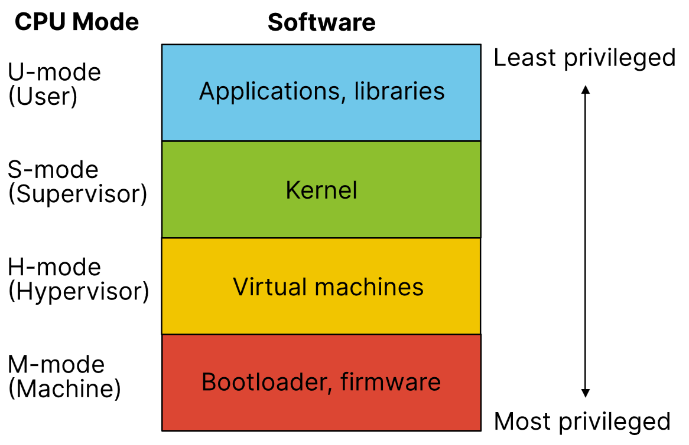

# Lecture 2, Jan 10, 2024

## Operating System Concepts

* *IPC* (inter-process communication) is how processes transfer data between each other
* *File descriptors* are a resource that users may read bytes from or write to, identified by an index stored in a process
	* 0 is standard input, 1 is standard output, 2 is standard error
* *System calls* (syscalls) make requests to the OS
	* The `write` syscall takes a file descriptor, a pointer to a buffer, and a number of bytes to write
		* `ssize_t write(int fd, const void *buf, size_t count);`
	* The `exit_group` syscall takes a status code and exits the current process with that code
		* `void exit_group(int status);`
	* Syscalls are traceable via the program `strace`
* Note: API: application programming interface; abstracts the details and describes the arguments and return value of a function; ABI: application binary interface: the actual details of the function, how to pass arguments and what the return value is, e.g. passing arguments using the stack
* System calls are not like function calls; instead we generate an interrupt for the OS using an `svc` instruction (aarch64)
	* Arguments are not passed on the stack, but through registers x0 to x5; register x8 stores the syscall number (the type of system call)
	* This has the disadvantage that the number of arguments and size of arguments is limited
	* In x86_64 the arguments are partially passed using the stack
* *ELF* (Executable and Linkable Format) is the format used to specify executables and libraries
	* The first 4 bytes are always 0x7f followed by "ELF" in ASCII; these are the *magic bytes* that indicate the file format
	* There is a 64 byte file header and 56 byte program header; these indicate endianness, ISA, ABI, etc as well as what to load into memory

## The Kernel

{width=50%}

* *Kernel mode* (aka S-mode) is a privilege level on the CPU that allows access to more instructions, allowing more direct access to hardware
	* All user programs run in *user mode*
	* This is a security measure that only allows trusted software to access hardware, e.g. to manage virtual memory
* The *kernel* is simply software running in kernel mode
* Syscalls are the only way to transition between user and kernel mode; i.e. if a user program wants to access hardware, it has to do so via a syscall to the kernel
* The kernel can load *modules*, which allows loading code on-demand
	* The modules are executed in kernel mode so they allow access to hardware
* Kernel architecture is the way we decide whether to run services in user or kernel space
	* *Monolithic kernel* run all OS services in kernel mode, including file systems, drivers, etc
	* *Microkernels* run the minimum amount of services in kernel mode, including only services close to hardware such as virtual memory but not file systems or drivers
	* *Hybrid* kernels are between the two; e.g. on Windows emulation services run in user mode, on macOS device drivers run in user mode
	* *Nanokernels* and *picokernels* run even more services in user mode

