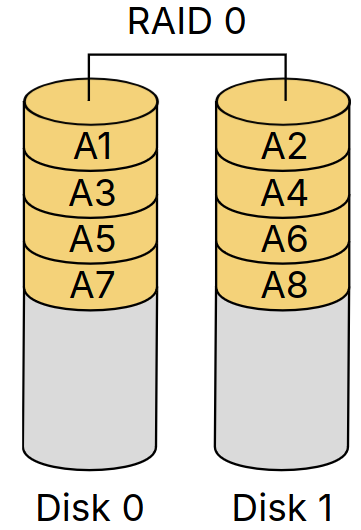
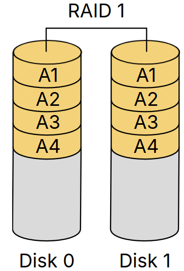
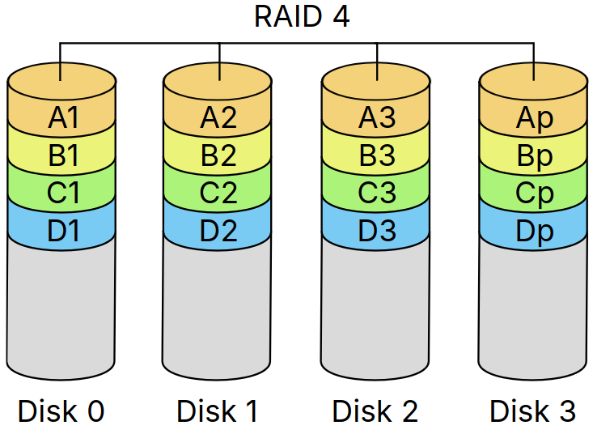
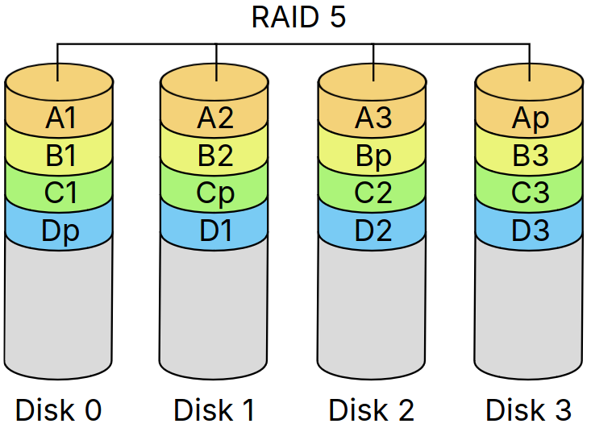
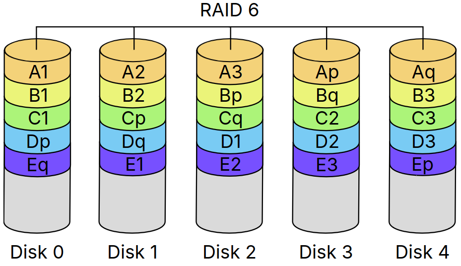

# Lecture 24, Mar 13, 2024

## SSDs and RAID

* SSDs use NAND flash, which can only be read in complete pages and write to freshly erased pages
* Erasing is done per-block (128 or 256 pages each)
	* Erasing a block can be a hundred times slower than reading a page or ten times slower than writing a page
* SSDs will garbage collect blocks
	* The disk controller does not know what blocks are still alive
	* The OS can use the TRIM command to inform the controller that a block is unused
* To store lots of data, we can use a Single Large Expensive Disk (SLED) or an Redundant Array of Independent Disks (RAID)
	* SLED uses a single large disk and presents a single point of failure
	* RAID has redundancy to prevent data loss and increase throughput
* RAID 0 (aka *striped volumes*) distribute data in block-level stripes (128 or 256 KiB) over multiple disks; used for performance at the cost of increased risk of failure
	* e.g. a file can be broken up into stripes, and odd stripes can go on one disk while even stripes can go on the other
	* RAID 0 increases performance since now we can read/write to multiple disks in parallel; read/write performance is increased by a factor of $N$
	* If any of the disks in the array fails, we will lose data, so the number of points of failure is increased
	* Typically only 2 is used for a balance between performance and risk of failure

{width=20%}

* RAID 1 (aka *mirror*) simply duplicates data across all disks identically; used for redundancy, at the cost of being wasteful
	* Redundancy means as long as at least one disk remains, no data will be lost
	* Can still increase read performance by reading different parts from different disks, but writes are not any faster (since we need to write to all drives)
	* This is wasteful since the data we can store is the same as a single disk; we can only use $\frac{1}{N}$ of the total space
* RAID 10 (aka *stripe of mirrors*) is RAID 1 + 0 and uses both; RAID 1 is used at the top level, and RAID 0 is used at the bottom level
	* We have multiple identical copies of RAID 0 arrays
	* If $N$ mirrors of $M$ stripes are used, read performance is increased by a factor of $NM$ and write performance by a factor of $M$
	* Whenever any matching pair of $N$ disks storing the same stripes dies, we have data loss
		* In the best case we can lose up to half the drives without data loss
		* In the worst case we can only tolerate 1 failure
	* No parity involved so replacement of disks is faster than RAID 4+

{width=20%}

* RAID 4 uses a dedicated disk for *parity*, which stores the XOR of the other copies; provides a balance between redundancy and performance
	* If any one of the disks fails, we can use the other disks to reconstruct the one that was lost
		* XORing gives whether there are an even or odd number of 1s, so by comparing the bits on the other disks we can deduce the missing bit
		* But if we lose more than one at a time, the missing disk cannot be reconstructed
	* Data can be distributed in block-level stripes across the other disks, so read (and theoretically write) performance is increased by a factor of $N - 1$
		* Note RAID 2 and 3 use bit-level and byte-level striping (instead of block-level) and are practically very bad ideas
	* Since every write must update the parity disk, the parity disk gets written to much more than the other disks, which can cause it to fail first
		* Write performance in practice can also suffer since everything must write to the parity disk
	* We can use $1 - \frac{1}{N}$ of the total available space
	* Note this needs at least 3 disks

{width=40%}

* RAID 5 distributes the parity information across all disks instead of putting it on a single disk
	* Used a lot in practice
	* This is better for write performance and doesn't cause a single disk to fail first
	* Has the same benefits as RAID 4

{width=40%}

* RAID 6 adds another checksum block compared to RAID 5
	* Performance is sped up by a factor of $N - 2$ and we can use $1 - \frac{2}{N}$ of the total space
	* Redundancy is increased to tolerate at most two disks failing at the same time
	* Note this requires at least 4 disks (in practice often 5 or more)
	* Write performance is slightly worse than RAID 5 due to the increased checksum calculation

{width=50%}

