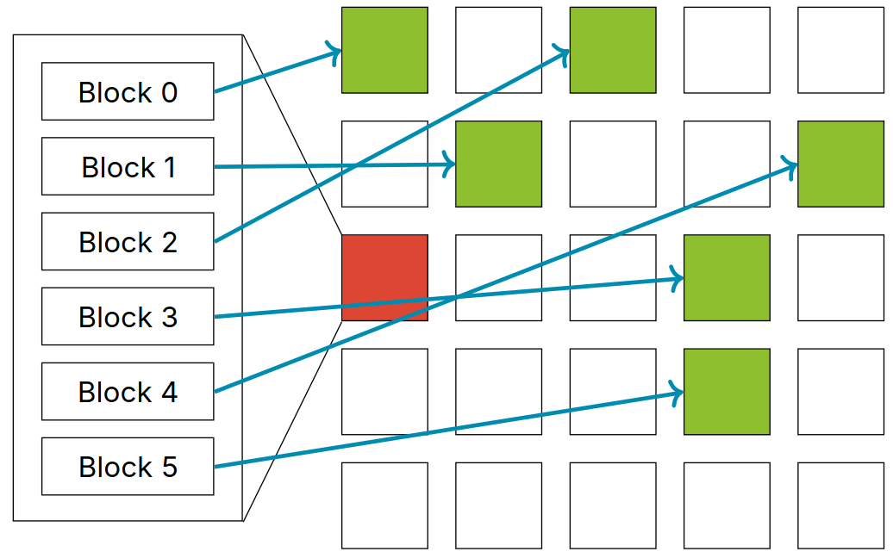

# Lecture 25, Mar 15, 2024

## Filesystems

* File access can be sequential (within a file) or random
	* The `read()` and `write()` syscalls will perform sequential access
	* For random access use `off_t lseek(int fd, off_t offset, int whence);` to set the offset
		* `whence` is either `SEEK_SET` (absolute/relative to start of file), `SEEK_CUR` (relative to current offset) or `SEEK_END` (relative to end of file)
* Each process stores a local open file table, which is indexed by file descriptor number
	* Each item in the local file table points to a location in a system-wide *global open file table*
	* Each GOF location stores the position (offset), flags, and a virtual node pointer (data can be read from/written to it) for each opened file
		* VNodes can represent files, pipes, sockets, etc

{width=50%}

* On fork, the PCB is copied, including the local open file table; however, they would still point to the same entries in the GOF
	* This means both processes share the same position; read, write, or seek by one process will affect all others
	* To get an independent copy, we need another open

{width=50%}

### File Allocation

* How do we store a file?
* We can use contiguous allocation and always use sequential blocks, like an array
	* Space efficient: only needs to store start block and number of blocks
	* Random access is fast since we can simply calculate the block number
	* Very slow if files need to expand, just like how we have to copy an array to expand it
	* Susceptible to *internal fragmentation* (not filling an entire block) and *external fragmentation* (wasted blocks between files)
	* Not used in practice
* Linked allocation uses a linked list-like structure where each block points to the next
	* Files can grow very easily and there is no external fragmentation (still internal fragmentation however)
	* Random access is very slow since we have to traverse all the blocks (and read them from disk) to find the block we want
	* Not used in practice
* File allocation tables (FAT) moves the linked list to a separate table; each entry in the table points towards a block used by a file
	* One of the most simple filesystems and very commonly used in low-end devices
	* Since the table is moved out, this is more performant than linked allocation
	* Can grow and shrink easily, no external fragmentation
	* Random access is much faster since the table can be held in memory/cache
	* Table size has to grow linearly with disk size so this can be very large

{width=50%}

* Indexed allocation uses an array of pointers to blocks to keep track of which blocks are used by files
	* Provides even faster random access than FAT, and table size has no relation to disk size
	* Each new file will have a block that stores its table
		* This means the max size of files is limited by the number of pointers we can store in the block
	* e.g. if each block is 8 KiB and pointers are 4 bytes, files can only be 16 MiB large

{width=50%}

