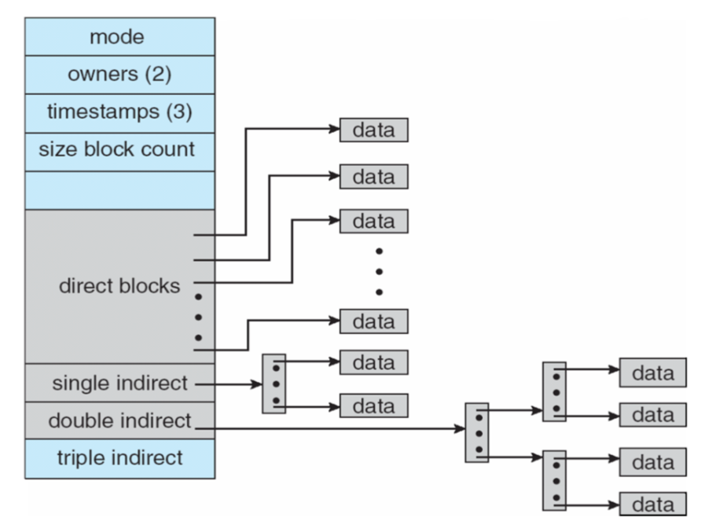

# Lecture 26, Mar 19, 2024

## inodes

{width=60%}

* *inodes* (*index nodes*) are how files are stored in a filesystem
	* Each inode stores the file size, type, number of hard links (to know when to erase the file), access rights, creation/modification timestamps, sometimes file contents, and an ordered list of data blocks
	* This is an alternative to other formats such as FAT; UNIX-style filesystems use them
* inodes store pointers to file blocks in addition to metadata
	* To be efficient for all file sizes, the file contents can have different levels of indirection
	* A typical Linux inode has 15 pointers in total, 12 are direct, 1 single, 1 double, and 1 triple indirect
		* The direct pointers directly point to blocks used for the file
		* The higher level indirection pointers point to blocks that store additional pointers, like with page tables
	* With this setup the maximum size of a file is approximately 64 TiB
	* Another optimization is to store files that are less than $15 \times 4$ bytes directly in the inode in place of the pointers, instead of pointing to data blocks
* A directory entry (aka filename) is called a *hard link*; each hard link points to one inode
	* Multiple hard links can point to the same inode; modifying the inode through any of the links will change the contents
		* Additional hard links can be created with `ln <src> <dest>`
	* `ls -li` will show the inode number linked to by each filename and the number of hard links to the inode
	* When we make a directory, its `.` and `..` will be hard links to inodes, increasing the link count
	* Hard links form a DAG (aside from the self-loops of `.`)
* Deleting a file only removes a hard link (hence the syscall for this is `unlink` and not delete)
	* When there are no more hard links to an inode, it can be recycled and its blocks reused
* A *soft link* (or *symbolic link*/*symlink*) is a pointer to another file on the system
	* These can be created with `ln -s <src> <dest>`
	* When attempting to access the symlink, the filesystem is redirected to that file
	* Soft link targets do not need to exist; they can be created with a nonexistent target, or the target can be deleted without notice of the soft link
	* If the target does not exist, attempting to resolve the link leads to an error (`ENOENT`/no such file or directory)
	* The size of a soft link is the size of the name it points to
* Soft links can point to each other, and create cycles
	* The kernel will detect this when attempting to resolve the link (`ELOOP`/too many levels of symbolic links)
* inodes can have different types to represent files, directories, block devices, etc
	* Directory inodes do not store pointers to data blocks, but tuples of names and pointers to inodes
* Caching is often done in filesystems to speed up writing to disk
	* File blocks are cached in main memory in the *filesystem cache*
	* The blocks have temporal locality (referenced blocks are likely to be referenced again) and spacial locality (nearby blocks are likely to be referenced)
	* A kernel daemon thread periodically writes the changes to disk
		* A `sync` syscall forces the write immediately
* Filesystems can also support copy-on-write and other advanced features (e.g. btrfs)
* Deleting a file involves removing its directory entry, releasing the inode, and freeing the disk blocks, and a crash can happen at any time, which leads to a storage leak
* *Journaling* filesystems (e.g. ext4) record current operations in progress in a journal
	* This makes the filesystem more resilient; if an unexpected crash occurs, we can recover using the journal

