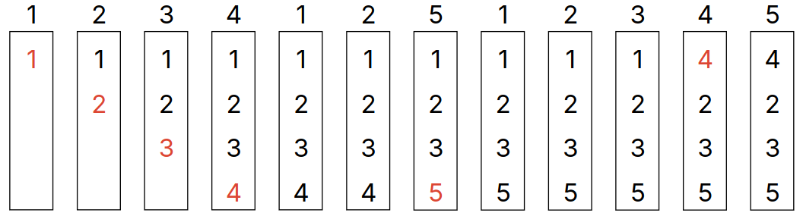
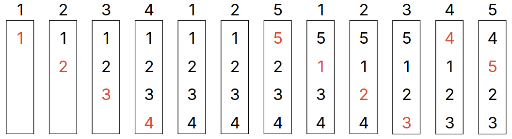
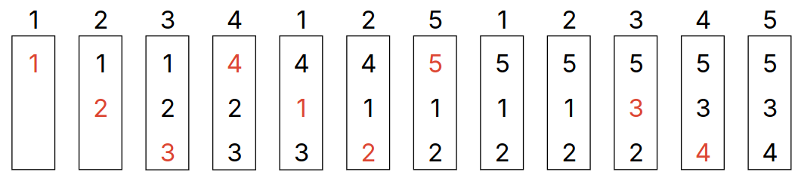
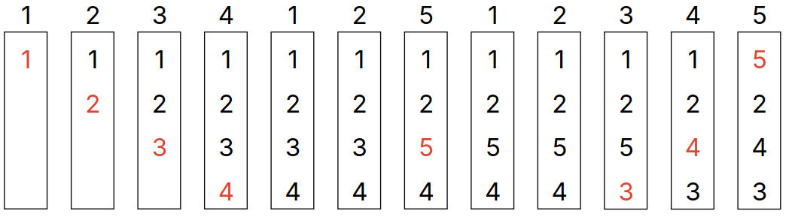

# Lecture 27, Mar 27, 2024

## Memory Replacement

* We want the speed of faster memory with the capacity of larger memory; this is accomplished with caching
* *Demand paging* is when memory is used as a cache for the filesystem
	* Memory pages are mapped to filesystem blocks
	* When a block is used for the first time, it is loaded through a page fault handler
	* Memory pages can be moved into swap space if we need more physical memory than we have
* The number of pages a process uses at a given time is called its *working set*
	* If the working set cannot fit into physical memory, it will *thrash*, i.e. constantly move entries in and out of cache
* Page replacement algorithms:
	* Optimal: replace the page that will be idle for the longest
		* Used as a benchmark
		* Can't be implemented in practice because we have no way of knowing which pages will be used in the future
		* Theoretically has the fewest number of page faults
	* Random: replace random pages
	* FIFO (first-in first-out): replace the oldest page first
	* Least recently used (LRU): replace the page that hasn't been used in the longest time
		* For parallel accesses, we can use FIFO tiebreaking
* When evaluating page replacement algorithms, we care mainly about the number of page faults, since each is an expensive page read from disk

{width=60%}

* The examples below show FIFO replacement with a memory size of 4 pages compared to a size of 3
	* In both cases, the number of page faults is significantly more than optimal, as expected
	* Counter-intuitively, the example with a memory of 3 pages only has 9 faults while the larger memory had 10 faults
* The fact that having more page frames can cause more page faults is known as *Bélády's anomaly*
	* This is a problem with FIFO in particular and doesn't exist with LRU or "stack-based" algorithms
	* The anomaly is unbounded -- you can construct a sequence to get any arbitrary page fault ratio
	* In general as the number of pages increases, the trend in page faults is random
	* For all other algorithms, having more page frames decreases the number of faults

{width=60%}

{width=60%}

* In practice random page replacement actually works better than FIFO since it avoids the worst case and has no anomaly
* LRU tries to approximate optimal replacement and is better than FIFO

{width=60%}

* Figuring out which page to replace for LRU can be expensive
	* Searching through all the pages to find the least recently used one is too expensive
	* We could use a doubly linked list that has all pages in least recently used order, and on each page access, we move the page to the front of the list, and always check the back of the list for page replacement
		* However this requires 6 pointer updates for each memory access, so we slow down memory access by a factor of 7
		* This can also bottleneck multiple processors since the list needs synchronization to avoid data races
	* Practically exact LRU is too slow to be implemented
* We can tweak the LRU algorithm to make it more efficient
	* We will look at the *clock algorithm* which approximates LRU
* Other algorithms include least frequently used (LFU), 2Q (hardware linked lists), adaptive replacement cache (ARC)

