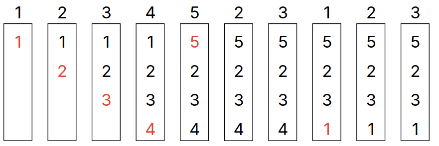

# Lecture 28, Apr 2, 2024

## Clock Page Replacement

* The clock replacement algorithm is an approximation of the LRU algorithm that is cheap to implement
	* Maintain a circular list of pages in memory, with each page having a reference bit, indicating whether it was recently accessed
		* The reference bit is usually stored in the PTE
	* An iterator or "hand" points to the next page to be replaced
	* When inserting a new page, check the reference bit of the page under the hand; if it is zero, replace the page and advance the hand; if it is one, set it to zero, don't replace the page, advance the hand and check the next page
	* When a page is accessed (that is already loaded), the reference bit is set to 1
		* This is normally done automatically by the MMU so we get it for free
		* The hand is not advanced

{width=60%}

* Initially we will load all pages into memory in order and fill the entire circular list
	* The first time we access an unloaded page, all loaded pages will have a reference bit of 1, so the hand has to go a full circle
	* After the hand goes a full circle and sets all reference bits to 0, we're back to the original page being pointed, which is the page being replaced
* For performance, we may choose to disable swapping altogether; sometimes it might make more sense to know that we've ran out of memory, rather than having things run slowly
	* Linux has an out of memory (OOM) killer which kills processes that use a lot of memory when the system runs out
* Increasing the page size allows for speedups; some systems use sizes such as 2 MiB (eliminate the lowest level of page table), or even 1 GiB (eliminate two levels of page tables)
	* 2 MiB is usually known as "huge pages" and 1 GiB is known as "gigapages"
	* Larger pages means we can cache more memory in the TLB
	* However this leads to more fragmentation (if we only use a small amount of memory, we still need to use an entire page)

