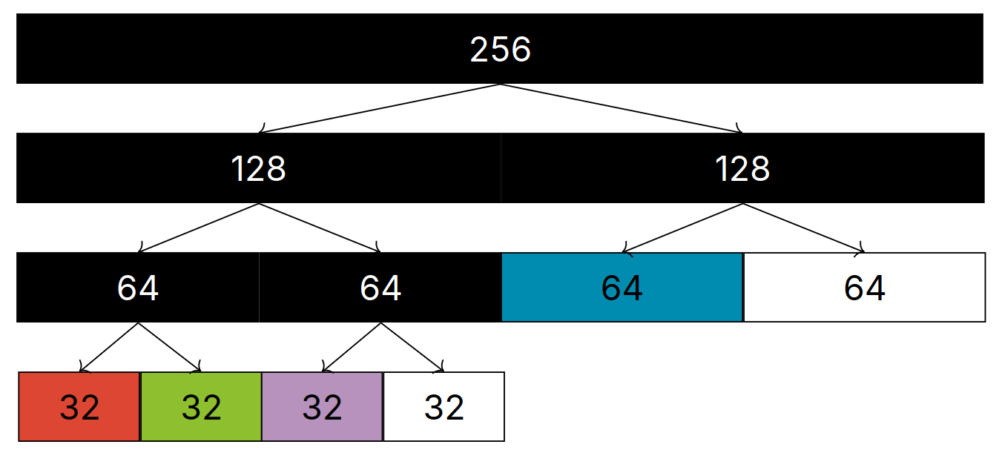
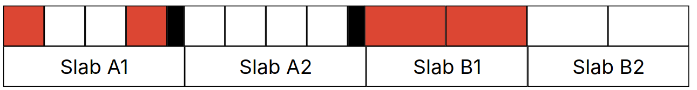

# Lecture 30, Apr 5, 2024

## Buddy and Slab Allocators

* We will look at memory allocation schemes for the kernel
	* Algorithms are designed to be fast and less general than `malloc()`
* With allocators, we want fast searching of free blocks and merging of freed blocks
* *Buddy allocators* restrict all allocations to powers of 2, up to $2^k, 0 \leq k \leq N$; blocks are split into two recursively until the request can be handled
	* The implementation would use a free list for each block size, with $N + 1$ free lists in total
	* To allocate a block of $2^k$, search the free list corresponding to $k$ to find a block of that size
		* If there is no free block of that size, check the free list for $k + 1$ (i.e. double the size) and so on
		* After we find a block that is big enough, recursively break the block into two until we reach size $2^k$ as requested
	* Every time a block is broken into two, the two halves become *buddies*
		* The unused buddy is inserted back into the correct list as a free block
	* When a block is freed, if its buddy is also free, it is merged with its buddy to become a larger block
		* Blocks are recursively merged if needed
		* Due to the power-of-two setup, we can look at the memory addresses to easily check if two blocks are buddies by checking for equal bits in the addresses

{width=60%}

* Linux uses buddy allocators
* Buddy allocators are fast and doesn't have external fragmentation (for the most part), but relies on the user to reduce internal fragmentation since allocated memory is always in powers of two
* *Slab allocators* allocate only fixed size chunks of memory; used for allocating objects of the same size from a pool
	* Each allocation size has a corresponding *slab* of slots; one slot holds one allocation
	* A bitmap is used to keep track of which blocks are in use
	* When allocating a block, set the corresponding bit and return the slot
	* When freeing a block, just clear the bit
	* This is how inodes and blocks are allocated in the ext filesystems
* Slab allocators completely prevent fragmentation, if we only need memory blocks of a fixed size
* We can mix the two allocators, e.g. allocating slabs with a buddy allocator or putting a slab allocator on top of a buddy allocator

{width=70%}

