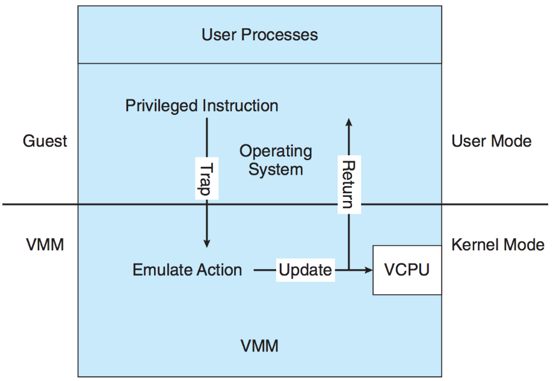

# Lecture 31, Apr 9, 2024

## Virtual Machines

* The goal of a virtual machine is to be able to run multiple OSes on the same system; to each OS, it appears as if it is the only one running
	* The *host* is the machine that the OSes are running on, which will have its own OS
		* A *guest* OS sees its own virtual copy of the host
	* The VM is isolated from the host for security
* The *hypervisor* or *virtual machine manager* (VMM) controls virtual machines, including creation, management and isolation
	* Type 1: *bare metal hypervisor*, which runs directly on the host hardware, with special hardware support
		* Kernel will run in kernel mode, so the hypervisor has even higher privileges than kernel mode
	* Type 2: *hosted hypervisor*, which runs as a normal process on the host's OS and simulates a hardware hypervisor
		* Slower but no need for specialized hardware

{width=60%}

* Note VMs are not the same as *emulation* (which typically translates one ISA to another); the guest executes instructions directly using the same ISA as the underlying hardware
	* A VM could use emulation, but this introduces heavy performance penalties
* VMs enable pause and play; just like the kernel can pause a process, a hypervisor can pause an entire OS
	* To enable this, the hypervisor does context switching between virtual machines
	* The guest can be moved between machines without its knowledge just like a process
	* This can be useful in e.g. cloud compute services
* Each guest is isolated from each other and the host
	* The hypervisor can set limits on CPU, memory, network bandwidth, disk space, etc
	* Guests can only access its own virtual hardware, which is useful for experimentation
* VMs can help consolidation
	* In a datacenter, there are often many servers that don't make use of all of their resources (e.g. one is using a lot of CPU and one is using a lot of memory)
	* Using VMs we can have different servers share the same hardware to be more efficient
* A *virtual CPU* (VCPU) saves all of the state of the entire CPU, allowing the hypervisor to pause and context switch guests
	* This is similar to a PCB, but a PCB only saves enough data for a user-mode process
	* When a VM is resumed, it loads the VCPU info and resumes the guest
* Each guest still uses user and kernel modes, without any change to their code
	* The kernel can still use privileged instructions
	* For type 1 hypervisors, the CPU's hypervisor mode is used to enter a privilege level higher than kernel mode
	* For type 2 hypervisors, the host/hypervisor needs to create a virtual kernel and user mode and emulate/simulate the hardware

{width=50%}

* Type 2 hypervisors need extra strategies to simulate kernel mode instructions that the guest is attempting to run
	* *Trap-and-emulate* is the strategy of running the guest in user mode, and trapping any instructions that can only execute in kernel mode
		* The errors are caught and explicitly handled by the hypervisor to emulate/simulate the operation
		* The VCPU state is updated according to the instruction, and then we return to the guest
		* This significantly slows down these instructions
	* Trap-and-emulate doesn't always work; there are instructions that can be both kernel mode and user mode
		* e.g. on x86, the `popf` instruction loads flags from the stack, which is different if the instruction is executing in kernel mode vs. user mode
		* Such instructions would not generate a trap and would just always behave as if it were in user mode
	* These special instructions need *binary translation*; when the VCPU is in kernel mode (according to the guest), then hypervisor inspects every instruction before execution, and handles any special instructions
		* We trap the user to kernel mode switch instruction
		* When the guest is in kernel mode, all instructions can be run natively as normal
		* Overall performance suffers a lot, but it works fine most of the time
		* This is how Valgrind works

{width=50%}

* Intel and AMD both introduced virtualization as a standard in CPUs in the mid-2000s (VT-x/VMX and AMD-V/SVM)
	* This adds the concept of "ring -1", which is the hardware hypervisor mode
	* The host OS kernel claims the hypervisor, allowing it to manage the isolation for guests
* A hypervisor needs to perform scheduling between CPUs on the host machine
	* Virtual CPUs in the guest are mapped to physical CPUs; the number of CPUs may not be the same
	* The simplest approach is CPU assignment, which maps VCPUs to physical cores one-to-one, with the host using spare physical cores
		* This only works if there are more physical cores than VCPUs
	* If there are more VCPUs than host CPUs, we need to use a scheduling algorithm like for processes; this is called *overcommitting*
		* Overcommitting leads to very bad performance for soft real-time tasks on the guest
			* Processes may be context switched out even when the guest is not trying to do so
		* In this case virtualization has a different observable behaviour
* The hypervisor also needs to manage virtual memory between VMs
	* The hypervisor translates the guest's page tables to the real physical page table
		* Each guest kernel is still trying to do its own page management
		* This leads to a nested page table
		* If there is hardware support, the MMU can use the nested page tables and do both steps of the translation at once, avoiding the slowdown
	* Memory can also be overcommitted
		* The hypervisor can have a swap space, leading to double paging
		* However the hypervisor doesn't have a good idea of the guest's memory access patterns, so page replacement is usually left to the guest
* Guests could share pages if they are duplicates, like copy-on-write
	* The hypervisor detects duplicates by hashing the page contents; when hashes are the same, check each byte individually to confirm
* The hypervisor also provides virtualised I/O, e.g. network interfaces
	* One physical device can be multiplexed to many virtual devices
	* The hypervisor can also emulate nonexistent devices
	* Direct mapping from physical devices to virtual devices can also be used to give the VM exclusive access to the device
		* The hypervisor still does translation in the middle
		* IOMMU is a new hardware solution that removes the hypervisor in these cases to improve performance
* VMs boot from a virtualised disk, which is specified using a disk image
	* The images contain partitions and filesystems within the partitions similar to a physical disk
	* The disk image is often one big file; some formats allow for splitting
	* The disk image is easily moved to move the VM
* VMs can be used to isolate an application; the app is packaged with all its dependencies into the VM image, so ABI changes on the host won't affect it
	* However we pay the cost of VM overhead
	* For smaller apps, the kernel itself likely takes up a lot of the VM
	* *Containers* (e.g. Docker) are lighter-weight alternatives that use mechanisms on the host OS, e.g. control groups (`cgroups`) on Linux for process isolation
		* Unlike a VM, the contained application shares the same kernel as the host
		* Processes inside the container are still isolated, and its resources can still be limited

