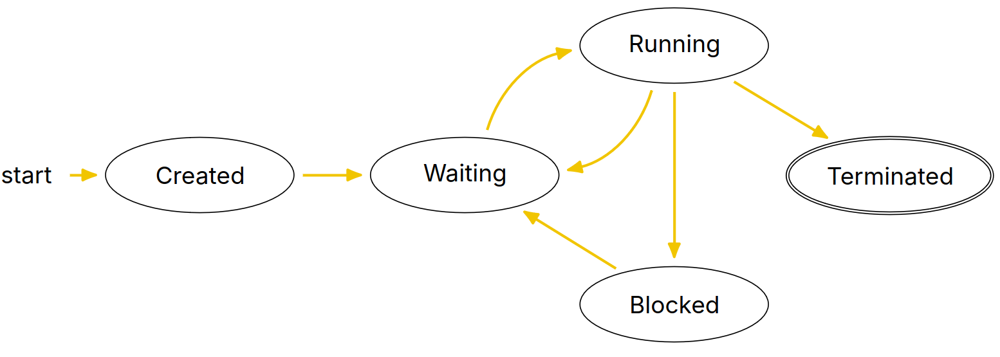

# Lecture 4, Jan 16, 2024

## Process Creation

* A *Process Control Block* (PCB) contains all information about a process
	* This includes:
		* Process state
		* CPU registers
		* Scheduling information
		* Memory management information
		* I/O status
		* Anything else that the process needs
	* In Linux this is the `task_struct` struct

{width=80%}

* Each process goes through a lifecycle as depicted above
	* The "waiting" state means a process is ready to run, but the CPU is not running it yet (due to scheduling)
	* The "blocked" state means a process is waiting for I/O and cannot be run
* In Linux, the `/proc` directory contains a special filesystem that present the kernel's state
	* Every directory that is a PID that represents a process
* Processes could be created from scratch; we can load the program into memory and create the PCB (which is what Windows does), but on Unix this works differently
* On Unix systems, instead of creating a new process, we can clone an existing process
	* This clones the entire PCB of the old process, so everything is copied, including variables
	* The two processes are distinguished using a parent-child relationship
	* We could then allow either process to load a new program and set up a new PCB
* To clone a process, use the `pid_t fork(void);` function (note `typedef int pid_t`)
	* The return value is the PID of the child process, or 0 if currently in the child process, or -1 on failure
	* Syscalls `pid_t getpid();` can be used to get the current process PID; `pid_t getppid();` gets the parent process PID
		* Note: `man <func>` can be used to view the manual pages (documentation) for syscalls and library functions
* `int execve(const char *pathname, char *const argv[], char *const envp[]);` replaces the current process with another program and resets
	* `pathname` is the full path of the program; `argv` are the program args; `envp` are the environment variables
		* Note: the first element of `argv` should still be set to the program name
	* Returns -1 on failure and sets `errno`
	* This allows a process to be replaced with another one; so to execute another program from a process, we can `fork()` and call `execve()` in the child process

