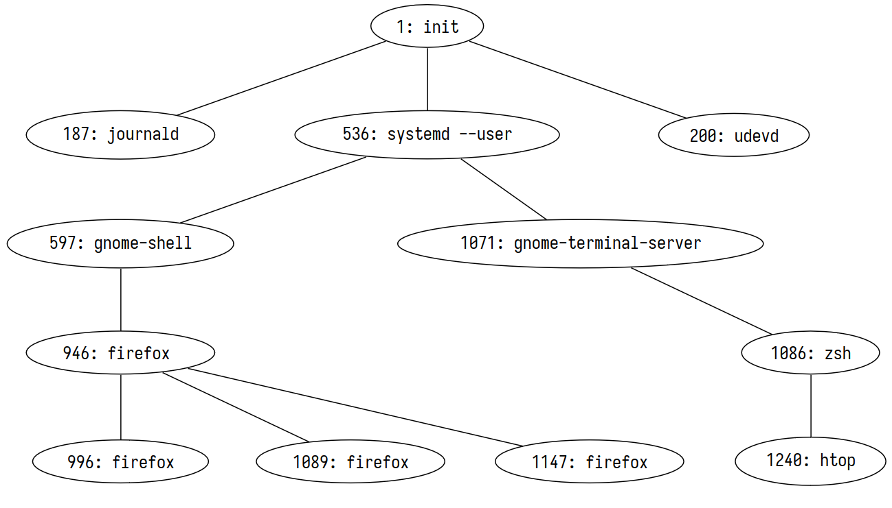

# Lecture 5, Jan 17, 2024

## Process Management

* On Linux a process's state can be read through `/proc/<PID>/status`:
	* R: Running and runnable (running/waiting)
	* S: Interruptible sleep (blocked; can be resumed by the kernel if desired)
	* D: Uninterruptible sleep (blocked; cannot be resumed since it is waiting on I/O)
	* T: Stopped (can be continued explicitly by the user or another process)
	* Z: Zombie
* On Unix systems the kernel launches a single user process, `init`, which is the parent of all other processes
	* This is located at `/sbin/init`, and is usually `systemd`
	* This executes every other process on the machine and must always be active; if it exits the kernel will think you're shutting down
	* Some OSes will also create an idle process (e.g. Windows)

{width=80%}

* Each process is assigned a process ID (PID) on creation, which does not change and is unique for every active process
	* On most Linux systems this goes up to 32768; 0 is reserved/invalid
	* The OS can recycle a PID after the process dies
	* Each process has its own *address space* (i.e. its own copy of virtual memory)

### Zombies and Orphans

* The parent is responsible for the child and should acknowledge when the child terminates
* If the child exits first, it becomes a *zombie process* until the parent reads its exit status
	* The PCB cannot be removed by the OS until its exit status is read
	* Use the `pid_t wait(int *status);` syscall to check the child's status
		* Returns -1 on failure, 0 for nonblocking calls with no child changes, and the PID of the child on success
			* If there are multiple children, it returns the PID of the first child to terminate
		* The child's status is written to the address `*status`, which is a bit mask
		* Use macros such as `WIFEXITED()`, `WEXITSTATUS()` etc to check specifics about the status
	* `wait()` is a *blocking* system call, i.e. it will not return until the child is terminated
	* The `waitpid()` syscall can be used to check on a child with a specific PID, and allows nonblocking calls
* When a child terminates the OS sends the parent a *signal* (`SIGCHLD`) to ask the parent to acknowledge the child
	* The parent is free to ignore this
	* If the parent always ignores it, the child will stay as a zombie until the parent dies, at which point it becomes an orphan and gets re-parented
* If the parent exits first, the child becomes an *orphan process*
	* Since some process still needs to acknowledge the child's exit, it needs a new parent
	* The OS will re-parent the child, usually to `init`
		* Note: A *subreaper* process (relatively new Linux feature) will take the place of `init` and adopt all orphans that are descendant from it

