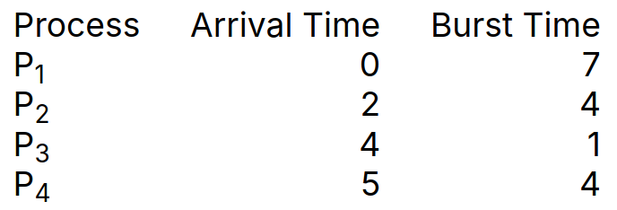
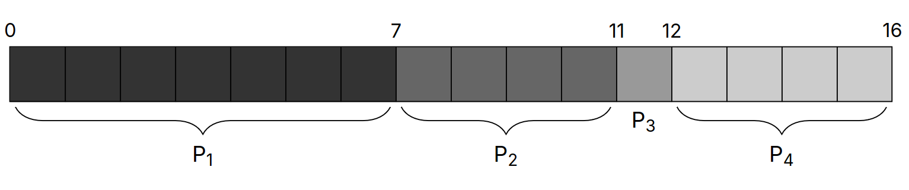
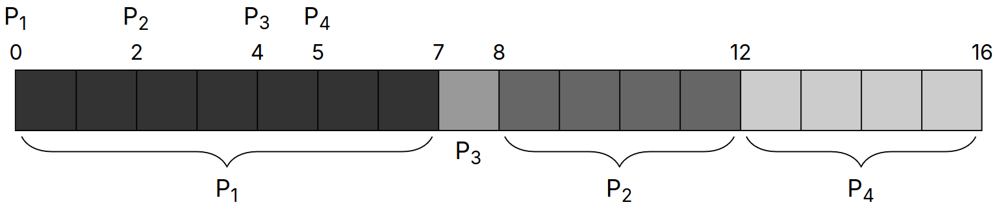
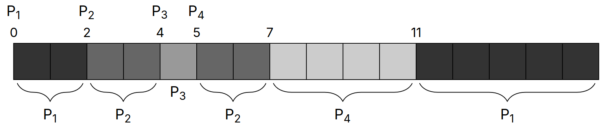
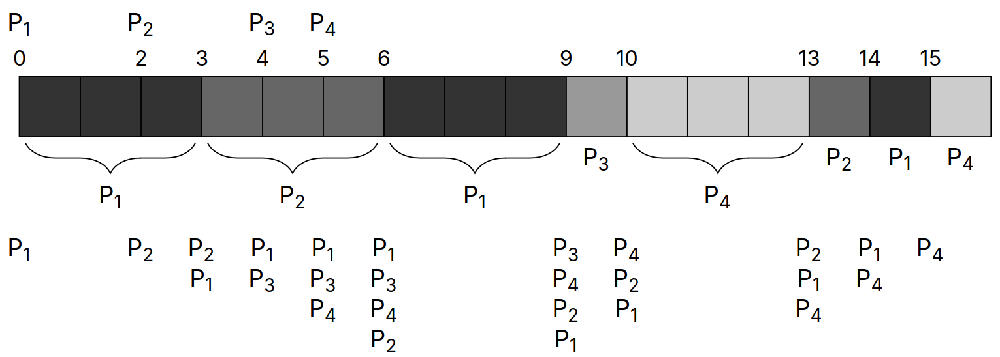

# Lecture 9, Jan 26, 2024

## Scheduling

* A resource is *preemptible* if it can always be taken away and used for something else at any time
	* e.g. a CPU is preemptible since we can perform context switching to use it for another process at any time
* A *non-preemptible* resource cannot be taken away with acknowledgement
	* e.g. memory and disk space
	* In this case, it is shared through allocations and deallocations
	* Some systems may allow you to allocate CPUs
* Scheduling is done by two components: the *dispatcher* and the *scheduler*
	* The dispatcher is a low-level mechanism that does the actual work of context switching
	* The scheduler is a high-level policy that decides which processes to run and when
		* The scheduler runs whenever a process changes state
		* For non-preemptible processes, once started they have to run until completion
* Process scheduling involves balancing the following tradeoffs:
	* Minimize waiting time and response time
		* The waiting time of each process is the time that it exists minus the amount of time it is actually executing
		* The response time is the time it waited from arrival until its first time on the CPU
	* Maximize CPU utilization
	* Maximize throughput
		* By extension, we should minimize context switching whenever possible since it introduces overhead
	* Try to achieve fairness
* The *burst time* of a process is the amount of time a process runs

### First Come First Served (FCFS) Scheduling

* The most basic form of scheduling, assumes no preemption
* The first process that arrives gets the CPU
* Processes are stored in a FIFO queue in arrival order

{width=40%}

{width=70%}

### Shortest Job First (SJF)

* A tweak to FCFS to schedule the job with the shortest burst time first (still assumes no preemption)
* Theoretically, compared to FCFS this could reduce the waiting time of processes since shorter jobs are run first
	* In fact, SJF is provably optimal at minimizing wait time with no preemption
* However, SJF is not practical since we don't actually know the burst times of each process
* Furthermore, SJF starves long-running processes (shorter processes will always get in front of longer processes, so the longer process can never execute)

{width=70%}

### Shortest Remaining Time First (SRTF)

* Adapts SJF to work for preemptions
* Any time a new process arrives, the process with the least remaining runtime gets switched to and executed
* Further reduces waiting time compared to SJF but again impractical

{width=70%}

### Round-Robin (RR)

* Incorporates fairness unlike the previous algorithms, and actually used in practice
* Execution is divided into time slices (aka *quanta*) and uses a FIFO queue similar to FCFS; if a process is still running by the end of its time slice, we preempt it and add it to the back of the queue to ensure fairness
* On a tie (new process arrives when previous one is preempted), favour the new process first
* Generally RR performance depends a lot on the quantum length and job length
	* Typically it has the advantages of low response time and good interactivity, with fair allocation of the CPU and low average waiting time (when job lengths vary)
	* If the time slice is too big, this reduces to FCFS; if the time slices are too small, the processes are preempted all the time, so a lot of time is wasted doing context switching
		* Generally we want time spent context switching to be less than 1%
		* We can reduce the time slice size until context switching overhead reaches 1%
	* Average waiting time is poor when jobs have similar lengths

{width=70%}

