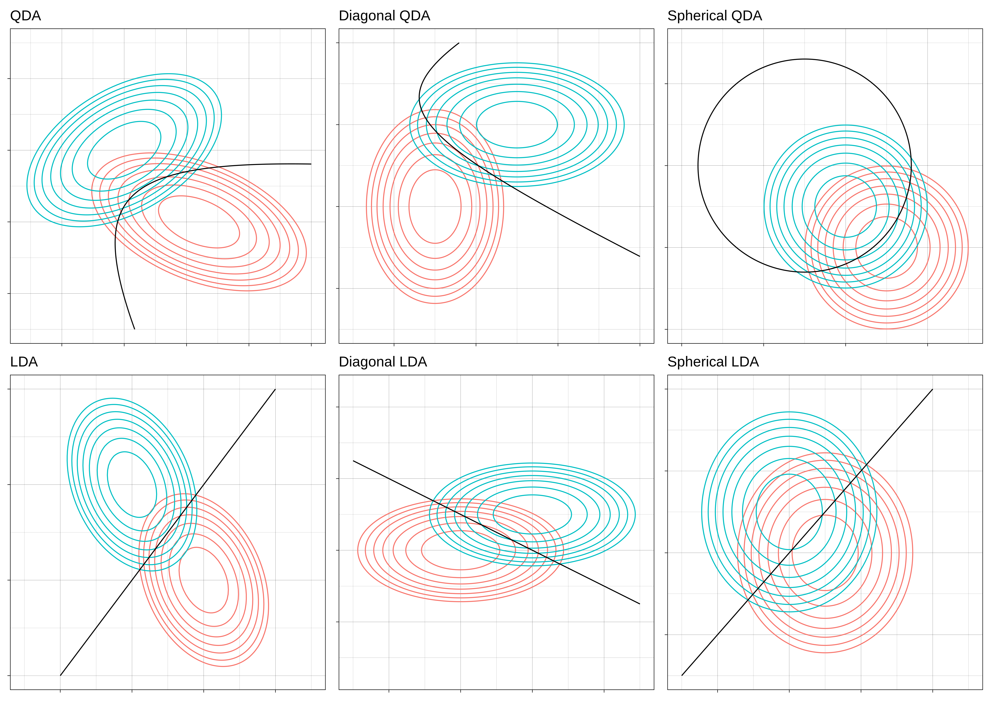

# Lecture 11, Feb 12, 2024

## Gaussian Discriminant Analysis

* Consider a classification problem where we have classes $c \in C$, each having a prior $\pi _c$, jointly Gaussian distributed with a mean of $\bm\mu _c$ and a covariance of $\bm\Sigma _c$
* Gaussian discriminant analysis is a special case of hypothesis testing for this type of classification problem; given an observation of the vector $\bm X$, we would like to know which class it came from (i.e. which hypothesis is true)
* Consider the case where all the classes have the same covariance $\bm\Sigma$, so they differ only by their mean
	* The posterior is $P[y = c | \bm x] = \frac{f(\bm x | c)\pi _c}{\sum _{c'} f(\bm x | y = c')\pi _c'}$
	* The numerator becomes $\frac{e^{-\frac{1}{2}(\bm x - \bm\mu _c)^T\bm\Sigma^{-1}(\bm x - \bm\mu _c)}}{(2\pi)^\frac{D}{2}\sqrt{\det{\bm\Sigma}}}\pi _c = \frac{e^{-\frac{1}{2}\bm x^T\bm\Sigma^{-1}\bm x}}{(2\pi)^\frac{D}{2}\sqrt{\det{\bm\Sigma}}}\exp\left[-\frac{1}{2}\bm\mu _c^T\bm\Sigma^{-1}\bm\mu _c + \bm\mu _c^T\bm\Sigma^{-1}\bm x + \log\pi _c\right]$
	* Let $\bm\beta _c^T = \bm\mu _c^T\bm\Sigma^{-1}$ and $\bm \gamma _c = \log\pi _c - \frac{1}{2}\bm\mu _c^T\bm\Sigma^{-1}\bm\mu _c$
	* The exponential can then be written as $p(y = c | \bm x) = \frac{\exp(\bm\beta _c^T\bm x + \bm \gamma _c)}{\sum _{c'}\exp(\bm\beta _{c'}^T\bm x + \bm\gamma _{c'})}$
		* This is a softmax function
		* The exponential in the softmax makes it so that the largest term dominates while all other terms are usually much smaller
		* Each class has an associated $\bm\beta _c$ and $\bm\gamma _c$, which contains all the info of the class
	* With this, we have $p(y = c | x) \approx \twocond{1}{\bm\beta _c^T\bm x + \bm\gamma _c \gg \bm\beta _{c'}^T\bm x + \bm\gamma _{c'}}{0}{\text{otherwise}}$
	* The decision rule is $\hat y(\bm x) = \argmax _c \bm\beta _c^T + \bm\gamma _c$
	* This is referred to as *linear Gaussian discriminant analysis*, since the decision boundary is a linear function of $\bm x$
		* The boundary occurs where $\bm\beta _1^T\bm x + \bm\gamma _1 = \bm\beta _0^T\bm x + \bm\gamma _0$ which forms a hyperplane
* More generally, the covariances of the classes are different
	* $\log p(y = c | \bm x) = -\frac{1}{2}(\bm x - \bm\mu _c)^T\bm\Sigma _c^{-1}(\bm x - \bm\mu _c) - \frac{1}{2}\det\bm\Sigma _c + \log \pi _c - \frac{D}{2}\log 2\pi$
	* Consider the boundary between two regions:
		* $-\frac{1}{2}\bm x^T\bm\Sigma _1^{-1}\bm x + \bm\mu _1^T\bm\Sigma _1^{-1}\bm x - \frac{1}{2}\log\det\bm\Sigma _1 + \log\pi _1 = -\frac{1}{2}\bm x^T\bm\Sigma _0^{-1}\bm x + \bm\mu _0^T\bm\Sigma _1^{-1}\bm x - \frac{1}{2}\log\det\bm\Sigma _0 + \log\pi _0$
		* $\bm x^T(\bm\Sigma _1^{-1} - \bm\Sigma _0^{-1})\bm x + 2(\bm\Sigma _0^{-1}\bm\mu _0 - \bm\Sigma _1^{-1}\bm\mu _1)^T\bm x + (\bm\mu _0^T\bm\Sigma _0^{-1}\bm\mu _0 - \bm\mu _1^T\bm\Sigma _1^{-1}\bm\mu _1) + \log\frac{\det\bm\Sigma _0}{\det\bm\Sigma _1} + 2\log\frac{\pi _1}{\pi _0} = 0$
		* This is a quadratic form that can define a parabola, hyperbola, or even circles and ellipses
* To obtain the parameters of the Gaussian distribution of each class, we can use ML estimation
	* $\hat\pi _c = \frac{n_c}{n}$ is given by the relative frequency of class $c$
	* $\hat{\bm\mu}_c = \frac{1}{n_c}\sum _i \bm x_i^c$ is given by the sample mean
	* $\hat{\bm\Sigma}_c = \frac{1}{n_c}(\bm x_i^c - \hat{\bm\mu}_c)^T(\bm x_i^c - \hat{\bm\mu}_c)$
	* Note that the variance estimate here is biased; use the version with $n_c - 1$ in the denominator for unbiased

{width=80%}

## Gaussian Parameter Estimation

* Let $\bm X, \bm Y$ be jointly Gaussian and let $\bm w = \cvec{\bm X}{\bm Y}$; we want to find the MAP estimator for $\bm X$ given $\bm Y$
	* i.e. we want to find the distribution of $\bm X$ conditioned on $\bm Y$
	* We will make use of the covariances between elements of $\bm X$ and $\bm Y$
	* Strategy: expand out the exponent of the joint PDF and rearrange it into a form with $\bm X$ as the variable
* The mean of $\bm w$ is $\bm\mu = \cvec{\bm\mu _X}{\bm\mu _Y}$
* The covariance is $\bm\Sigma _w = E[(\bm w - \bm\mu _w)(\bm w - \bm\mu _w)^T] = E\left[\cvec{\bm X - \bm\mu _X}{\bm Y - \bm\mu _Y}\cvec{(\bm X - \bm\mu _X)^T}{(\bm Y - \bm\mu _Y)^T}\right] = \mattwo{\bm\Sigma _{\bm X\bm X}}{\bm\Sigma _{\bm X\bm Y}}{\bm\Sigma _{\bm Y\bm X}}{\bm\Sigma _{\bm Y\bm Y}}$
	* The overall dimension is $N \times N$; the $\bm\Sigma _{\bm X\bm Y}, \bm\Sigma _{\bm Y\bm X}$ matrices are in general rectangular
	* Let the *precision matrix* $\bm\Lambda = \bm\Sigma _w^{-1} = \mattwo{\bm\Lambda _{\bm X\bm X}}{\bm\Lambda _{\bm X\bm Y}}{\bm\Lambda _{\bm Y\bm X}}{\bm\Lambda _{\bm Y\bm Y}}$
		* This is the opposite of variance; the larger the precision, the more tightly concentrated the distribution
		* Note $\bm\Sigma _{\bm X\bm X} \neq \bm\Lambda _{\bm X\bm X}^{-1}$, and $\bm\Lambda _{\bm X\bm Y} = \bm\Lambda _{\bm Y\bm X}^T$
* Now consider the exponent of the joint PDF
	* $\alignedeqn[t]{-\frac{1}{2}(\bm w - \bm\mu _w)^T\bm\Sigma _w^{-1}(\bm w - \bm\mu _w)}{-\frac{1}{2}\cvec{\bm X - \bm\mu _X}{\bm Y - \bm\mu _Y}^T\mattwo{\bm\Lambda _{\bm X\bm X}}{\bm\Lambda _{\bm X\bm Y}}{\bm\Lambda _{\bm Y\bm X}}{\bm\Lambda _{\bm Y\bm Y}}\cvec{\bm X - \bm\mu _X}{\bm Y - \bm\mu _Y}}{-\frac{1}{2}(\bm X - \bm\mu _X)^T\bm\Lambda _{\bm X\bm X}(\bm X - \bm\mu _X) - \frac{1}{2}(\bm X - \bm\mu _X)^T\bm\Lambda _{\bm X\bm Y}(\bm Y - \bm\mu _Y) - \frac{1}{2}(\bm Y - \bm\mu _Y)^T\bm\Lambda _{\bm Y\bm X}(\bm X - \bm\mu _X) - \frac{1}{2}(\bm Y - \bm\mu _Y)^T\bm\Lambda _{\bm Y\bm Y}(\bm Y - \bm\mu _Y)}{-\frac{1}{2}\left(\bm X^T\bm\Lambda _{\bm X\bm X}\bm X - \bm X^T\bm\Lambda _{\bm X\bm Y}(\bm Y - \bm\mu _Y) + (\bm Y - \bm\mu _Y)^T\bm\Lambda _{\bm Y\bm X}\bm X - \bm\mu _X^T\bm\Lambda _{\bm X\bm X}\bm X - \bm X^T\bm\Lambda _{\bm X\bm X}\bm\mu _X + \dots\right)}{-\frac{1}{2}\left(\bm X^T\bm\Lambda _{\bm X\bm X}\bm X - 2\bm X^T(\bm\Lambda _{\bm X\bm X}\bm\mu _X - \bm\Lambda _{\bm X\bm Y}(\bm Y - \bm\mu _Y)) + \dots\right)}$
	* This gives us $f(\bm x | \bm y)$ and implies that it is jointly Gaussian
	* Let $f(\bm x | \bm y) = c\exp\left[-\frac{1}{2}(\bm x - \bm\mu _{X | Y})^T\bm\Sigma _{X | Y}^{-1}(\bm x - \bm\mu _{X | Y})\right] = c\exp\left[-\frac{1}{2}\left(\bm x \sigma _{\bm X\bm Y}^{-1}\bm x - 2\bm x^T\bm\Sigma _{\bm X\bm Y}^{-1}\bm\mu _{X | Y}\right)\right]$
	* By matching terms we see $\bm\Sigma _{\bm X\bm Y} = \bm\Lambda _{\bm X\bm X}^{-1}$ and $\bm\mu _{X|Y} = \bm\mu _X - \bm\Lambda _{\bm X\bm X}^{-1}\bm\Lambda _{\bm X\bm Y}(\bm y - \bm\mu _Y)$
	* Therefore $f_{\bm X | \bm Y}(\bm x | \bm y) \sim \mathcal N(\bm\mu _{X | Y}, \bm\Sigma _{X | Y})$
* Given this PDF, we can see that the MAP estimate is simply $\bm\mu _{X | Y}$
	* We can show that this is the same as the LMS estimate
	* However, we only have this in terms of the precision matrix; can we find it in terms of $\bm\Sigma$?
* Using the Schur complement on $\bm\Sigma^{-1}$ we can find a general expression for each of the $\bm\Lambda$
	* $\bm\Lambda _{\bm X\bm X} = (\bm\Sigma _{\bm X\bm X} - \bm\Sigma _{\bm X\bm Y}\bm\Sigma _{\bm Y\bm Y}^{-1}\bm\Sigma _{\bm Y\bm X})^{-1}$
	* $\bm\Lambda _{\bm X\bm Y} = (\bm\Sigma _{\bm X\bm X} - \bm\Sigma _{\bm X\bm Y}\bm\Sigma _{\bm Y\bm Y}^{-1}\bm\Sigma _{\bm Y\bm X})^{-1}\bm\Sigma _{\bm X\bm Y}\bm\Sigma _{\bm Y\bm Y}^{-1}$
	* Therefore $\bm\mu _{X|Y} = \bm\mu _X + \bm\Sigma _{\bm X\bm Y}\bm\Sigma _{\bm Y\bm Y}^{-1}(\bm y - \bm\mu _Y)$, $\bm\Sigma _{X|Y} = \bm\Sigma _{\bm X\bm X} - \bm\Sigma _{\bm X\bm Y}\bm\Sigma _{\bm Y\bm Y}^{-1}\bm\Sigma _{\bm Y\bm X}$
	* We get both the mean of the estimate and its sprea

