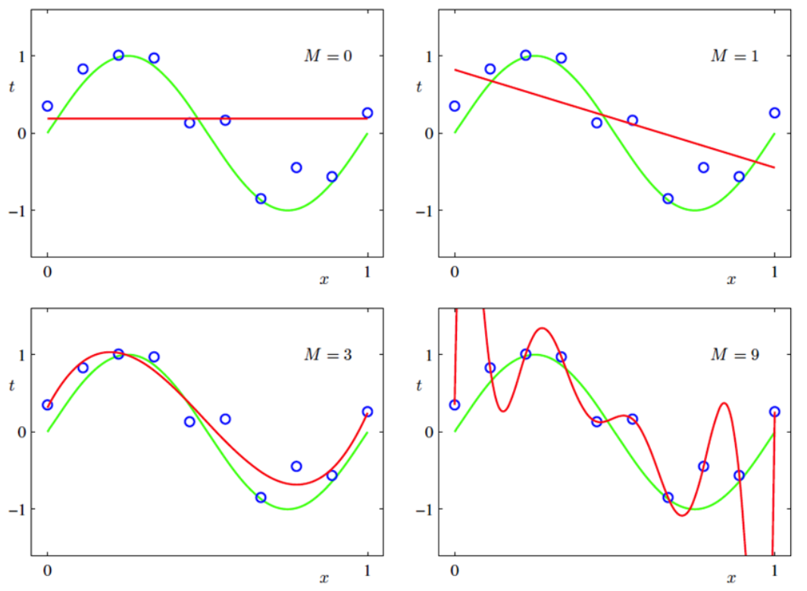

# Lecture 13, Feb 26, 2024

## Linear Regression

* Consider a linear model $Y = \bm w^T\bm X + Z$ where we have $n$ noisy measurements $y_i$ from $n$ inputs $\bm x_i$
	* Assume $Z$ is some IID Gaussian random noise
	* Given these measurements, our goal is to find the best set of weights $\bm w^T = \rvec{w_1}{\dots}{w_D}$
	* Each weight $w_j$ corresponds to the $j$th coefficient of $\bm x$, which has dimension $D$
* Form the *design matrix* $\matthreetwo{\bm x_1^T}{y_1}{\vdots}{\vdots}{\bm x_n^T}{y_n}$
* Consider the MLE $\alignedeqntwo[t]{\hat{\bm w}_\text{ML}}{\argmax _{\bm w \in \reals^D} \log p((\bm x_1, y_1), \dots, (\bm x_n, y_n) | \bm w)}{\argmax _{\bm w \in \reals^D} \log \prod _{i = 1}^n p(\bm x_i, y_i | \bm w)}{\argmax _{\bm w \in \reals^D} \sum _{i = 1}^n \log\left(\frac{1}{\sqrt{2\pi}\sigma}e^{-\frac{1}{2\sigma^2}(y_i - \bm w^T\bm x_i)^2}\right)}{\argmax _{\bm w \in \reals^D} -\sum _{i = 1}^n (y_i - \bm w^T\bm x_i)^2}{\argmin _{\bm w \in \reals^D} \bm e^T(\bm w)\bm e(\bm w)}$
	* Where the error vector is $\bm e(\bm w) = \cvec{y_1 - \bm w^T\bm x_1}{\dots}{y_n - \bm w^T\bm x_n} = \bm y - \cvec{\bm x_1^T}{\vdots}{\bm x_n^T}\bm w$
	* This is now a *least squares regression problem*
	* Let $\bm X = \cvec{\bm x_1^T}{\vdots}{\bm x_n^T}$ then we have $\argmin _{\bm w \in \reals^D} (\bm y - \bm X\bm w)^T(\bm y - \bm X\bm w)$
	* Expand: $\frac{1}{2}\bm w^T\bm X\bm X\bm w - \bm w\bm X^T\bm y + \frac{1}{2}\bm y^T\bm y$ (note a factor of $\frac{1}{2}$ was added)
	* Derivative: $\bm X^T\bm X\bm w - \bm X^T\bm y = 0 \implies \bm X^T\bm X\bm w = \bm X^T\bm y$
	* Therefore $\hat{\bm w}_\text{ML} = (\bm X^T\bm X)^{-1}\bm X^T\bm y$
* Another way to write this is $\bm X^T(\bm X\bm w - \bm y) = 0$, meaning we can interpret this as making the error vector orthogonal to all the input data
	* This is the *normal equation*
* $\bm X^T\bm X$ is the *scatter matrix*
	* This is an estimate of the covariance/correlation matrix of the data
* Regression can be performed in any general vector space, so our model can be nonlinear in $\bm x$ (but still linear in $\bm w$)
	* In general given any basis function $\bm \phi(\bm x_i)$ we can try to fit $y_i = \bm w^T\bm \phi(\bm x_i) + z_i$
	* Let $\bm X = \cvec{\bm\phi^T(\bm x_1)}{\vdots}{\bm\phi^T(\bm x_n)}$ then $\hat{\bm w}_\text{ML} = (\bm X^T\bm X)^{-1}\bm X^T\bm y$ 
	* e.g. we can work in the vector space of polynomials to perform polynomial regression, or the space of sinusoids for a Fourier series
		* For $d$-degree polynomial regression we'd have $\bm\phi^T(x_i) = \rvec{1}{x_i}{x_i^2}{\dots}{x_i^d}$
	* Example: measuring the height of a cannonball $h_i$ vs. time $t_i$ for $i = 1, \dots, n$
		* Use the model $h_i = w_1t_i + w_2t_i^2 + z_i = \bm w^T\bm x_i + z_i$ where $\bm x_i = \cvec{t_i}{t_i^2}$

### Bayesian Regression -- Regularization

{width=70%}

* If we make the model too complex, i.e. too high of a dimension for $\bm\phi$, we will get overfitting
* Typically when the model overfits, we get very large weights that are not physically realistic for our system
	* To keep the weights down, we can use regularization
	* Here we show a way to derive the same result by instead assuming a prior on $\bm w$
* Assume that each weight has a prior $w_i \sim \mathcal N(0, \tau^2)$; now can find the MAP estimate
* $\alignedeqntwo[t]{\hat{\bm w}_\text{MAP}}{\argmax _{\bm w \in \reals^D} p((\bm\phi(x_1), y_1), \dots, (\bm\phi(x_n), y_n))p(\bm w)}{\argmax _{\bm w \in \reals^D} \sum _{i = 1}^n\left[\log \left(\frac{1}{\sqrt{2\pi}\sigma}e^{-\frac{1}{2\sigma^2}(y_i - \bm w^T\bm\phi(\bm x_i))^2}\right) + \sum _{j = 1}^D \log \frac{1}{\sqrt{2\pi}\tau}e^{-\frac{w_j^2}{2\tau^2}}\right]}{\argmin _{\bm w \in \reals^D} \sum _{i = 1}^n (y_i - \bm w^T\bm \phi(\bm x_i))^2 + \frac{\sigma^2}{\tau^2}\norm{\bm w}^2}{\argmin _{\bm w \in \reals^D} \sum _{i = 1}^n (y_i - \bm w^T\bm \phi(\bm x_i))^2 + \lambda\norm{\bm w}^2}$
	* The first term is the same least squares term as before, but now we have an additional term that penalizes the norm of $\bm w$, effectively keeping the weights small
	* Let $\bm e(\bm w) = \cvec{y_1}{\vdots}{y_n}{\bm 0} - \cvec{\bm\phi^T(\bm x_1)}{\vdots}{\bm\phi^T(\bm x_n)}{-\sqrt{\lambda}\bm 1}\cvec{w_1}{\vdots}{w_D}$ and $\tilde{\bm X} = \cvec{\bm\phi^T(\bm x_1)}{\vdots}{\bm\phi^T(\bm x_n)}{-\sqrt\lambda\bm 1}$
		* The error can again be written as $\bm e^T(\bm w)\bm e(\bm w)$
	* Using the same derivation as before, $\hat{\bm w}_\text{MAP} = (\tilde{\bm X}^T\tilde{\bm X})^{-1}\tilde{\bm X}^T\cvec{\bm y}{\bm 0} = (\bm X^T\bm X + \lambda\bm 1)^{-1}\bm X^T\bm y$
	* Notice that this result is almost the same as the MLE solution, except with the addition of $\lambda\bm 1$
	* This is known as *ridge regression*
* We can also solve this by writing it as a Gaussian system
	* $\cvec{Y_1}{\vdots}{Y_n} = \cvec{\bm x_1^T}{\vdots}{\bm x_n^T}\cvec{W_1}{\vdots}{W_D} + \cvec{Z_1}{Z_n} \iff \bm y = \bm X\bm w + \bm z$
	* $\hat{\bm w}_\text{MAP}(\bm y) = (\bm\Sigma _{W}^{-1} \bm X^T\bm\Sigma _Z^{-1}\bm X)^{-1}\left(\bm X^T\frac{1}{\sigma^2}\bm y + \frac{1}{\tau^2} \cdot 0\right) = (\bm X^T\bm X + \frac{\sigma^2}{\tau^2}\bm 1)^{-1}\bm X^T\bm y$
	* This gives us the conditional precision $\bm\Sigma _{X|Y}^{-1} = \frac{1}{\tau^2}\bm 1 + \frac{1}{\sigma^2}\bm X^T\bm X$
	* So $\bm\Sigma _{X|Y} = \sigma^2\left(\bm X^T\bm X + \frac{\sigma^2}{\tau^2}\bm 1\right)^{-1}$
		* Notice that $\bm X^T\bm X + \frac{\sigma^2}{\tau^2}\bm 1$ is related to the covariance
		* As we collect more data the added term becomes negligible
		* $\bm X^T\bm X$ becomes bigger so the covariance shrinks

