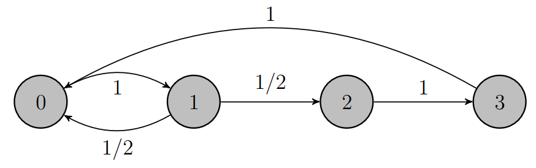

# Lecture 15, Mar 11, 2024

## Discrete-Time Markov Chains

* A *Markov chain* is a discrete-valued random sequence $X_n$ where the future is of the process given the present is independent of the past, i.e. $P[X_{n + 1} | X_1, \dots, X_n] = P[X_{n + 1} | X_n]$
	* The present $X_n$ is known as the *state*
* Example: sum process $S_n = X_1 + \dots + X_n = S_{n - 1} + X_n$ where $X_i$ are IID, $S_0 = 0$
	* $P[S_{n + 1} = s_{n + 1} | S_n = s_n, \dots, S_1 = s_1] = P[X_n = s_{n + 1} - s_n] = P[S_{n + 1} = s_{n + 1} | S_n = s_n]$
* $P[X_3, X_2, X_1] = P[X_3 | X_2]P[X_2 | X_1]P[X_1]$ due to the Markov property
	* The latter is a lot easier to store since we don't have to go over all possible comminations of the 3 variables
	* $P[X_3 | X_2]$ and $P[X_2 | X_1]$ are *transition probabilities*
	* $P[X_1]$ is the *initial probability*
	* The joint PMF of the values is the product of the initial probability and all intermediate transition probabilities
* These transition probabilities could be time-dependent, but often they are constant, in which case the Markov chain has *homogeneous transition probabilities*
	* We only need to store a single version of the transition probability matrix
* $X_n$ is completely specified by $p_i(0)$ and the *transition probability matrix*, where the entry $ij$ denotes the probability of transitioning to state $j$ while in state $i$
	* Each row sums up to 1 since it s a PMF
	* We can also use a *state transition diagram* to visualize this
* Example: speech activity using a Markov model; if packet $n$ was silent, then the probability of silence in the next packet is $1 - \alpha$ and probability of speech activity is $\alpha$
	* Transition matrix: $P = \mattwo{1 - \alpha}{\alpha}{\beta}{1 - \beta}$

{width=40%}

* The transition probability matrix after $n$ steps, $P(n)$, is the original single-step transition matrix raised to the power $n$; $p_{ij}(n)$ denotes the probability of transition for $n$ steps
	* $P(n) = P(n - 1)P = P^n$
	* Suppose we start with some initial state PMF $\bm p(0)$, then after $n$ steps the new distribution will be $\bm p(n) = \bm p(0)P^n$
	* To find a closed-form expression we can diagonalize $P$
* Some Markov chains will have $\lim _{n \to \infty} P(n)$ exist; this will give the asymptotic or steady-state PMF
* Instead of finding an expression for $P^n$, we can find the steady-state PMF more directly, assuming one exists
	* Let the steady-state PMF be $\pi = (\pi _1, \dots, \pi _n)$ and so $p_{ij}(n) = \pi _j$
	* To find the steady-state PMF we solve $\bm\pi = \bm\pi P$ such that $\sum _i \pi _i = 1$
		* Since $\bm\pi$ is a PMF, the first equation only gives $n - 1$ independent equations
		* i.e. when we have this PMF, it remains unchanged by the Markov chain
	* These together are known as the *global balance equations*

### Recurrence Relations in Markov Chains

* When does a Markov chain have steady-state probabilities?
* We can break states into separate *classes*, where each one is of a different type
	* State $j$ is *accessible* from $i$ if there is a sequence of transitions from $i$ to $j$ with nonzero probability
	* States $i$ and $j$ *communicate* if they are accessible from each other (i.e. we can go from $i$ to $j$ and back); this is denoted $i \leftrightarrow j$
		* A state always communicates with itself by definition (even if there are no self edges)
		* $i \leftrightarrow j, j \leftrightarrow k \implies i \leftrightarrow k$
	* States that communicate with each other are in the same *class*
		* States in the same class share the same fate -- they have the same limiting behaviour
	* Classes are always disjoint (i.e. one state cannot be in two different classes; in that case the two classes would communicate with each other so they would be the same)
		* However, states in different classes aren't necessarily independent, since we can still have one-way accessible connections
* The states of a Markov chain consists of one or more disjoint classes; if it has a single class, it is *irreducible*
	* Intuitively this means that we can go from one state to any other state
* A state is *periodic* with period $d$ if it can only re-occur at times that are multiples of $d$, i.e. $p_{ii}(n) = 0$ if $n$ is not a multiple of $d$
	* If the Markov chain is periodic, it's similar to having multiple chains
	* Let $\tau(x)$ be all the possible times that we can visit $x$ (starting from $x$ at time 0); the period of $x$ is the GCD of $\tau(x)$ (same across an entire class)
	* If all states/classes have period 1, the chain is *aperiodic*
* A Markov chain that is irreducible and aperiodic will converge to a stationary distribution (we see this later)

{width=55%}

{width=55%}

* A state $i$ is *recurrent* if the process returns to the state with probability 1, or *transient* if the probability is less than 1
	* For any recurrent state, if we leave it, we know eventually we will come back
	* Whenever we come back we will go through the exact same cycle again
	* For a transient state, when we leave it, it's possible that we won't reach this state again
* Recurrence/transience is a class property; if a state is recurrent then all states in its class will also be recurrent
* To find if a state is recurrent, we sum the probability of returning to the state after all possible number of steps
	* State $i$ is recurrent iff $\sum _{n = 1}^\infty p_{ii}(n) = \infty$
	* State $i$ is transient iff $\sum _{n = 1}^\infty p_{ii}(n) < \infty$
	* e.g. if $p_{00}(n) = \left(\frac{1}{2}\right)^n$, then the sum converges to 2 so it is finite and the state is transient

{width=70%}

{width=60%}

