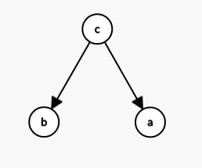
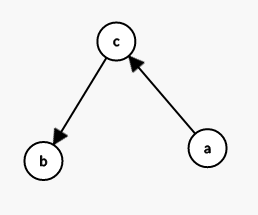
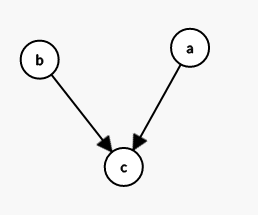
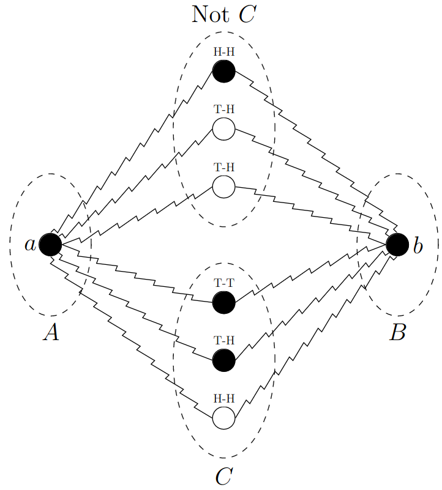
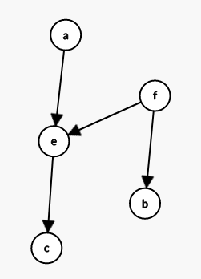
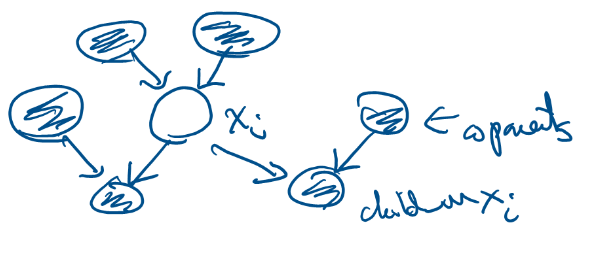

# Lecture 17, Mar 18, 2024

## Bayesian Networks

* Given $X_1, \dots, X_n$ where each $X_i \in \set{1, 2, \dots, S}$, then fully specifying $P[X_1, \dots, X_n]$ requires specifying $S^n - 1$ values, which is very expensive
* However, we can reduce this if not all the variables depend on each other
	* e.g. if $X_n$ is Markov then we only need to specify the transition probability matrix and initial PMF, which is only $S + S^2 - 1$ values
* We model the dependence relationship between variables as a graph, where the nodes are random variables and a directed edge from $X$ to $Y$ means $Y$ depends on $X$; these are known as *Bayesian networks*
	* e.g. for a Markov chain, the graph is just a long chain, since each variable only depends on the previous one
	* We assume that the inter-dependencies among RVs can be factorized into the form $p(y | \text{pa}\{y\})$, where $\text{pa}\{y\}$ denotes all parents of $y$
	* Note an edge from $X \to Y$ does not mean $X$ does not depend on $Y$, but we specify the conditional probabilities as $P[Y | X]$ instead of $P[X | Y]$
	* This can be used to describe causal relationships (but causality is not necessary in a graph)
* These graphs can have complex relationships that are not necessarily linear like a Markov chain, so we can no longer just specify state transition matrices
	* In general these are DAGs
	* The more parents a node has, the more information we need to fully specify its conditional probability, since it depends on more things
		* For a node that depends on $k$ other nodes, we need to specify $S^k$ values; this is often much less than $S^n$
		* The time/space complexity of storing a Bayesian network is therefore related to the node with the most connections
* We are interested in the conditional independence between RVs in the network -- given some set of variables, are two variables conditionally independent?
	* e.g. in a Markov chain, given the present state, all future states are independent of all past states
	* Recall that conditional independence of $a$ and $b$ given $c$ means $p(a | b, c) = p(a | c) \iff p(a, b | c) = p(a | c)p(b | c)$
* Consider $p(a, b | c) = p(a | b, c)p(b | c) = p(a | c)p(b | c)$; graphically this corresponds to $c$ pointing to $a$ and $b$, with no edge between $a$ and $b$
	* In this configuration $c$ is known as a *tail-to-tail* node
	* Without observing $c$, $a$ and $b$ are dependent; if $c$ is given, then they are independent
	* We can think of $c$ as a "gate" -- when it's nonblocking/not observed, we have dependence between $a$ and $b$; but when it is observed, it "blocks" the dependence between $a$ and $b$

{width=20%}

* Consider another configuration, where $a$ points to $c$ points to $b$
	* Without $c$, $a$ and $b$ are dependent: $p(a, b) = \sum _{c'} p(a, b, c') = p(a)\sum _{c'} p(b | c')p(c' | a) = p(a)p(b | a)$
	* If we observe $c$, $a$ and $b$ are independent: $p(a, b | c) = \frac{p(a)p(c | a)p(b | c)}{p(c)} = \frac{p(a, c)p(b | c)}{p(c)} = p(a | c)p(b | c)$
	* Having $c$ again blocks the dependence between $a$ and $b$
	* This is known as *head-to-tail* configuration

{width=20%}

* Now consider $a$ pointing to $c$ and $b$ pointing to $c$
	* Now without $c$, $a$ and $b$ are independent since $p(a, b) = \sum _{c'} p(a)p(b)p(c | a, b) = p(a)p(b)\sum _{c'}p(c | a, b) = p(a)p(b)$
	* However, once $c$ is observed, $a$ and $b$ are no longer independent since $p(a, b | c) = \frac{p(a)p(b)p(c | a, b)}{p(c)} \neq p(a)p(b)$
	* This is the opposite of the two previous cases; not having $c$ blocks the dependence
	* This is a *head-to-head* configuration

{width=20%}

* For $n$ random variables, $p(x_1, \dots, x_n) = p(x_n | x_1, \dots, x_{n - 1})p(x_{n - 1} | x_1, \dots, x_{n - 2})\dots p(x_2 | x_1)p(x_1)$
	* In this form, the relation holds for all random variables; to simplify, we need to make assumptions about independence, i.e. removing edges so that the graph is more sparse
* If we have a Bayesian network then we can show $p(x_1, \dots, x_n) = \prod _{i = 1}^n p(x_i | \text{pa}\{x_i\})$
	* The joint probability distribution is the product of the PMF of each variable given its parents
* Let $A$, $B$, $C$ be disjoint sets of nodes in a DAG; a path from $A$ to $B$ is *blocked* with respect to $C$ if the path passes through a node in $C$ that is not head-to-head, or it passes through a head-to-head node for which neither the node nor its descendants are in $C$
	* If every path from $A$ to $B$ is blocked, then $A$ is *D-separated* (*directed separated*)
	* If $A$ and $B$ are D-separated, then all nodes in $A$ are independent of all nodes in $B$ given all nodes in $C$

{width=50%}

* Example: consider the network in the figure below
	* Are $a$ and $b$ independent given $c$?
		* The path from $a$ passes through $e$ (head-to-head) and $f$ (tail-to-tail)
		* $e$ is head-to-head, and its descendant $c$ is given; $f$ is tail-to-tail but it is not given
		* Therefore $a$ and $b$ are not independent
	* Are $a$ and $b$ independent given $f$?
		* $f$ is tail-to-tail and it is given; $e$ is head-to-head and neither it nor its descendants are given
		* Therefore $a$ and $b$ are independent

{width=20%}

* For $x_1, \dots, x_n$, consider $x_i$ given all others $x_j$
	* $p(x_i | \bm x_{j \neq i}) = \frac{p(x_1, \dots, x_n)}{\sum _{x_i} p(x_1, \dots, x_n)} = \frac{\prod _k p(x_k | \text{pa}\{x_k\})}{\sum _{x_i} \prod _{k'} p(x_k' | \text{pa}\{x_k'\})}$
	* Any factor in the denominator that does not depend on $x_i$ can be taken out of the summation, which cancels a corresponding term in the numerator
	* The terms that remain are $p(x_i | \text{pa}\{x_i\})$, and all descendants of $x_i$, and co-parents of these descendants
	* These terms are known as the *Markov blanket* and separates $x_i$ from the rest of the nodes

{width=30%}

