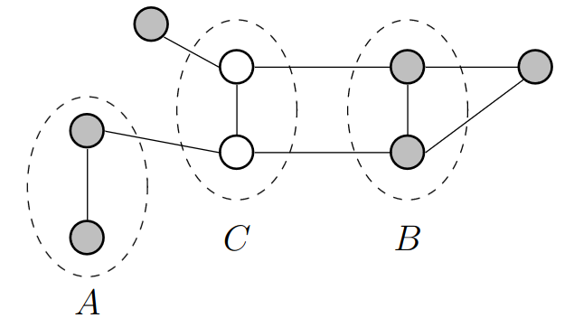
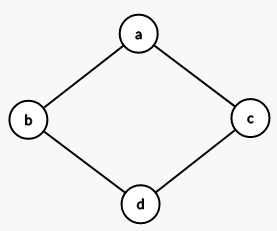

# Lecture 18, Mar 22, 2024

## Markov Random Fields (Undirected Graphs)

* Unlike Bayesian networks, these graphs are undirected, so we no longer have to worry about subtleties such as head-to-head nodes
* An edge does not necessarily indicate dependence, but rather related behaviour between nodes; conditional independence depends on path connectivity
* Factorization is done differently

{width=40%}

* We want the conditional independence property: given disjoint sets of nodes $A$, $B$, and $C$, where $C$ is observed
	* If all paths between $A$ and $B$ pass through $C$, then they are conditionally independent
	* If at least one path is not blocked, then conditional independence is not guaranteed
	* Alternatively we can remove all nodes in $C$ and check for connectivity between the two sets
* How should we factor the probabilities so that we get the above properties?
* The Markov blanket in the case of Markov random fields is just the immediate neighbours of the node (no more descendants or co-parents)
* Consider $x_i$, $x_j$; suppose that they are conditionally independent, then $p(x_i, x_j | x_{\backslash\set{i, j}}) = p(x_i | x_{\backslash\set{i, j}})p(x_j | x_{\backslash\set{i, j}})$
	* This requires that there is no direct path between $x_i$ and $x_j$ and all other paths are blocked
	* $x_i$ and $x_j$ cannot be in the same factor
* A *clique* is a subset of nodes where all pairs are connected by a link (i.e. they're all direct neighbours)
	* A *maximal clique* is a subset of nodes where no additional node can be added while remaining a clique
	* Every maximal clique must form its own factor, since the nodes inside it cannot be separated by intermediate nodes, so they are not independent
* The joint distribution of all $\bm x$ is a product of the *potential function* on all the maximal cliques
	* $p(\bm x) = \frac{1}{Z}\prod _C \psi _C(\bm x_C)$ where $Z$ is a normalization and $C$ are the maximal cliques
		* $Z = \sum _{\bm x}\prod _C \psi _C(\bm x_C)$ is the partition function
		* We do this over maximal cliques because as per the discussion above, nodes in a maximal clique must all be in the same factor, because they are directly connected
	* The potential functions $\psi _C$ are all nonnegative, but they need not be conditional PDFs
	* In this way we factorize the joint distribution
* The *Hammerly-Clifford theorem* states that we can always construct these distributions this way over maximal cliques
* Since potentials are exponential, we express $\psi _C(\bm x_C) = e^{-E(\bm x_C)}$
	* $E(\bm x_C)$ is the *energy*
* Therefore the joint distribution is $p(\bm x) = \frac{1}{Z}\prod _C e^{-E(\bm x_C)} = \frac{1}{Z}\exp\left(-\sum _C E(\bm x_C)\right)$
	* Note that the energy function for each clique is possibly different
	* To maximize the joint probability, we need to minimize the total energy $\sum _C E(\bm x_C)$
* Example: suppose we scan a monochrome image (each pixel $x_i \in \set{1, -1}$), and we get $y_i \in \set{1, -1}$; the process introduces some noise which possibly flips the pixels, so we would like to denoise the image by recovering $x_i$ from $y_i$
	* We assume that for the most part, $x_i = y_i$ and noise occurs relatively rarely
	* The pixels are scanned in a rectangular grid; we assume that adjacent pixels tend to have the same sign
		* The maximal cliques in the image are adjacent pixels, and each $x_i$ with its corresponding $y_i$
		* Each pair will have its own potential function
	* Consider $\psi(x_i, y_i) = e^{-\eta x_iy_i}$ and $\psi(x_i, x_j) = e^{-\beta x_ix_j}$
		* This is defined so that if $x_i, y_i$ (or $x_i, x_j$) have the same value/sign, the potential is lower than the case of the pixels having different signs
		* The more frequent case of the pixels being the same sign has a lower potential
		* $\eta$ and $\beta$ are relative weightings
	* Let $\psi(x_i) = e^{-hx_i}$, which biases the pixels (if we know that there are more +1s than -1s or otherwise)
	* $E(\bm x, \bm y) = h\sum _i x_i - \beta \sum _{i, j}x_ix_j - \eta \sum _i x_iy_i$ and $p(\bm x, \bm y) = \frac{1}{Z}e^{-E(\bm x, \bm y)}$
	* Now given $\bm y$, we wish to find $\bm x$ that minimizes the energy $E(\bm x, \bm y)$
	* In this case, we do it by brute force:
		* Set $x_i = y_i$ for all $i$ initially
		* Select a pixel $x_i$ to change to the opposite polarity, and keep the change if the energy is reduced
		* Continue until a local minimum or maximum iterations is reached

### Directed to Undirected Graphs

* Suppose we have a simple Markov chain with each $X_i$ pointing to $X_{i + 1}$
	* This factors as $p(\bm x) = p(x_1)p(x_2 | x_1)\dots p(x_n | x_{n - 1})$
	* Each pair of two nodes except the first is a clique
* If we have a node that has multiple parents, we "marry" the parents (*moralizing*) by connecting them, and all the parents and the child gives a maximal clique
* We can always convert a directed graph to an undirected graph this way
* However, it's not always possible to convert an undirected graph to a directed graph (we can't find a directed graph that satisfies all the conditional independence properties of the original graph)
	* If the undirected graph is a tree then we can do this, but if it has cycles then it's not possible

{width=20%}

