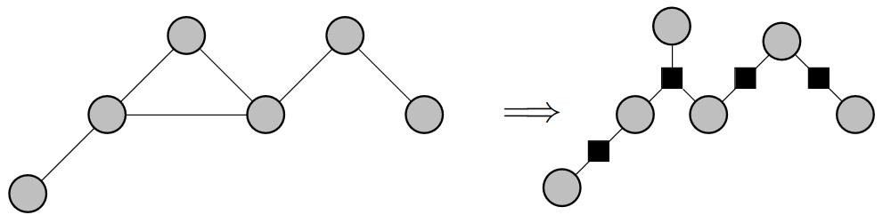
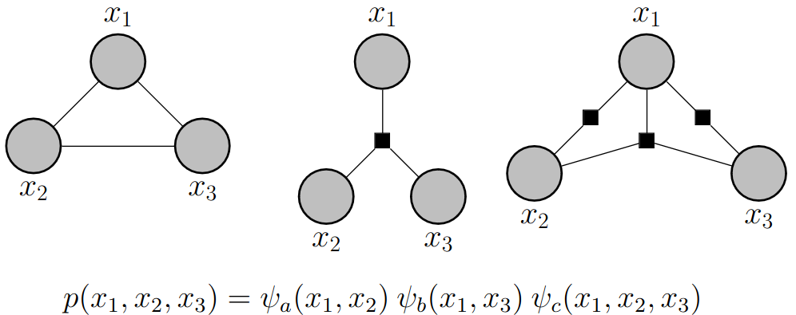
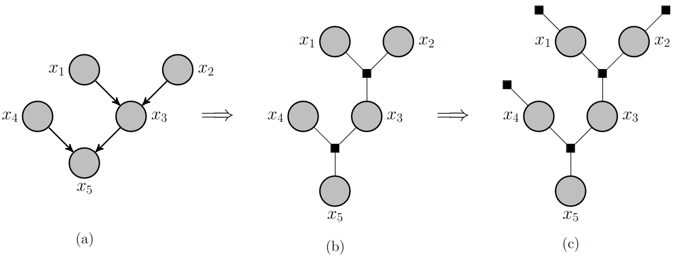
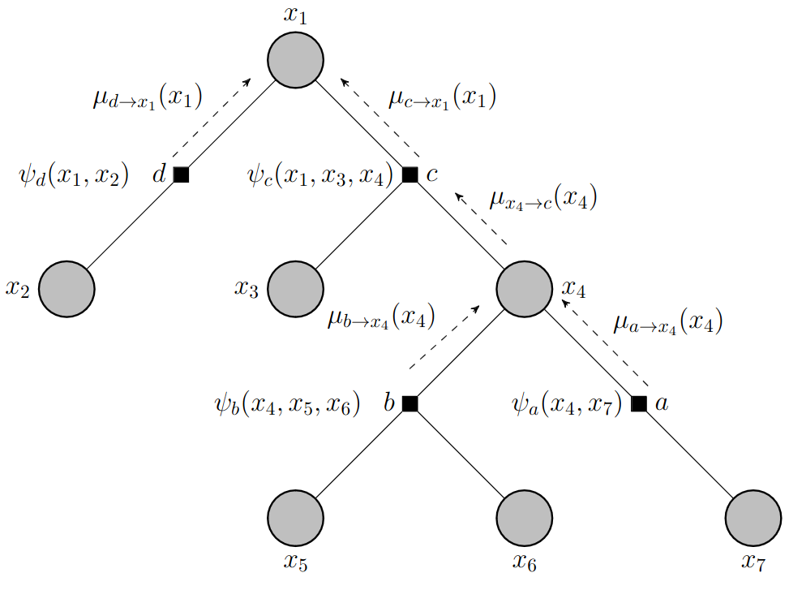

# Lecture 19, Mar 25, 2024

## Inference on Graphical Models

* Consider a Markov chain; we may want to perform inference tasks, such as finding the most likely state at time $n$, or finding the most likely sequence until time $n$, etc
	* All of these require us to find the marginal distribution, either over one variable or multiple variables
* Suppose we have $N$ variables and we want to find the marginal of one of the variables
	* The brute force approach needs to sum over all the other variables, resulting in a summation with $S^{N - 1}$ terms and so exponential complexity
	* However this could be simplified drastically with assumptions about the graph
* Our summation goes over all the variables to marginalize over, but the summed terms may not all depend on these variables
	* This lets us factor out terms and simplify the computation drastically
	* The factored sums can be computed, into functions over the variables in the expression that aren't summed over
	* This results in *messages*
	* We represent each of the messages as a vector, and the factors as matrices, so we can simply do a vector matrix multiplication to perform the summation
	* The messages start at each end and get passed towards the middle to the variable that we are finding the marginal for; when we get both messages, we multiply them to get the final marginal distribution
* *Message passing algorithm*: for a linear Markov model, messages are passed from either side inwards
	* This results in a complexity of only $NS^2$ instead of $S^{N - 1}$
	* By letting the messages pass through the entire chain instead of stopping it at a node, we can get the marginals for all nodes
	* This is the *sum-product* algorithm
* To find the maximum likelihood sequence, we need more than just the marginals, due to dependence between variables
* We want to find $\argmax _{\bm x} \frac{1}{z}\psi _{12}(x_1, x_2)\dots\psi _{N - 1, N}(x_{N - 1}, x_N)$
* Consider finding the max of just two variables, $g(x_1, x_2)$
	* The distribution can be represented in a table
	* We first find the maximum value of each row, and then find the maximum of all the row maxima
	* Now we go back to the row that the overall max came from and find the column that gave the max
	* This is the *sum-product* algorithm
* When we have multiple variables, we can factor out terms just as we did in a summation, since the max function also distributes
	* This also involves message passing in the same way, completely analogous to the sum-product algorithm
	* This is the *max-product* algorithm
* In practice, we normally work with the log probabilities to avoid over/underflow

### Factor Graphs

* In a factor graph, in addition to nodes for random variables, we also have nodes that are factors of the joint distribution that explicitly state the relationships between nodes
	* Noes are only connected directly to nodes of the other type (variable nodes are only connected to factor nodes and vice versa)
	* Instead of using edges connecting nodes to state the relationships between nodes, we use the factor nodes to do this explicitly
		* Each factor node is the keeper of a factor $\psi$
	* This changes the graph to a star pattern instead
	* This results in a *bipartite graph* (we can put all variables in one partition and all factors in the other, and there will be no connections within the two partitions)
* To convert an undirected graph to a factor graph, we associate a factor node with each maximal clique
	* Links between variables in the maximal clique are replaced by links to the factor node
	* Note that we don't have to use maximal cliques; by using non-maximal cliques we can get alternative factor graphs for the same undirected graph
		* These other graphs will have more factors, which makes the factorization finer
	* Therefore factor graphs are in general not unique

{width=60%}

{width=50%}

* We are particularly interested in factor graphs that are trees (between any pair of nodes, there is only one path)
	* An undirected graph that is a tree will always have a factor graph that is a tree
* For directed graphs, we replace each conditional probability with a factor node
* A directed graph is a tree if every node has only one parent; in a *polytree*, nodes can have multiple parents, but there is still only a single path between nodes (ignoring directions)
	* Directed trees and polytrees can both be converted into factor graphs that are trees

{width=70%}

* In a factor tree, we can also pass messages
	* Starting at the lowest factor nodes, we sum over its child variables and pass the message to the parent
	* When the parent has multiple factors passing it messages, the messages are multiplied
	* This is analogous to factoring out terms/moving sums
	* Since our graph is no longer linear, the way we can move the sums is more complicated and depends on the factors

{width=60%}

* Generally we see two types of activity: either at variable nodes or factor nodes
* At variable nodes, we have a product over all the factors that are coming in
	* One or more factor nodes feed the variable $x$ with their messages $\mu f_{l_k \to x}(x)$
		* These messages are functions of the variable
	* The output produced is a product, the message $\mu _{x \to f}(x)$
	* For variable nodes that are leaves, we let its message $\mu _{x \to f}(x) = 1$ as initialization
* At factor nodes, we take the product of all incoming messages, and then multiply and marginalize over the factor at the node (for all variables except the one that the resulting message will be passed to)
	* One or more variables feed it with the messages $\mu _{x_{m_j \to f}}(x_{m_j})$
	* For factor nodes that are leaves, the message will be a function of the next variable as initialization
* This algorithm lets us find all marginal PMFs if we pass messages both from the leaves to the root and from the root to al leaves
* The result is exact for tree graphs, but if the graph has cycles, this is only an approximation
* For max-product, the variable nodes simply take the product as before, but the factor nodes take the maximum over the local factor instead of marginalizing (summing) over it
	* This goes all the way to the root, and then we trace back the maxima at each step to find the maximum likelihood sequence

