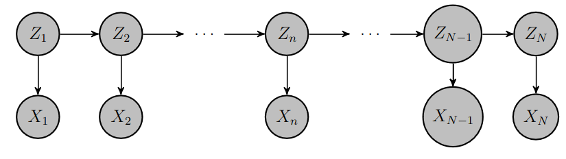
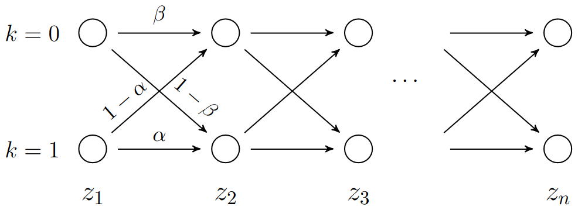
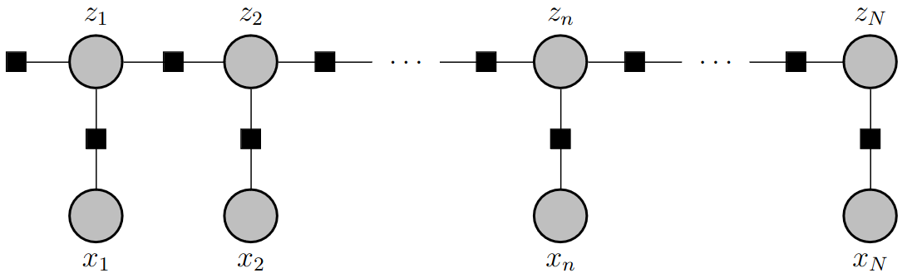
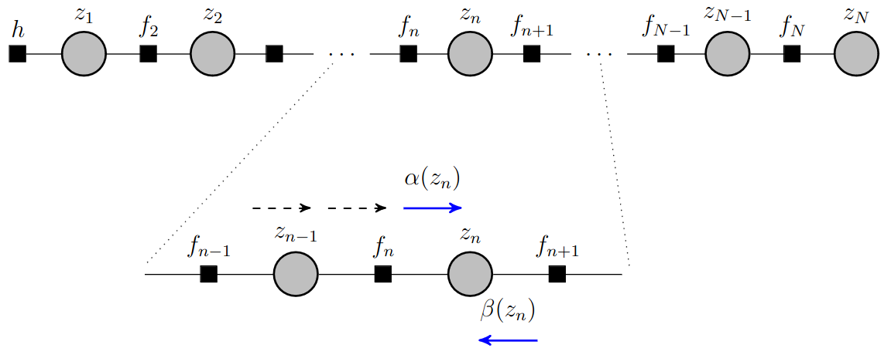
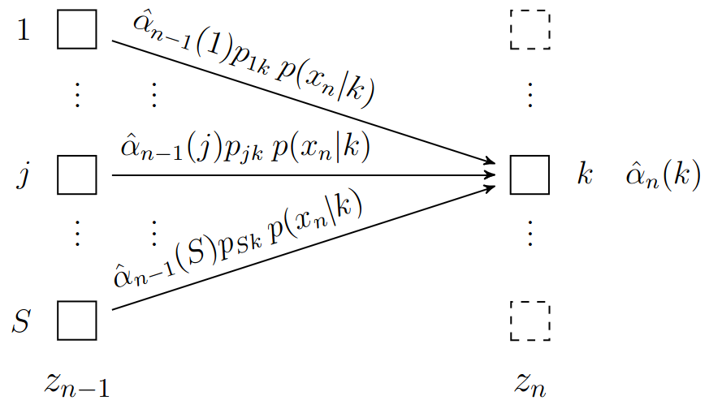
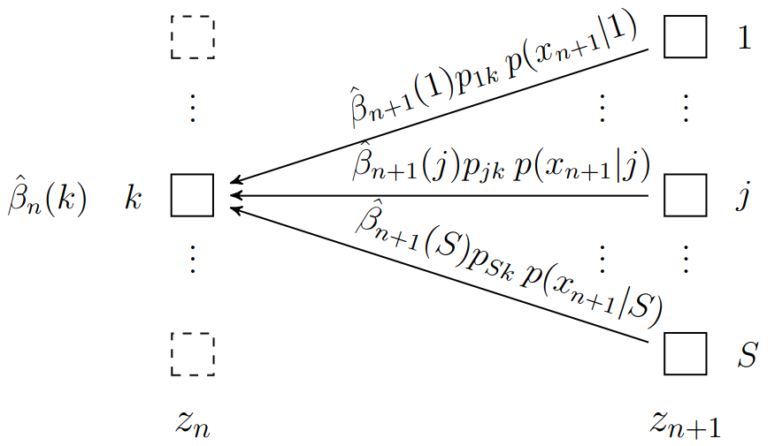
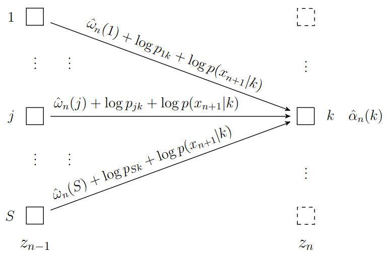

# Lecture 20, Apr 1, 2024

## Hidden Markov Models

* Suppose we have a Markov chain $Z_1, \dots, Z_N$, and instead of being able to observe $Z_i$ directly, we instead observe $X_1, \dots, X_N$, where $p(x_i | z_i)$ is known, i.e. we observe the states with some noise
	* This is known as a *hidden Markov model*
	* e.g. sequence of speech, robot locations, pixels in handwriting, etc
	* $p(x_i | z_i)$ are the *emission probabilities* (what we can observe)
	* We'd like to perform inference on this, such as MAP estimation like we did with graphical models before
	* $p(z_1, \dots, z_N, x_1, \dots, x_N) = p(\bm z | \bm x)p(\bm x) = p(z_1)\prod _{n = 2}^N p(z_n | z_{n - 1})\prod _{m = 1}^N p(x_m | z_m)$
		* This gives the joint distribution of states and measurements

{width=60%}

* Example: two-state HMM: $Z_i$ are binary variables; observation $X_i$ is equal to $Z_i$ with probability $1 - \epsilon$ and its complement with probability $\epsilon$
	* $\bm p = \cvec{0.5}{0.5}$
	* $\bm P = \mattwo{\beta}{1 - \beta}{1 - \alpha}{\alpha}$
	* $P_e = \mattwo{1 - \epsilon}{\epsilon}{\epsilon}{1 - \epsilon}$
		* This is the matrix of emission probabilities
	* The figure below shows a *trellis diagram*, which has one column for each time, one row for each state, and transition probabilities
		* Every possible realization of $Z_1, \dots, Z_N$ corresponds to a path across the Trellis diagram
		* The probability of the sequence is the product of its initial state and the corresponding transition probabilities
		* The "length" of a path is its log probability, equal to the sum of the logs of the probabilities of its transitions
	* Observing $X_i = k$ gives a hint about the likelihood of $Z_n = j$ through the emission probability $P[X_n = k | Z_n = j]$

{width=60%}

* Once we make the observations, $\bm x$ is no longer a random variable, but known observations
* Note $p(\bm z, \bm x) = p(z_1)p(x_1 | z_1)p(z_2 | z_1)p(x_2 | z_2) \dots p(x_N | z_N)p(z_N | z_{N - 1}) = \psi(z_1, x_1)\psi(z_1, z_2, x_2)\dots\psi(z_{n - 1}, z_N, x_N)$
	* We group together every pair of transition probability and emission probability
* With this factorized form, we can use message passing to find the most likely value at time $n$, $z_n^* = \argmax _{z_n} p(z_n, \bm x)$ or the most likely sequence $\bm z^* = \argmax _{z_1, \dots, z_N} p(\bm z, \bm x)$

{width=60%}

{width=70%}

* The HMM can be converted into a factor graph
	* Since $x_i$ are observed, they can be combined into the factors between $z_i$
	* $h(z_1) = p(z_1)p(x_1 | z_1)$ is the initial factor
	*  $f_n(z_{n - 1}, z_n) = p(z_n | z_{n - 1})p(x_n | z_n)$
	* Factor node $f_{n - 1}$ comes before the variable node $z_{n - 1}$
* At each node the following happens:
	* At a variable node $z_{n - 1}$, we only have a single factor coming in, so the message created is simply the message from the preceding factor node, $\mu _{z _{n - 1} \to f_n}(z_{n - 1}) = \mu _{f_{n - 1} \to z_{n - 1}}(z_{n - 1})$
		* Messages are passed right through without modification
	* At a factor node $f_n$ we marginalize the product of its factor and the incoming message, so $\mu _{f_n \to z_n}(z_n) = \sum _{z_{n - 1}} f_n(z_{n - 1}, z_n)\mu _{z_{n - 1} \to f_n}(z_{n - 1})$
		* Multiply the factor by the incoming message and marginalize the variable of the incoming message
		* This is similar to a matrix multiplication
	* Messages that pass from right to left can be simplified similarly
* Let $\alpha(z_n) = \mu _{f_n \to z_n}(z_n)$ (left to right message) and $\beta(z_n) = \mu _{f_{n + 1} \to z_n}(z_n)$ (right to left message)
	* $\alpha(z_n) = p(x_n | z_n)\sum _{z_{n - 1}}\alpha(z_{n - 1})p(z_n | z_{n - 1})$
		* Obtained by substituting what we had above
		* This is like computing the next state probability normally, but multiplying by the hint, $p(x_n | z_n)$, for each possible state
		* Each possible value of state $z_n$ is weighed by the hint
	* $\beta(z_n) = \sum _{z _{n + 1}}\beta(z_{n + 1})p(x_{n + 1} | z_{n + 1})p(z_{n + 1} | z_n)$
		* In this case we cannot move the hint outside the summation, since the hint is from the node we came from, $z_{n + 1}$, which is the one we sum over
	* $\alpha(z_1) = p(z_1)p(x_1 | z_1)$
	* $\beta(z_N) = 1$
* Therefore the joint distribution when the messages meet is $p(z_n, \bm x) = \alpha(z_n)\beta(z_n)$
	* Let $\gamma(z_n) = \frac{p(z_n, \bm x)}{p(\bm x)} = \frac{\alpha(z_n)\beta(z_n)}{p(\bm x)} = p(z_n | \bm x)$
	* This is the marginal of $z_n$ given the observations $\bm x$
	* This can also be a form of normalization, since $p(z_n, \bm x)$ is going to have very small values due to the large number of observations
* If we condition on $z_n$, it disconnects the chain on its two sides
	* $\alpha(z_n) = p(x_1, \dots, x_n, z_n)$
	* $\beta(z_n) = p(x_{n + 1}, \dots, x_N | z_n)$
	* $\alpha(z_n)$ encapsulates all the information of the observations prior to $z_n$, and $\beta(z_n)$ encapsulates all the information provided by observations after $z_n$

### Forward-Backward (Baum-Welch) Algorithm

* Both $\alpha(z_n)$ and $\beta(z_n)$ involve multidimensional distributions, so computing them deals with very small probabilities; this introduces round-off errors when working with numbers of normal magnitudes
* For numerical stability it's better to normalize $\alpha$ and $\beta$:
	* $\hat\alpha(z_n) = p(z_n | x_1, \dots, x_n) = \frac{\alpha(z_n)}{p(x_1, \dots, x_n)}$
	* $\hat\beta(z_n) = \frac{p(x_{n + 1}, \dots, x_N | z_n)}{p(x_{n + 1}, \dots, x_N | x_1, \dots, x_n)} = \frac{\beta(z_n)}{p(x_{n + 1}, \dots, x_N | x_1, \dots, x_n)}$
	* Note $\hat\alpha(z_n)\hat\beta(z_n) = \frac{\alpha(z_n)\beta(z_n)}{\left(\prod _{m = 1}^n c_m\right)\left(\prod _{m = n + 1}^N c_m\right)} = \frac{\alpha(z_n)\beta(z_n)}{p(\bm x_N)} = \gamma(z_n) = p(z_n | \bm x)$
		* This is why we define $\beta$ as above, so it complements $\alpha$
* We need the normalization $p(\bm x_n)$
	* Let $c_n = p(x_n | \bm x_{n - 1}) = p(x_n | x_1, \dots, x_{n - 1})$
	* Then $p(\bm x_n) = p(x_1)p(x_2 | x_1)\dots p(x_n | x_1, \dots, x_{n - 1}) = \prod _{m = 1}^n c_m$
* Substituting $\hat\alpha$ into the old recursive relation for $\alpha$ gives us the recursive relationship for $\hat\alpha$
	* $c_n\hat\alpha(z_n) = p(x_n | z_n)\sum _{z_{n - 1}}\hat\alpha(z_{n - 1})p(z_n | z_{n - 1})$
* For $\beta$ we have $c_{n + 1}\hat\beta(z_n) = \sum _{z_{n + 1}}\hat\beta(z_{n + 1})p(x_{n + 1} | z_{n + 1})p(z_{n + 1} | z_n)$
* Using the fact that $\sum _{z_n} \hat\alpha(z_n) = 1$, we obtain an expression for $c_n$
	* $c_n = \left[\sum _{z_n}\left(p(x_n | z_n)\sum _{z_{n - 1}} \hat\alpha(z_{n - 1})p(z_n | z_{n - 1})\right)\right]^{-1}$
* For each node $n$, we first calculate $\hat\alpha(z_n)$ for all values of $z_n$, and then find $c_n$ through the summation; do this for all nodes up until $z_{N}$, and then go in the reverse direction to calculate $\hat\beta(z_n)$
	* We need to go in reverse for $\hat\beta$ since it requires $c_{n + 1}$, which we can only get through the forward pass
	* This is called the *forward-backward algorithm*
* To compute $\hat\alpha(z_n)$: for state $z_n = k$, we do the following to find $\hat\alpha(z_n = k)$:
	* Use the previous values of $\hat\alpha(z_{n - 1})$, multiply by the transition probabilities $p(z_n = k | z_{n - 1} = j)$ for each previous state $z_{n - 1} = j$ and sum
	* The sum is multiplied by $p(x_n | z_n = k)$, the hint
	* After we compute this for each $k$, we find the normalization $c_n$, by summing over the values we computed for all $k$ and taking the inverse
	* Using $c_n$ we find $\hat\alpha(z_n)$ by dividing each of the previous results by $c_n$

{width=45%}

* To compute $\hat\beta(z_n)$: for state $z_n = k$, do the following to find $\hat\beta(z_n = k)$:
	* Use the values of $\hat\beta(z_{n + 1})$, multiply by transition probabilities $p(z_{n + 1} = j | z_n = k)$ for each $j$, and then multiply by the hint $p(x_{n + 1} | z_{n + 1} = j)$ (note in this case the hint does not distribute), and sum
	* Use $c_{n + 1}$, obtained from the forward pass for $\hat\alpha$, to normalize and find $\hat\beta(z_n = k)$

{width=45%}

### Example: Robot Position Estimation

* Consider a robot with position described by $(x_n, y_n)$
* At each time it takes an action $a_n$ to stay put, or move up, down, left, or right according to some transition probability
	* The action depends on the previous action; if the robot was previously moving in some direction, it will continue along that same direction unless it decides to stop
* The robot lives in a rectangular grid; at the end, the transition probabilities are such that the robot never leaves the grid
* We have noisy observations of the robot's position, $\hat{\bm x}_n$ (but not its actions)
* Let $z_n = (x_n, y_n, a_n)$ where $(x_n, y_n)$ is the position at time $n$ and $a_n$ is the previous action
	* The state is augmented by the previous action
* We have a lot of possible states, but since the actions are local, the transition probability $p(z_n | z_{n - 1})$ will eliminate many prior states as impossible
	* Having the noisy observations broadens the set of possible state transitions

### Viterbi Algorithm

* This algorithm is used to find the most likely sequence of hidden random variables given the observations
* We are now looking for $\bm z^* = \argmax _{z_1, \dots, z_N} p(\bm z, \bm x)$
* We create the factor graph in the exact same way as before
* In this case, instead of summing to find marginals, we are only interested in the maximums; therefore we can take the log, since it is a monotonic function
	* We couldn't before because we needed to sum probabilities
* We now look for $\max _{x_1, \dots, x_N}\left(\log\frac{1}{Z} + \sum _{i = 2}^N\log\psi(x_{i - 1}, x_i)\right)$ where $Z$ is normalization
* Recall message passing for the max-sum algorithm:
	* At each variable node, take sum (due to logs) $\mu _{x \to f}(x) = \sum _{k = 1}^L \mu _{f_{l_k} \to x}(x)$
		* At each leaf we initialize to $\log 1 = 0$
	* At each factor node, we find $\mu _{f \to x} \max _{x_{m_1}, \dots, x_{m_M}} \left(\log\psi _f(x, x_{m_1}, \dots, x_{m_M}) + \sum _{j = 1}^M \mu _{x_{m_j} \to f}(x_{m_j})\right)$
* For a hidden Markov model this simplifies:
	* $\mu _{h \to z_1}(z_1) = \log p(z_1) + \log(p(x_1 | z_1) \equiv \omega _1(z_1)$
		* This is initialization of the messages
	* $\mu _{z_n \to f_{n + 1}}(z_n) = \mu _{f_n \to z_n}(z_n)$
		* Just like the forward-backward algorithm, only a single factor feeds into each variable, so it's just passed along
	* $\mu _{f_{n + 1} \to z_{n + 1}}(z_{n + 1}) = \max _{z_n} \set{\log f_{n + 1}(z_n, z_{n + 1}) + \mu _{z_n \to f_{n + 1}}(z_n)}$
		* Take the maximum value of the message over all possible values for $z_n$
* Let $\omega _{n + 1}(z_{n + 1})$ be the function that records the max at $z_n$, computed for each possible value of $z_{n + 1}$
	* $\alignedeqntwo[t]{\omega _{n + 1}(z_{n + 1})}{\max _{z_n}\set{\log p(z_{n + 1} | z_n) + \log p(x_{n + 1} | z_{n + 1}) + \omega _n(z_n)}}{\log p(x_{n + 1} | z_{n + 1}) \max _{z_n}\set{\log p(z_{n + 1} | z_n) + \omega _n(z_n)}}$
	* This recursive relationship for $\omega _n$ is the core of the Viterbi algorithm
* At each step, we compute the best path and store it along with the state that was chosen that led to the best path; the probability is summed due to the logs
* To calculate $\omega _{n + 1}(k)$:
	* Take $\omega _n(j)$, the transition probability $\log p(z_{n + 1} = k | z_n = j)$ and hint $\log p(x_{n + 1} | z_{n + 1} = k)$ and add, for each state $j$ at the previous time
	* Find the value of $j$ that leads to the max; this is the value of $\omega _{n + 1}(k)$
	* Keep track of which $j$ led to the max $\omega _{n + 1}(k)$, so we can backtrack later

{width=55%}

