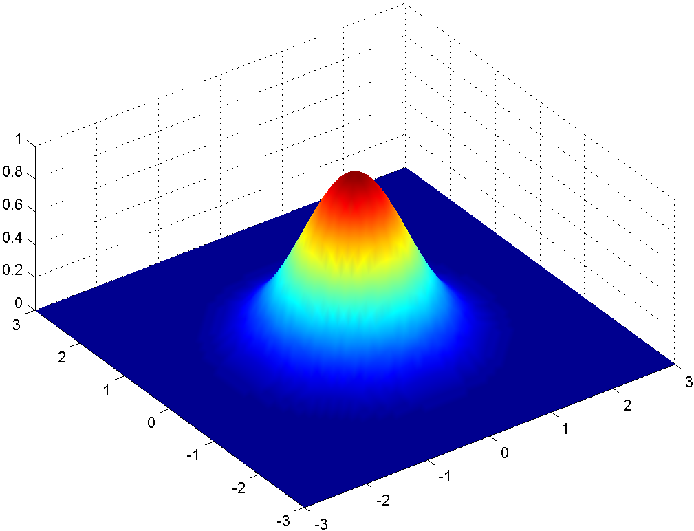

# Lecture 9, Feb 5, 2024

## Joint Gaussian Distributions

\noteThm{\textit{Central Limit Theorem}: Let $X_1, \dots, X_n$ be a sequence of IDD RVs from any distribution with finite mean $\mu$ and variance $\sigma^2$, and let $S_n = X_1 + \dots + X_n$ be their sum; and let $$Z_n = \frac{S_n - n\mu}{\sigma\sqrt n}$$which is zero-mean and unit variance, then $$\lim _{n \to \infty} P[Z_n \leq z] = \frac{1}{\sqrt{2\pi}}\intlinf{z} e^{-\frac{x^2}{2}}\,\dx$$i.e. the distribution of $Z_n$ approaches $\mathcal N(0, 1)$.}

\noteDefn{$X$ and $Y$ are \textit{jointly Gaussian} if their joint PDF is given by $$f_{X, Y}(x, y) = \frac{1}{2\pi\sigma _1\sigma _2\sqrt{1 - \rho _{X, Y}^2}}e^{-\frac{1}{2(1 - \rho _{X, Y}^2)}\left(\left(\frac{x - \mu _1}{\sigma _1}\right)^2 - 2\rho _{X, Y}\left(\frac{x - \mu _1}{\sigma _1}\right)\left(\frac{y - \mu _2}{\sigma _2}\right) + \left(\frac{y - \mu _2}{\sigma _2}\right)^2\right)}$$where $\mu _1, \mu _2$ are the means, $\sigma _1^2, \sigma _2^2$ are the variances, and $\rho _{X, Y}$ is the correlation coefficient of $X, Y$.}

* Notice that the expression is symmetric in $X$ and $Y$, and both variables appear in their normalized form
* If $X$ and $Y$ are uncorrelated, then $f_{X, Y}(x, y) = \frac{1}{2\pi\sigma _1\sigma _2}e^{-\frac{1}{2}\left(\left(\frac{x - \mu _1}{\sigma _1}\right)^2 + \left(\frac{y - \mu _2}{\sigma _2}\right)^2\right)} = f_X(x)f_Y(y)$
	* For Gaussian RVs, uncorrelated implies independent
* If we compute marginals by completing the square, we that both are Gaussian

{width=50%}

* For the case of zero-mean, unit variance and uncorrelated $X, Y$ above the contours of constant probability are circles centered about the origin
	* Changing the mean shifts the centre of the distribution
	* The exponent is in quadratic form
	* If the variances are not equal (but still uncorrelated), we will get axis-aligned ellipses as the distribution in each dimension gets stretched out
	* If the correlation is nonzero, the axes of the ellipse will no longer be axis-aligned
		* For a positive $\rho$ the ellipse is along the $x = y$ axis
		* For a negative $\rho$ the ellipse is along the $x = -y$ axis
		* The closer $\rho$ is to 1, the more tightly packed the ellipse is along its axis
	* We can always find a transformation that aligns the axes of the ellipse with the $x$ and $y$ axis to make them independent in the new transformed space
* The conditional PDF is $f_{X, Y}(x | y) = \frac{1}{\sqrt{2\pi\sigma _1^2(1 - \rho _{X, Y}^2)}}e^{-\frac{1}{2(1 - \rho _{X, Y}^2)\sigma _1^2}\left(x - \rho _{X, Y}\frac{\sigma _1}{\sigma _2}(y - \mu _2) - \mu _1\right)^2}$
	* This is another Gaussian with $\mu = \rho _{X, Y}\frac{\sigma _1}{\sigma _2}(y - \mu _2) + \mu _1$ and $\sigma^2 = (1 - \rho _{X, Y}^2)\sigma _1^2$
	* Notice the new mean is the normalized $y$, scaled up by the standard deviation of $x$, multiplied by the correlation and then add back to mean of $x$ to shift it
	* The variance has no dependence on $y$ but knowing $y$ reduces the variance of $x$
	* As $\rho _{X, Y} \to \pm 1$, the conditional variance approaches 0 because $X$ is just a linear function of $Y$
* Consider a linear transformation $\cvec{V}{W} = \mattwo{a}{b}{c}{e}\cvec{X}{Y} = \bm A\bm X$ where the determinant is nonzero (invertible)
	* The joint PDF of $V$ and $W$ is given by $f_{V, W}(v, w) = \frac{f_{X, Y}(x, y)}{\det\bm A}$
	* Intuitively an area $\dx$ by $\dy$ is mapped to an area of size $\dd P$; this ratio is the determinant
		* $f(x, y)\,\dx\,\dy = f(v, w)\,\dd P$ since both are the probability of a small region
	* For a nonlinear transformation the determinant is replaced by a Jacobian
	* Note practically to get this in terms of $v, w$ we need to find the inverse mapping from $v, w$ to $x, y$
* More generally consider $\bm Z = \bm A\bm Z$ where $A \in \reals^{n \times n}$$ and is invertible
	* The joint PDF is $f_Z(\bm Z) = f(z_1, \dots, z_n) = \frac{f(x_1, \dots, x_n)}{\det{\bm A}} = \frac{f_{\bm X}(\bm A^{-1}\bm z)}{\det\bm A}$

## Generalization of Expectation and Variance

* Let the *mean vector* of $\bm X = \cvec{X_1}{\vdots}{X_n}$ be $\bm m_{\bm X} = E[\bm X] = \cvec{E[X_1]}{\vdots}{E[X_n]}$
* Let the *correlation matrix* be $\bm R_{\bm X} = \begin{bmatrix}E[X_1^2] & E[X_1X_2] & \dots & E[X_1X_n] \\ E[X_2X_1] & E[X_2^2] & \dots & E[X_2X_n] \\ \vdots & \vdots & \ddots & \vdots \\ E[X_nX_1] & E[X_nX_2] & \dots & E[X_n^2] \end{bmatrix}$
	* Note that this is symmetric
	* The diagonal elements are second moments
* Let the *covariance matrix* be $\bm K_{\bm X}$ such that entry $(i, j)$ is $\sigma _{X_i, X_j}$
	* This is symmetric positive semidefinite
	* The diagonal entries are the variances of each variable
	* If the means are all zero, this is equivalent to the correlation matrix
	* If all $X_i, X_j$ are uncorrelated, then the covariance matrix is diagonal
* Notice that $\bm R_{\bm X} = E[\bm X\bm X^T]$ and $\bm K_{\bm X} = E[(\bm X - \bm m_{\bm X})(\bm X - \bm m_{\bm X})^T] = \bm R_{\bm X} - \bm m_{\bm X}\bm m_{\bm X}^T$
* For any general linear transformation $\bm Y = \bm A\bm X$:
	* $E[\bm Y] = \bm AE[\bm X] = \bm A\bm m_{\bm X}$
	* $\bm K_{\bm Y} = \bm A\bm K_{\bm X}\bm A^T$
* We can apply an eigendecomposition to the covariance matrix
	* Often our covariance matrix will be full rank, which makes it positive definite, and makes the decomposition always possible
	* Find eigenvectors $\bm e_i$ such that $\bm K_{\bm X}\bm e_i = \lambda\bm e_i$ and $\bm e_i^T\bm e_j = \delta _{ij}$ (orthonormal eigenvectors)
	* Let $\bm P = \rvec{\bm e_1}{\dots}{\bm e_n}$ and $\bm\Lambda = \diag\lambda _i$, then $\bm X = \bm P\bm\Lambda\bm P^T$
	* For a general Gaussian, this means that if we first transform the variables by $\bm P^T$, then they will all be independent of each other

