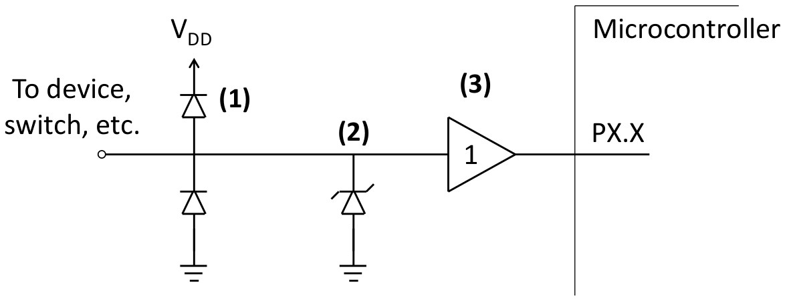
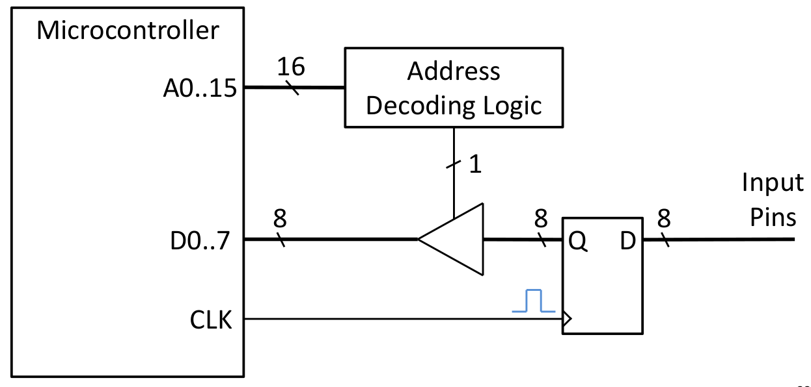
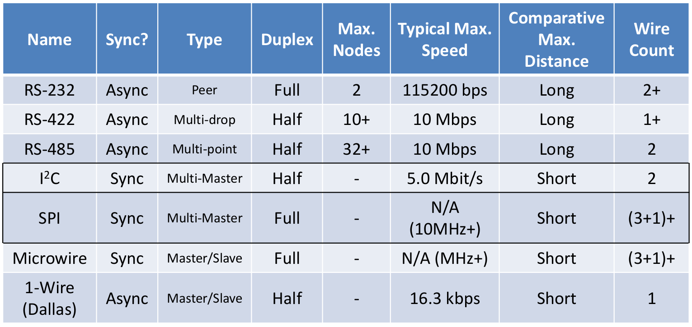
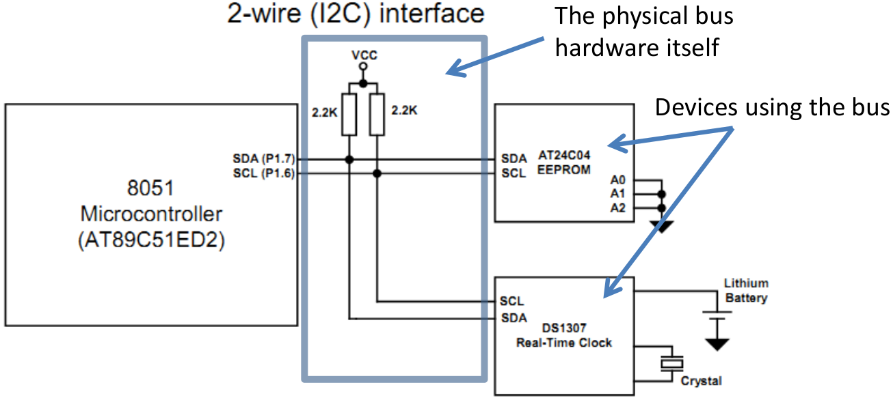
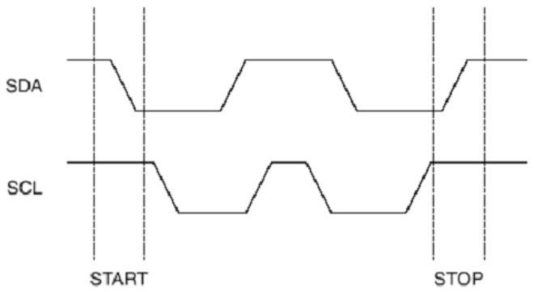

# Lecture 10, Mar 19, 2024

## General-Purpose I/O -- Additional Considerations

* Pins will sometimes have diodes to $V_{DD}$ and $V_{SS}$ for purposes of ESD protection, so the voltage on the pin is clamped to a certain range
	* Note this can cause problems if other parts of the system start up first, they may unintentionally power the microcontroller through a GPIO and put it in an indeterminate state
* Some pins are able to be configured as input, output, and a third, high-impedance mode; these are known as *tri-state outputs*
	* In the high-impedance mode, the pin is not actively driven to a logical high or low
	* This is very useful for shared data lines such as in buses, so we don't have multiple drivers interfering
* Tri-state outputs are usually configured through an SFR; when the tri-state control SFR is enabled, the pin will be high impedance, and the internal driving circuitry is entirely disconnected
* We can also achieve a similar effect with open-collector/open-drain outputs, where the pin is connected to ground through a MOSFET or BJT, and an external pull-up makes the pin high when it's disconnected from ground
	* More common in older hardware
	* This has a tradeoff between speed and efficiency
	* If we want to go faster, we need a smaller pullup to charge the line capacitance faster; but smaller pullups are less efficient
	* This was used originally in applications such as the I2C bus
	* In an open-drain configuration, the bus state will be low if any device outputs a low, so driver conflicts are impossible
* Whenever we have uncontrolled input to a pin, we should add protection circuitry
	* Common types include external protection diodes, purpose-built transient/ESD suppression diodes (often two Zener diodes back to back), or a transceiver/buffer/filter to act as a sacrificial device

{width=50%}

* Additional external multiplexing can be used if we run out of GPIOs
	* This is better than simply choosing a chip with a larger number of pins
	* Introduces a propagation delay
	* A multiplexer takes an input and a number of address bits, and connects the input to one of the outputs depending on the address
	* A decoder takes a binary encoded number, and outputs a pattern of bits depending on the input number
* If we need a very large number of I/O pins, there are dedicated I/O expansion chips that communicate over protocols
	* This offers many more advanced features such as tri-state outputs, interrupts, etc that you would expect in normal GPIO

## Bus-Based I/O

* On older systems, the I/O ports are connected as devices on a shared data bus, which may be exposed externally
	* This requires adding a lot of external hardware, so this is rare today
* This is almost infinitely expandable (as long as we have free memory addresses), but very complex to implement
	* To the microcontroller this is indistinguishable from a normal read/write to any other memory, so it's easy to use in software
* This makes the I/O memory mapped instead of SFRs -- reading/writing to a range of memory addresses will get picked up by the devices on the bus, and respond with the appropriate action
* Memory is often divided into multiple banks
	* Each bank starts its addressing from 0, so we need a decoder that takes the high bits and enables the correct memory bank for the address
	* The lower bits are sent directly to the memory bank
	* Any external devices on the bus also need a decoder
* Since the bus is shared, only one device can drive it at a time
	* If we have bus conflicts, we can irreversibly corrupt the internal state of the microcontroller

{width=50%}

## Communication Protocols

* *Serial interfaces* send out the data one bit at a time, usually synchronized by an additional clock signal
* *Parallel interfaces* send out a group of bits at a time, usually an entire word
* Parallel interfaces used to be prevalent due to their higher speed (back then), but they have issues with noise immunity, driving, and bus size, so modern devices are usually serial
	* Serial interfaces today are often faster than parallel ones due to their simpler logic and hardware

{width=70%}

* SPI and I2C are two of the most common serial protocols used today
* I2C is designed for compatibility, so it is designed to be as general as possible
	* However different hardware might have different electrical specs, so they might not be compatible on the same bus
	* I2C can often be bit-banged if needed
	* Much slower relative to SPI
* SPI is designed for speed and usually requires dedicated hardware
	* e.g. ESP32 uses 4 SPI buses to communicate with external memory
	* Does not make sense to bit-bang
* Many standards are based on UART (Universal Synchronous Receiver/Transmitter)
	* While I2C and SPI both have hardware expectations, UART does not
* Other high-level standards exist to handle specific applications:
	* CAN (Controller Area Network): usually used in automotive applications; usually layered over RS-485; designed for high noise immunity and range due to its differential voltages and CRC checksums
		* Looks more like a network than a bus protocol -- data is broadcasted, and devices choose to respond based on the CAN frame
		* I2C and SPI are designed for very short buses (a few inches) while CAN can be much longer
	* Bluetooth/ZigBee/Xbee/etc: short-range wireless standards
	* USB (Universal Serial Bus): long-range, designed for high noise immunity and throughput
	* JTAG: standard for programming and debugging embedded devices
	* 802.3/11(a/b/g/n): wired/wireless networking standards

### I2C (Inter-Integrated Circuit)

* A two-wire interface, with a shared, bidirectional data bus, and a clock line driven by the master; multi-slave (and multi-master in theory, but rarely in practice due to poor support)
* Data lines are open collector or open drain, as previously mentioned
	* Modern versions of the standard expand to support tri-state outputs
* Half-duplex (can send or receive, but not at the same time)
* Bitrates can include 0.1/0.4/1.0/3.4/5.0+ Mbit/s

{width=65%}

* Communication process:
	1. Bus master sends the address of the destination device to the bus
	2. Slave devices monitor the bus for their address
		* Although in theory we can have many devices on the same bus, in practice we often have address incompatibilities from different manufacturers
	3. Handshake occurs once slave recognizes its address and communication starts
* An I2C bus handshakes using a *start condition*: holding SDA low for a certain amount of time while SCL is high
	* Note that since we have the pullups, the bus idles with both lines high
* Communication ends with a *stop condition*: holding SDA high while SCL is high

{width=40%}

* Between the start and stop conditions, the clock is pulsed, and data is latched on rising edge
	* SDA should be set to the correct level before the rising edge and be held stable while SCL is high
	* Therefore SDA can only change when clock is low
* After the end of a word (or multiple words depending on device), the receiving device sends back an ACK
	* The sending device stops driving SDA and waits for the receiving device to assert SDA low for the ACK
	* The master will pulse SCL one more time for this
* Note for many I2C devices, if we send a malformed packet (i.e. not properly framed by start/stop), its state machine may not be able to recover
* Different I2C devices may have different word sizes, different number of words per transfer, etc

