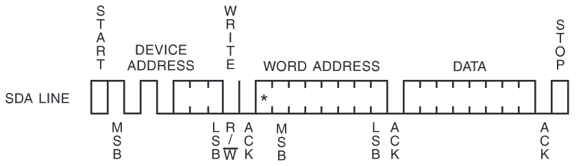
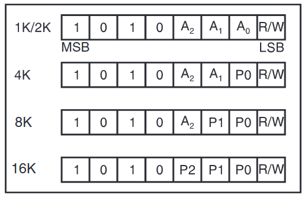

# Lecture 11, Mar 26, 2024

## Software I2C Implementation Example

* We want to write a software I2C implementation to interface a 24C02 EEPROM chip and write a single byte
* The payload consists of:
	* Address byte: first 4 bits are `0b1010`, next 3 bits are the I2C device address, final bit is R/W flag
		* Depending on the chip size, the 3 bits are divided differently into address bits and page number bits
	* Word address: 8-bit memory address of the byte to write to
	* Data: 8-bit data byte to write

{width=50%}

{width=35%}

* Assume SDA is connected to P0.0 (alias `_SDA`), SCL is connected to P0.1 (alias `_SCL`), CPU with no hardware I2C support
* We're asked to:
	* Write a flexible, extensible software I2C implementation (i.e. a library) to send a single byte to a specified I2C address (low-speed mode)
	* Use the code to write 0x51 to the 2K version of the EEPROM memory at address 0xA2 at I2C device address 0x04 on the bus
* Generally we split up the code into several layers:
	* *Application layer*: high-level user code that calls functions within the library or protocol layer; does not directly interface with hardware
	* *Library/protocol layer*: defines common operations that are part of the core protocol specification, e.g. start/stop/send for I2C and read/write for the EEPROM; calls the hardware/physical layer
	* *Hardware/physical layer*: code that interfaces with the exact hardware used, e.g. setting pin modes, specific timing, using SFRs

	```c
	#define _SDA P0.0
	#define _SCL P0.1

	/***** Physical Layer *****/

	void initPhysical(void) {
		// [Hardware setup, including pin mode configuration, pin speed, etc]
	}

	inline void setSDA(void) {
		// [Possibly (re-)set SDA as output]
		// [Wait for setup time]
		_SDA = 1;
		// [Wait for hold time]
	}

	// Omitted but similar to above
	inline void clearSDA(void);
	inline void setSCL(void);
	inline void clearSCL(void);

	/***** Protocol Layer *****/

	void i2cInit(void) {
		initPhysical();
		// Set idle state of I2C pins
		// We do this here instead of initPhysical() since this is specified by I2C
		_SCL = 1;
		_SDA = 1;
	}

	void i2cStart(void) {
		// Pre-condition: SDA and SCL both high
		ASSERT(_SDA && _SCL);
		clearSDA();
	}

	void i2cSend(uint8_t data) {
		// Pre-condition: SDA low, SCL high
		ASSERT(!_SDA && _SCL);
		for (uint8_t i = 0; i < 8; i ++) {
			// Bring SCL low, so SDA can change
			clearSCL();
			// Send data
			if (data & 0x80)
				setSDA();
			else
				clearSDA();
			data <<= 1;
			// Bring SCL high again to get ready for the next bit
			setSCL();
		}
		// Ack: bring SCL low, set SDA to input, read ack, bring SCL high again
		clearSCL();
		// Should be added to physical layer
		releaseSDA();
		// Should be added to physical layer
		if (!readSDA())
			// Should be added to one of the layer depending on functionality
			// This depends on the hardware, the application, etc
			handleError();

		// Reset the pin and bus states so that we can send again
		// Should be added to physical layer
		driveSDA();
		clearSDA();
		setSCL();
	}

	void i2cStop(void) {
		// Pre-condition: SDA low, SCL high
		ASSERT(!_SDA && _SCL);
		setSDA();
	}

	/***** Application Layer *****/

	void main(void) {
		i2cInit();
		i2cStart();
		// Address: 0b1010 to start, address of 0b100, write mode (0)
		i2cSend(0b10101000);
		// Word address
		i2cSend(0xA2);
		// Data
		i2cSend(0x51);
		i2cStop();
	}
	```

