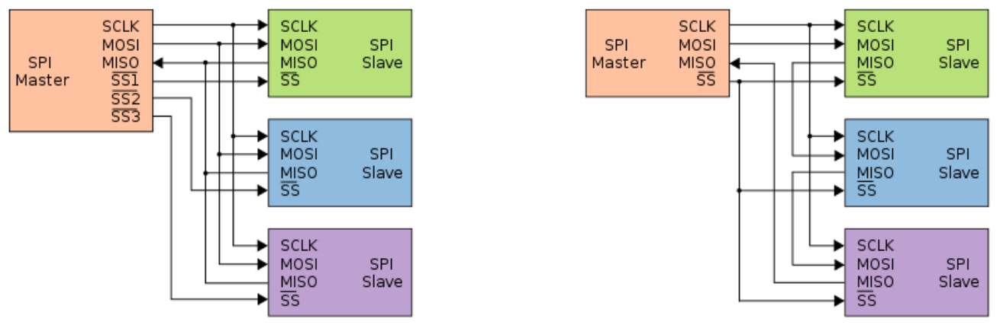

# Lecture 12, Apr 2, 2024

## SPI

* A 4-wire serial interface with one master and multiple slave devices (in theory can be multi-master, but never used)
	* SCLK (serial clock)
	* MOSI (master out slave in)
	* MISO (master in slave out)
	* SS (slave select), or CS (chip select)
		* Asserted when this device is being talked to
		* One per slave device
* Designed for much faster speed than I2C
	* Since MOSI and MISO are separate, the protocol is full-duplex (send and receive at the same time)
	* Using SS instead of an address also makes this faster
	* Can use hardware shift registers
	* Easily achieves 10 MHz+ speeds
	* No backwards compatibility
* Designed for short-distance transmission; no hardware flow control or ACK/error checking
	* For inter-board communication, this is often not practical

{width=70%}

* Typically we have one SS line for each device, which is not very pin-efficient
* Some devices support daisy-chained connections
	* Like a ring buffer -- when we want to send data to devices beyond the first one in the chain, we clock the data through all intermediate devices
	* This allows us to only use a single SS for all devices
	* This slows down the bus since data needs to go through all intermediate devices
* In a full-duplex implementation, it is expected that we would have hardware shift registers so that MISO and MOSI are simultaneously active
	* SPI expects hardware support; software implementation is rare and often impractical
* Often we need to set 2 SFRs: CPOL (clock polarity: is clock active high or low?) and CPHA (clock phase: is data clocked in on rising or falling edge?)
	* Once set up in hardware, this is usually very easy to use

## Control Loops

* How do we set up the fundamental structure of a control loop while making use of as much hardware as we can?
* Our goal is to control a plant, which is possibly affected by a disturbance, and has its output measured by a sensor with added noise
* The controller has a filter which removes the sensor noise or compensates for its transfer function and tries to make the plant output track the reference input
* We need to perform the following tasks:
	1. Collect sensor input
		* We often do this in an interrupt handler
		* If we can calculate the control update quickly, we can do the entire control loop in the ISR
		* However putting the loop in the ISR means we often do not have control over when control updates occur (updates may be irregular)
		* Having the sensor read in the ISR but control loop outside the ISR breaks the timing between the control loop and sensor update, which can be an issue
	2. Store sensor input
		* Sometimes we need to store past inputs, e.g. for an integral controller
		* If only one or two past samples are needed, use extra variables
		* Otherwise we typically use a circular buffer, where the oldest data is replaced by the newest data
	3. Calculate reference signal
		* This depends on the purpose of the system; could come from user commands (from another sensor) or calculated internally
		* We may need to capture the reference signal over time just like the sensor data, with a circular buffer
		* However, the reference and sensor inputs are usually not synchronized
			* If we can guarantee that the input is always evenly spaced and roughly synchronized with feedback, we can often ignore timing differences
				* This only happens if we are polling at regular intervals
				* Interrupts, conditionals, or missed polls will introduce timing differences
				* Even if there are timing differences, many controllers are robust enough to deal with this
			* We can timestamp each input; maintain a system clock and record the time each sample is taken at
				* If no specialized hardware is available for timekeeping, we may need to do instruction counting to keep track of time
				* The degree of accuracy is inherently limited since we need very fast timers; often it's better to try to reduce the misalignment first
	4. Calculate error signal
		* The time that the feedback and reference input were taken can be different, leading to misalignment
		* Calculating the control output and applying the control update also takes time
		* If our control loop updates at a rate that is similar to the reference itself, we need to speed up the system
		* Using interpolation/extrapolation we can align data based on timestamps
			* We can bring everything back to a known past time to align the reference and feedback
			* We can also extrapolate to the time that we are expected to apply the control input
				* The quality of this prediction has a direct impact on the quality of the control
			* Interpolation or extrapolation should generally be avoided in favour of speeding up the loop if possible
	5. Calculate control output
		* To low-pass the input, we can use a (weighted) moving average
			* `Y[i] = K * (E[i] + E[i - 1] + ... + E[i - n]) / n`
			* By changing the number of samples we average, we can change the corner frequency of this filter
		* To high-pass the input, we take the difference between the last two samples and scale it up (i.e. a first order derivative)
			* `Y[i] = K * (E[i] - E[i - 1])`
		* An IIR (infinite impulse response, also known as non-windows low-pass) filter can be implemented with a recursive summation
			* `Y[i] = K * (k * Y[i - 1] + (1 - k) * E[i])`
			* `K` is a proportionality constant and `k` is a weight from 0 to 1 (typically 0.25 to 0.5)
			* This gives us finer control over the corner frequency and does not require a large buffer of past values to average over
			* Using the last value essentially maintains a long memory
		* To calculate integral and derivative terms for a PID controller we can use numerical methods to approximate
			* Integral can be calculated with a moving average between the last and current samples
			* Derivative can be calculated with a backward difference
			* This always introduces some sort of error to the system and possibly leads to instability
			* However PID controllers are often robust enough to work with some minor re-tuning
		* For an arbitrary continuous time transfer function, we can implement it in discrete time on a microcontroller using the Z-transform
	6. Send control output to plant
		* This can be done synchronously or asynchronously
		* Synchronous output sending is often accomplished in a polling loop, while asynchronous output is sent on-demand by the plant (e.g. in an ISR)

