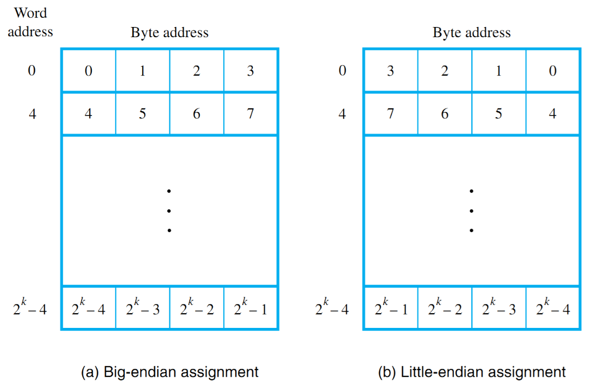

# Lecture 3, Jan 23, 2024

## Storage and Variables

### Code Memory and Instructions

* Slower and larger than registers, but usually faster than data memory
* Usually not modifiable when the program is running
* This can be a region of a larger set of memory (*unified memory model*) or physically separate (*separate memory model*)
	* We need to be aware of this because it may have performance implications
* Code is compiled/assembled into *instructions*, which are stored here
* Each instruction is an atomic operation that may take multiple clock cycles to complete (measured in *cycles-per-instruction*, CPI)
	* Particularly in CISC architectures, CPI for some instructions can be much greater than 1
	* Typical goal of RISC architectures is to limit CPI to 1 for most instructions
	* CPI can also be less than 1 (e.g. multiple cores, superscalar architecture, etc)
* Actual execution time is the sum of the CPIs of all instructions multiplied by the clock period
* *Pipelining* helps achieve CPI of exactly 1 by overlapping instructions to avoid having idle hardware
	* If two instructions have multiple sub-parts that use different internal areas, we can start the second instruction while the first one is still executing
	* e.g. fetch the second instruction while the first is executing
	* This is akin to an assembly line
* Such features are mostly to the programmer, but not the hardware designer
	* These affect our ability to relate real execution time to CPI, since it adds unpredictability to execution time
	* Other features can include caching, branch prediction, out-of-order execution, etc

## Registers

* The *program counter* (PC) keeps track of either the current instruction executing or the next instruction to be fetched
	* The CPU would fetch the instruction at the position, interpret it, and execute it, which modifies the program counter
	* This is a *special function register* (SFR), which are registers that have specific uses and must be accessed in specific ways
* All microcontrollers provide *general purpose registers* or *accumulators*
	* They are very limited in number, but very fast
* The register size typically matches the microcontroller word size, but occasionally divided into half-words or bytes
	* If we're working with a lot of math that exceeds the bit width of the microcontroller, this can be very slow
	* Most execution time is spent moving data between registers and slower memory
* Some instructions may concatenate multiple registers to form a larger operand
* Some older microcontrollers (e.g. 8051) implement registers in RAM, which allows for *register banking* (having multiple sets of registers that can be switched)
	* This is mostly obsolete in newer chips due to speed
* *Accumulators* are general purpose registers that are often dedicated to arithmetic
	* These are inherently used by math instructions
	* To use them as e.g. an address, they often have to be copied to another register first
	* This simplifies the instruction set since math instructions will only use the accumulators
	* Mostly a feature in modern RISC chips; CISC designs directly use general purpose registers

### Memory Layout

* Most memory in CPUs will be byte-addressable, even if the bit width of the microcontroller is more than 8
* Since a word can span multiple memory addresses, we need a convention on how to store a word in multiple bytes
	* *Big endian* systems store the most significant bytes first
	* *Little endian* systems store the least significant bytes first
		* Note the individual bits are not reordered, only the byte order is
	* This is normally handled by the compiler, but may become important when we do type casting or accessing a specific bit in a mask

{width=50%}

### Stack Pointer

* The *stack* is a special region of memory inherently accessed through special instructions
	* This has a variety of uses such as subroutines and temporary variable storage
* The stack and program memory may share the same address space or physical memory, or may be entirely separate
* The *stack pointer* (SP) is another SFR that tracks where the top of the stack is in memory
* What exactly the stack pointer points to varies between implementations
	* Some platforms (e.g. 8051) have the SP point to the next free space, while some others (e.g. HC12) point towards the last filled space
	* Some stacks grow downwards (SP decreases, e.g. 68HC12), while others grow upwards in memory
* Since the stack doesn't know where the data came from and how big it was, if we push a 16-bit value onto the stack and pop it into an 8-bit register, we would only get the first 8 bits while the rest stays on the stack
* Note that in most architectures, popping the stack only copies the value to a register and moves the stack pointer, without ever clearing the value in the stack
* Growing the stack past the designed limit causes a *stack overflow*, which could overwrite data or even code
* Many stack implementations are very limited, and some platforms may even have a fixed upper limit to the call depth

## Code Compilation

* Each instruction is compiled into an *op-code*, which is decoded by the microcontroller
* Every variant of the instruction has its own distinct encoding
	* e.g. the `MOV` instruction can have many different op-codes depending on where it's reading from and writing to
* Instruction encoding is usually handled by the assembler/compiler and not too much of a concern

