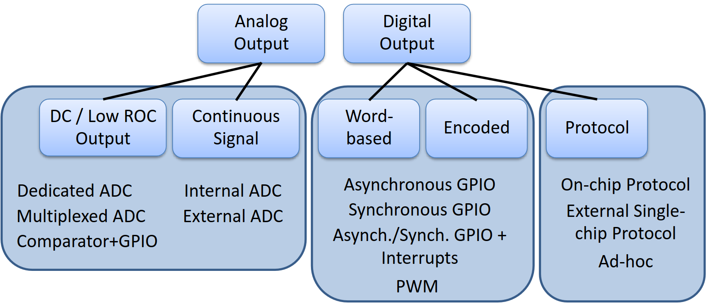
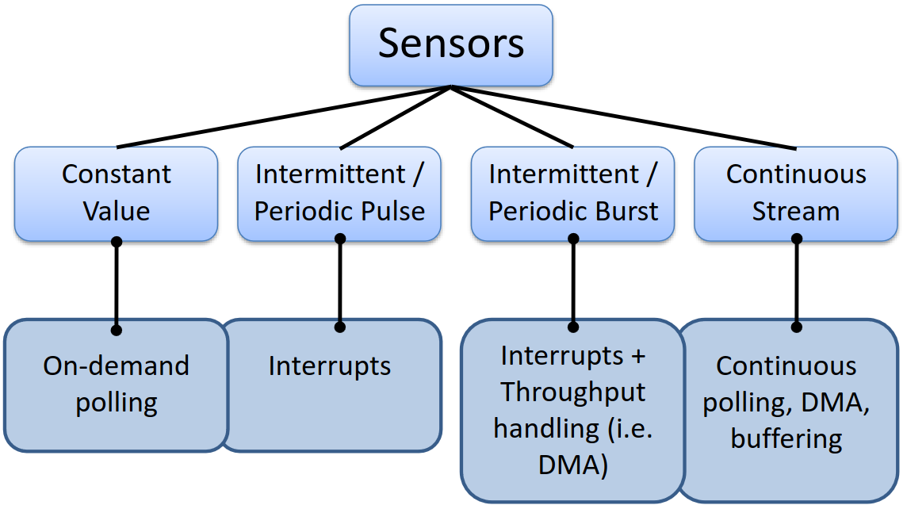
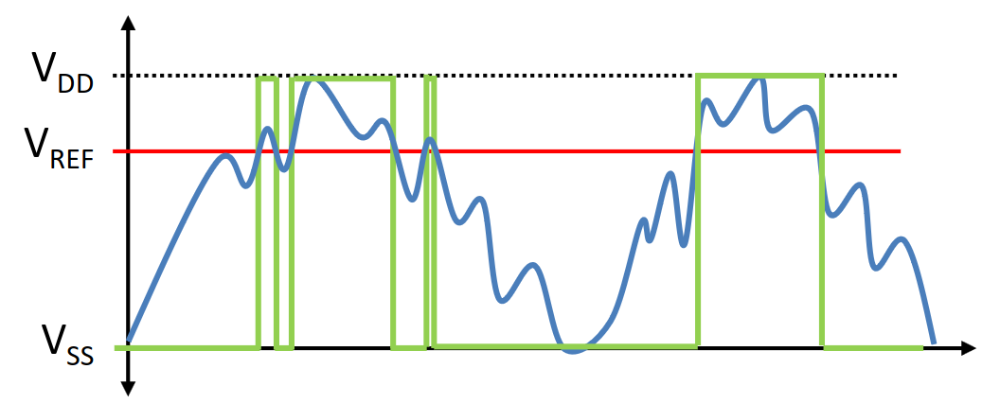
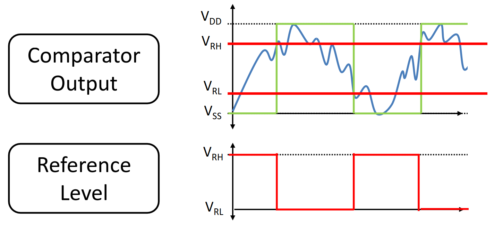
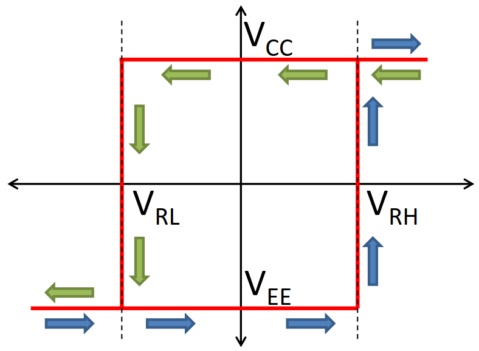
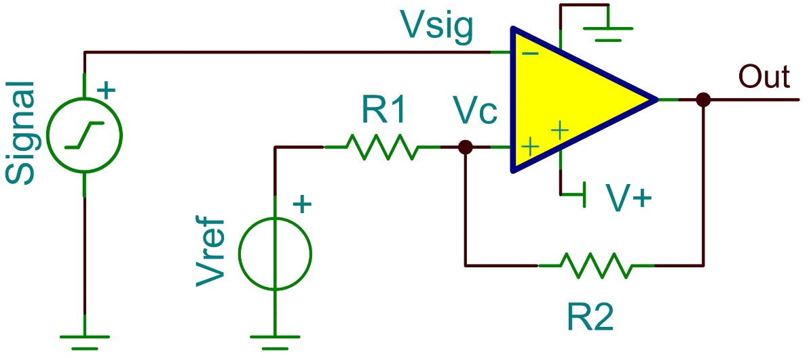
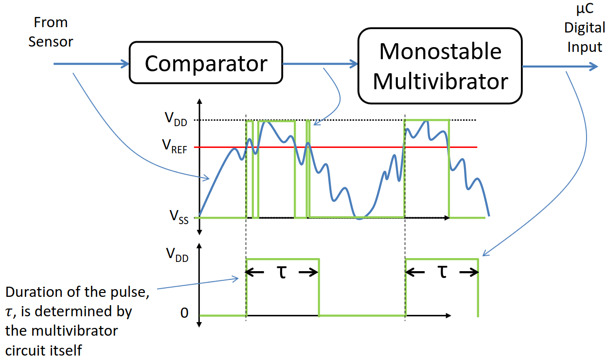

# Lecture 8, Mar 5, 2024

## Interrupts -- Data Sharing

* Transfer of data to and from ISRs is done through shared global variables
* Since interrupts can occur at any time, this can lead to *race conditions*
* The interrupt may occur and write to a variable during a sequence of operations in which the variable is assumed constant
	* e.g. comparing two variables that are set in an ISR; the interrupt can occur after the main code reads one of the values, and update the other value before it is read from main, leading to inconsistency
	* This can occur at the end of any assembly instruction, and not just high-level code constructs
	* An interrupt can occur in the middle of a line of code that gets translated to multiple instructions!
* *Critical sections* access important shared resources/variables and thus must prevent multiple access to those resources
	* Disable interrupts at the beginning and re-enable them at the end to prevent multiple access
	* Critical sections must be as short as possible, since disabling interrupts directly increases system latency
		* Critical sections that are too long can lead to comatose states
	* To reduce their size, make local copies of shared data, e.g. for a comparison, load the two variables into temporaries in a critical section and compare the temporaries outside the critical section
* Some compilers have the ability to disable certain unsafe optimizations
	* e.g. `volatile` in C tells the compiler that the variable's value may change at any time

## Interfacing Sensors

* Sensors can be categorized by output type broadly into either analog or digital
	* Within analog output, we can classify sensor output into either DC/low rate-of-change (ROC) or a general continuous-time signal (higher frequency)
	* Within digital output, we can classify sensor output as word-based, encoded into something like PWM, or some other communications protocol

{width=70%}

* Sensors can also be classified by output data frequency (i.e. how often the data changes)

{width=55%}

## A/D Conversion

### 1-Bit Conversion

* This would be used for a signal that changes slowly or takes on only a few fixed values
* We want to compare the analog voltage level with a threshold to generate a 1 or 0
* This can be done using a *comparator*, which is like an op-amp without a feedback loop, so it outputs either 1 or 0 depending on which input voltage is higher
	* This allows for high-speed comparison
	* If we input a triangle wave and a reference voltage to a comparator, we can implement PWM by changing the reference voltage
* Many modern platforms have built-in comparators, the inputs of which can be mapped to GPIO pins via SFRs
* For input voltages near the threshold, we could have the result change rapidly between 1 and 0 due to oscillations, caused by noisy data, control lag, etc

{width=40%}

* This can be addressed with *hysteresis*: split the reference into an upper and lower bound; if the input is over the upper reference, output 1; if it's under the lower reference, output 0; if it's between, hold the previous output
	* This can be implemented with a changing reference signal; when output is high, set reference to low bound, and when output is low, set reference to high bound
	* This is good for dealing with noise in either the signal or the reference itself
	* Another application is quasi-digital signals such as button presses, encoder outputs, etc
	* In analog, hysteresis is implemented using a positive feedback from output to reference, or via dedicated triggers such as *Schmitt triggers*

{width=60%}

{width=35%}

{width=45%}

* The effects of hysteresis on a slow-responding control system is to increase the oscillation period (so the output switches less frequently), but the magnitude will increase
* Filters can be used on noisy data
	* These can be implemented in hardware or software depending on tradeoff of added parts/circuit complexity vs. added code complexity/load on CPU, and sampling rate requirements
	* Noisy signals can be smoothed out, but this introduces information loss and a phase shift
	* Best applied for high-frequency noise that is distinct from the frequency of the signal
	* However, this often can't eliminate all noise and incorrect switching by itself
* Another method is to use triggering methods, such as *multivibrator circuits*
	* Switch debouncing is one common application
* Multivibrators come in 3 variants:
	* Astable: an oscillator (not useful for us)
	* Monostable: a single stable state that the multivibrator will stay in; the state switches to an unstable state on some signal input, and switches back after a set amount of time
	* Bistable: both states are stable (needs an external reset trigger signal)
* While hysteresis needs to be implemented in the comparator itself, a multivibrator can be attached after the comparator to have the same effect
	* This is useful when we have comparators in hardware that we cannot modify
	
{width=70%}

