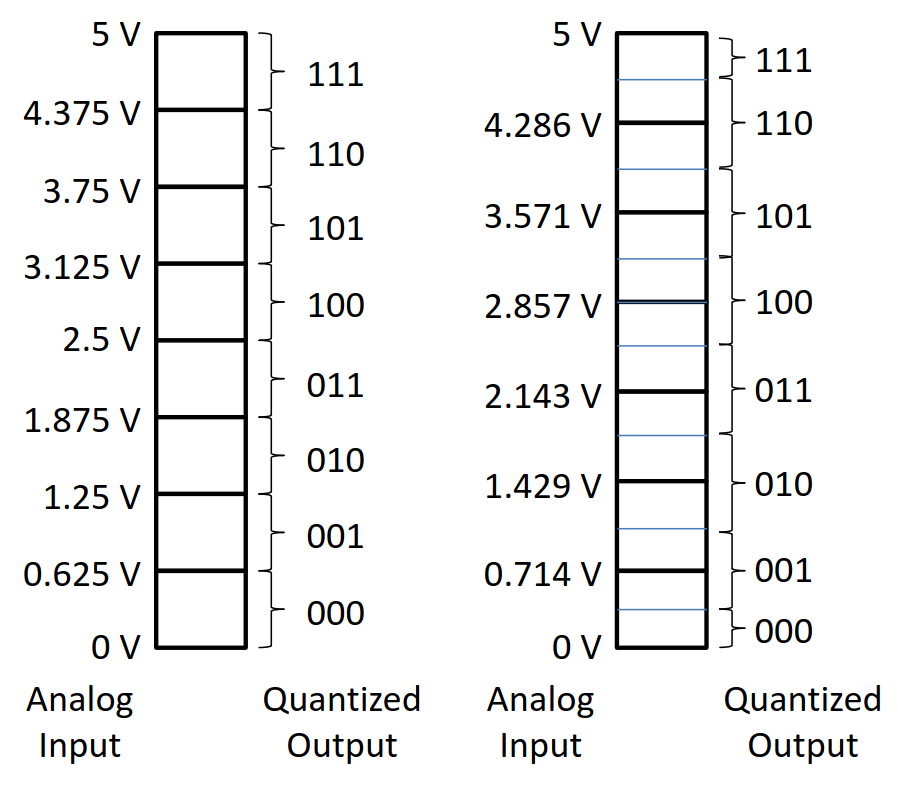
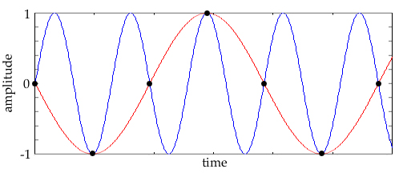
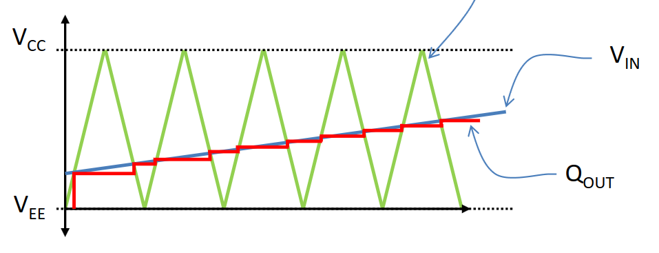
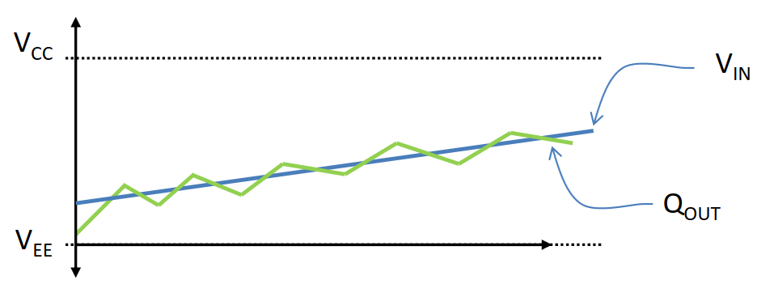
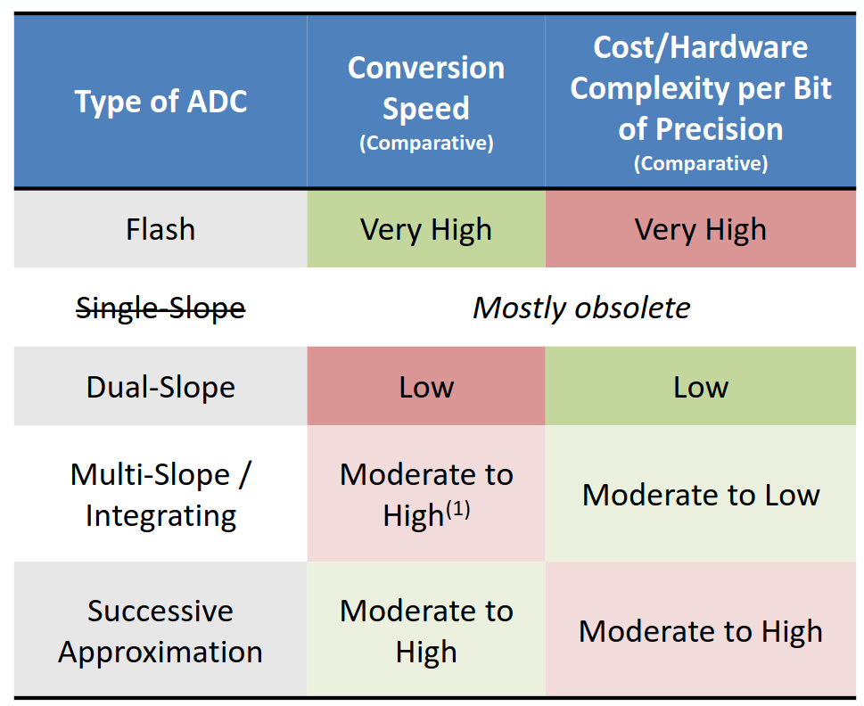
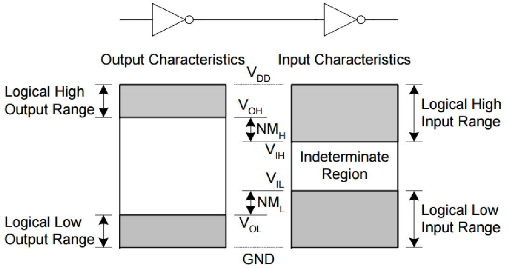
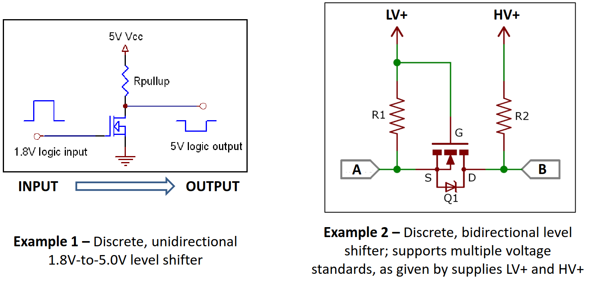

# Lecture 9, Mar 12, 2024

## General A/D Conversion

* Generally ADCs consist of two components: *sample & hold* and *quantizer*
	* The sample & hold takes a snapshot of the input voltage level (on sample clock) and holds it constant, even if the input changes
		* This is needed because quantization takes time, so the input to the quantizer cannot change during this time
	* The quantizer maps the input voltage to an $n$-bit signal and put into an SFR
		* More modern processors with DMA can write this directly to a location in shared memory
* The input voltage in the range of 0 to $V_{ref}$ is mapped to the entire digital output range
	* Having a stable reference voltage is important
	* Internal ADCs often have reference voltages that can vary due to temperature changes, etc, causing the ADC output to drift over time
	* External ADCs do a lot to make $V_{ref}$ constant
* A naive quantization scheme would simply divide the full range into the $2^n$ possible output values and maps input to output evenly
	* However, for the max and min input levels, the quantization error is equal to $\frac{V_{ref}}{2^n}$ since we can't go below zero or above max
* A more common quantization scheme will use only half a division at the top and bottom of the input range
	* Now each digital unit maps to a range of $\frac{V_{ref}}{2^n - 1}$
	* The worst-case quantization error is now $\frac{1}{2} \cdot \frac{V_{ref}}{2^n - 1}$
	* More modern hardware will do this, because the precision lost by doing this becomes negligible at higher bit widths

{width=50%}

* Most ADCs can only sample at fixed intervals; they require setup time, hold time, and output time, which is often significant compared to the CPU clock
	* Many features can increase this time, e.g. hardware oversampling/averaging
	* ADC data will lag behind real time!
* The *Nyquist-Shannon Sampling Theorem* states that we must sample at at least twice the frequency of the highest component of the input, otherwise we will get aliasing
	* Some ADCs will have Nyquist filters built-in to avoid this (the input will be passed through a low-pass filter)
	* If the ADC does not have one built-in, we need additional hardware to do the filtering, since it's not possible to do this in software

{width=50%}

### External ADCs

* Most microcontrollers have internal ADCs, however these often have low specs when it comes to bit width, $V_{ref}$ stability, accuracy, speed, etc
* External ADCs can send the data in parallel, serial, serial shift register, or some other protocol 
* Depending on the ADC implementation/structure, we can get very different conversion speeds, precisions, etc
* A *flash ADC* uses a ladder of $2^n$ comparators to directly quantize the input
	* The output is generated almost instantly
	* Highly impractical for large bit widths
* *Single-slope ADCs* use a triangle/ramp signal (from a counter + DAC) and a comparator to find the signal level
	* The counter counts up and raises the reference; whenever the reference exceeds the input, we take the current value of the counter as the output
	* However this is very slow, so true single-slope ADCs are mostly obsolete
* A *dual-slope ADC* counts up as well as down, giving essentially twice the conversion speed
* An *integrating/multi-slope ADC* tries to keep the reference near the input signal so we don't waste too much time counting
	* These work the best on slowly-changing signals but bad on rapidly changing signals
	* Integrating/multi-slope ADCs are complex and expensive but much faster

{width=50%}

{width=60%}

* *Successive approximation ADCs* (SARs) essentially performs a binary search to find the correct output value
	* This is used by the lab HCS12s
	* This doesn't scale well with larger bit widths and faster speeds, but they are still good and common in older hardware
* The more precise the output, the more time and complexity the ADC will take

{width=60%}

## Digital I/O

* Some CPUs have dedicated instructions for I/O
	* This is uncommon because this ties the ISA to the actual pin count of the chip
* Most CPUs use SFRs to control I/O; often one SFR is used per *port*
* Pin configuration (input or output, open drain, etc) is also set via SFRs
* In older hardware, each physical pin on the microcontroller has only a small number of functions or a single fixed function
	* This is convenient for the programmer, but hard to expand, is wasteful of pin count, and hard to design the wiring
* In modern hardware each pin often has many selectable functions; each pin is multiplexed
	* e.g. modern PIC chips have a peripheral pin select (PPS) system that allows near-complete remapping of pins
	* This allows much easier layout of hardware
	* Often accomplished through a matrix mapping
* When interfacing with digital I/O, we must be mindful of:
	* Voltage ranges of signals (e.g. 3.3 or 5 volt logic)
	* Noise margins of different parts (i.e. the ranges that are considered high/low; this can be considered different even within 3.3 or 5 volt logic)
		* When one device outputs a logic high, it could be anywhere within the noise margin
		* We need to ensure that the noise margins match or the margin of the source device is contained within the margin of the destination device
		* Many different standards exist for noise margins and logic thresholds
	* Fan-in/fan-out (i.e. loading effects when driving multiple things)

{width=60%}

* Some devices have compatibility with different logic levels; a lower voltage device can sometimes interpret a higher voltage input and withstand it without damage
	* This does not guarantee that it works the other way around!
* If logic levels and noise margins are incompatible, we need hardware logic level shifters; these are often simple and easily implemented with MOSFETs
	* However, these add a slight propagation delay

{width=70%}

