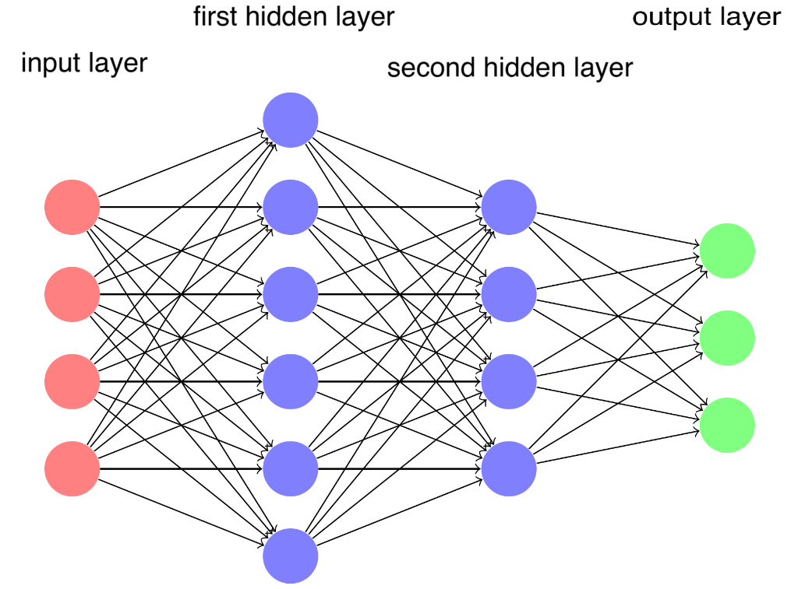
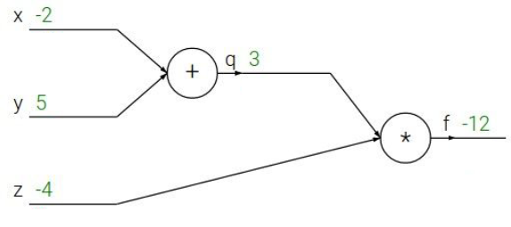
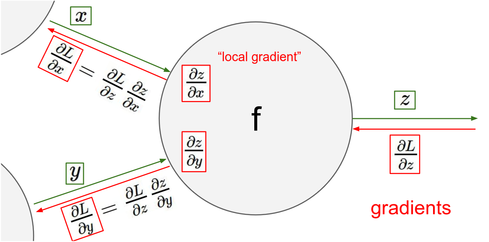
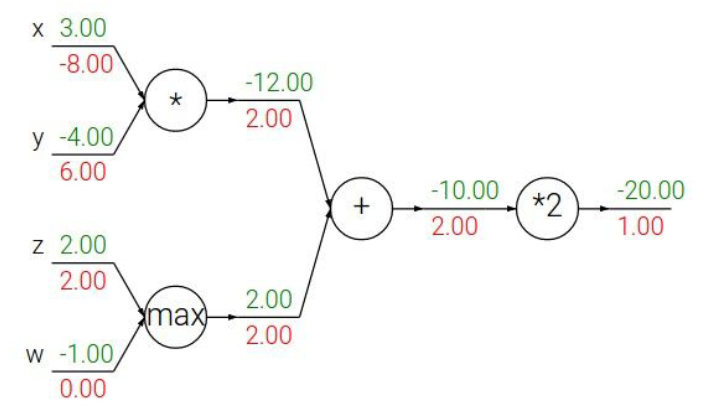

# Lecture 12, Mar 12, 2024

## Neural Networks

* $w_{jk}^{(i)}$ denotes the weight for input $k$, from neuron $j$ in layer $i$
* $\bm W^{(i)}, \bm b^{(i)}$ are the weight matrix and bias vector for layer $i$
* Each layer's input is denoted by $\bm X \in \reals^{N \times D}$ and output is denoted by $\hat{\bm F}$
* Each layer's output is computed as $\phi^{(i)}\left(\bm X{\bm W^{(i)}}^T + {\bm b^{(i)}}^T\right)$
* A linear activation function would see no benefit from stacking layers, so it is typically not used
* Other common activation functions are ReLU, soft/smooth/leaky ReLU, threshold (perceptron), logistic (sigmoid), and tanh

{width=70%}

* To find weights, we either minimize a loss (e.g. least-squares) or maximize a likelihood (e.g. Gaussian)
* A logistic sigmoid activation $\sigma(z) = \frac{1}{1 + \exp(-z)}$ is used in classification to restrict the output range to $(0, 1)$, allowing us to interpret it as a probability
* For multi-class classification we assume an output distribution of a categorical (multinomial) distribution
	* This leads us to the softmax function, $\frac{e^{z_j}}{\sum _k e^{z_k}}$
	* For $k = 2$ we get back the sigmoid (up to a scaling)
* For numerical stability, use the LogSumExp function, i.e. taking the log of the softmax

### Backpropagation

* A recursive procedure to find the gradient
* Consider the simple example $f(x, y, z) = (x + y)z$ where $x = -2, y = 5, z = -4$
	* We have $q = x + y$, so $\pdiff{q}{x} = 1, \pdiff{q}{y} = 1$, and $f = qz$ so $\pdiff{f}{q} = z, \pdiff{f}{z} = q$
	* To perform backpropagation, we start from the end of the computational graph and work backwards
	* Use the chain rule to get successively deeper in the graph

{width=25%}

* In a computational graph, each node is aware of only its surroundings: its local inputs $x, y$ and its output $z$, and some operation $f$ that is applied
	* We can compute a local gradient $\pdiff{z}{x}$ and $\pdiff{z}{y}$
* We also have the upstream gradient of the final output $L$ with respect to the current node output, $\pdiff{L}{z}$
* Now when we pass downstream, we pass $\pdiff{L}{x} = \pdiff{L}{z}\pdiff{z}{x}$ and $\pdiff{L}{y} = \pdiff{L}{z}\pdiff{z}{y}$

{width=70%}

* Given any function, first find its computational graph, then apply the algorithm recursively starting from the output, until we reach the inputs we want
* The computational graph can be broken down into any level of granularity; e.g. instead of breaking a sigmoid into a negation, exponentiation, addition, etc, we can treat the entire thing as a sigmoid gate
* We can observe some patterns in how common operations affect gradient flow:
	* Add gates are gradient distributors: the upstream gradient is propagated as-is to both inputs
	* Max and min gates are gradient routers: the upstream gradient is propagated as-is to only a single input, while the other input(s) get zero (since they do not affect the output)
	* Multiplication gates are gradient switchers: the gradient of one input is the upstream gradient multiplied by the value of the other inputs

{width=60%}

* One node can connect to two other nodes, in which case the upstream gradient is the sum of the upstream gradients of all the nodes it connects to
	* $\pdiff{f}{x} = \sum _i \pdiff{f}{q_i}\pdiff{q_i}{x}$ where $q_i$ are upstream nodes connected to this node
* The whole operation can be vectorized, replacing gradients with Jacobian matrices

