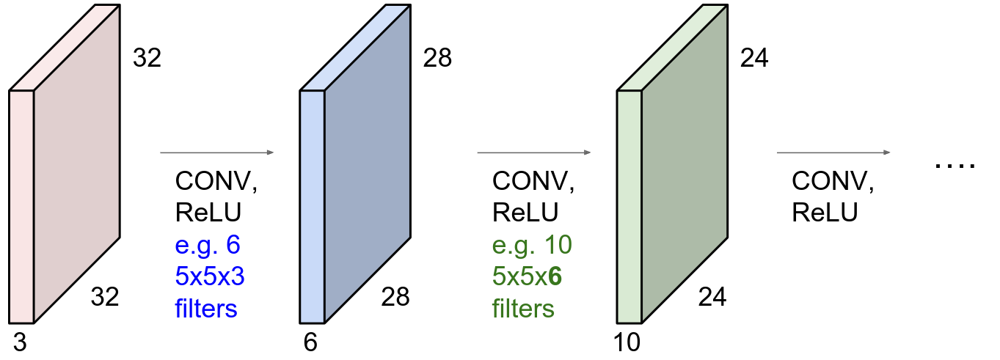

# Lecture 13, Mar 15, 2024

## Neural Networks -- Training Considerations

### Weight Initialization

* Deep neural networks suffer from the problem of *vanishing* or *exploding* gradients
	* Since we have to multiply together a large number of gradients, if the gradients are each individually small, the overall gradient goes to zero; if the gradients are individually large, the overall gradient goes to infinity
	* If our gradient is too small, then we might be moving very slowly or detect false convergence
	* If the gradients are too large, we suffer from instability
* Initializing the weights to the same value, e.g. zero, is not a good choice
	* With all weights being zero, each neuron receives an input of zero, so the gradients are the same and the network cannot learn complex patterns
	* We also have the symmetry issue; if the network architecture and weights are symmetric, we get symmetric gradients and the entire network just becomes symmetric
* What about small random numbers?
	* Since the weights are small, all activations will tend to zero, and all gradients will become the same
* What about large random numbers?
	* The opposite happens -- the activations saturate and all gradients become zero (assuming sigmoid or tanh activation)
* If our input data is normalized to zero-mean and unit variance, we can expect that we'd also want our weights to be distributed the same
* *Xavier initialization* scales the weights by the square root of the number of inputs
	* Derived by looking at what weights will avoid vanishing or exploding gradients
	* The distribution is a unit Gaussian scaled down by the root of the number of inputs
	* This is the default for PyTorch, Tensorflow, etc
* For other activation functions, we have other strategies
	* For ReLU, we instead divide by the root of half the number of inputs
* Symmetries in the weight space lead to equivalent networks with different sets of weights (*model identifiability problem*)
	* Having different ways to connect weights that lead to the same result will give many local optima
	* However, if we overparameterize our network, it will turn the minima into saddle points (at the cost of overfitting)

## Overfitting Prevention

* Regularization can be used to prevent overfitting in neural networks as well
	* Penalize the magnitude of the weights
	* Using $l_2$ regularization is commonly called weight decay
	* $l_1$ regularization introduces sparsity
* *Early stopping* is the idea of stopping training after a certain number of iterations, instead of checking for convergence in the gradient
	* The number of iterations is treated as a hyperparameter
	* Once the validation loss starts increasing, we stop, backtrack a bit till the point before it started increasing, and take that as the final model
* Another method is to use more data
	* If it's not possible to collect more data, we can use *data augmentation* techniques, such as rotation, blurring, cropping etc, to generate new training samples that the model should still recognize
	* We can also intentionally add adversarial examples by adding noise
* Bagging/bootstrap aggregation can also be used to reduce the variance in the estimates
* *Dropout* is another technique where some hidden units are "dropped" during training with probability $1 - \pi$, where $\pi$ is a hyperparameter)
	* During testing/inference, the weights are scaled back up by $\pi$
	* Typical values are $\pi \in [0.5, 0.8]$
	* Statistically, this is an approximate Bayesian inference scheme
* *Weight sharing* is a technique that uses prior knowledge to identify weights that should be close to each other, and force the weights to be the same or penalize their difference
	* CNNs are an example of this, since convolutions share the same weights in the kernels

### Convolutional Neural Networks (CNNs)

* In a fully-connected network each layer is fully connected to the one before it -- all neurons are connected to all the neuron in the previous layer
	* In such a network, if we have $m$ neurons in the previous layer and $n$ in the current, we'd need $nm$ weights
* In convolutional neural networks, we convolve a filter with the image
	* This keeps the spacial structure of the input image
	* Note filters always extend the full depth of the input volume, e.g. for an RGB image the filters have a depth of 3
	* The filter slides over the input, taking a dot product at each position, resulting in an activation/feature map
* Multiple filters can be stacked together to get more output channels, for variety in feature spaces
* A CNN has a sequence of convolutional layers, interspersed with activation functions

{width=60%}

* Earlier layers in the stack will learn low-level features, and layers deeper in the network learn more abstract features
	* Eventually the data is transformed into a linearly separable form, which can be passed to fully connected layer(s) to be processed into the final output
* Between fully connected layers, we can use pooling layers to reduce the size of the feature map to make it more manageable
	* Pooling layers are essentially downsampling the network spatially
	* The depth of the map remains the same since we only pool spatially
	* Pooling methods include max pooling and average pooling

### Autoencoders

* Autoencoders are a type of model for unsupervised learning, which can be used for dimensionality reduction
* Autoencoders consist of an encoder, mapping from input to feature space, and a decoder, mapping from feature to output space
* Data is passed through the encoder and mapped into the feature space, and then mapped by the decoder back into a reconstruction of the input
	* Due to the reduction in dimension of the feature space, the reconstruction of the input will only have the "important parts"
	* Now we apply a loss function between the input and output data (usually $l_2$)
* After training we can discard the decoder, and use the encoder as a dimensionality reducer
	* We can use the encoder to initialize a supervised model -- the output from the encoder can be fed to a classier
	* This is important for semi-supervised learning where we only have a small amount of labelled data
	* Improves performance since the input is lower in dimension and already processed to only contain the "important parts"

