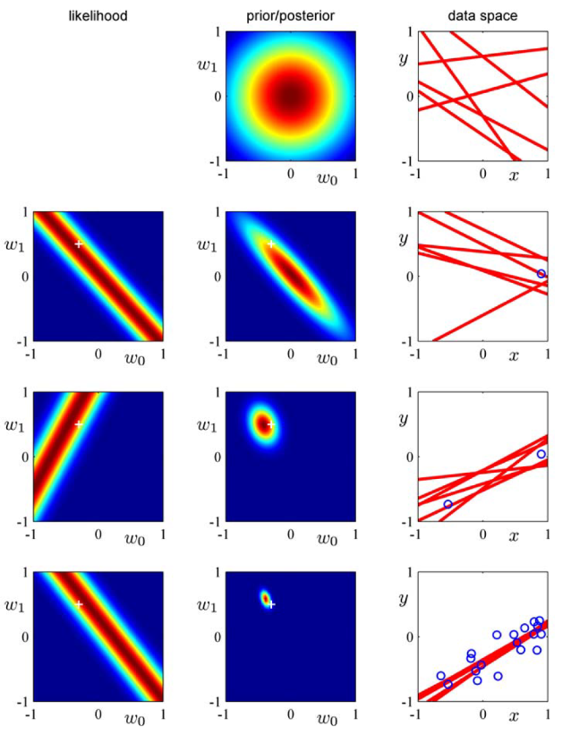
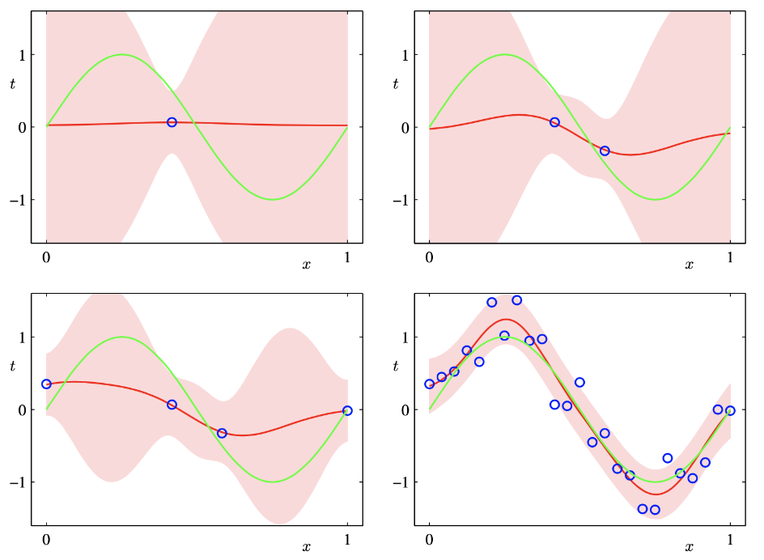

# Lecture 14, Mar 26, 2024

## Bayesian Estimation

* Bayesian approaches allow us to quantify the uncertainty in predictions, whereas MLE and MAP are frequentist approaches that only give a point estimate
* Additional benefits include:
	* Allows us to use a prior toe encode our beliefs about the parameters before seeing any data
	* Prevents overfitting so long as the prior and likelihood are accurate
	* Allows us to construct models in the low-data regime
* Frequentist methods assume that there exists a true, fixed parameter value $\theta^*$
	* Error bars on the estimate of $\theta$ are obtained by considering the distribution of all possible datasets
* In the Bayesian approach, we have a single observational dataset, and we estimate the posterior distribution of the parameters given the data
	* Error bars are obtained from this posterior distribution
* Bayesian methods use two things:
	* The likelihood $p(y^{(1)}, \dots, y^{(N)} | \theta) = p(\mathcal D | \theta)$
		* This is not a probability distribution but rather a function of the parameters $\theta$
	* The prior $p(\theta)$
		* Encodes prior beliefs about the parameters before looking at the data
		* Often we use a form that makes the computation easy rather than some rigorous statistical assumption
* We are interested in computing two distributions:
	* The *posterior distribution* $p(\theta | \mathcal D)$
		* This encodes our beliefs about the parameters after observing the data
		* Comes from Bayes rule, $p(\theta | \mathcal D) = \frac{p(\mathcal D | \theta)p(\theta)}{\int p(\mathcal D | \theta')p(\theta')\,\dtheta'}$
	* The *posterior predictive distribution* $p(y' | \mathcal D)$
		* This is the distribution of a future observation given the data
		* Used to estimate what unseen values in the data are
		* Marginalize out $\theta$ to get $p(y' | \mathcal D) = \int p(y' | \theta)p(\theta | \mathcal D)\,\dtheta$
* Process:
	1. Write down the likelihood $p(\mathcal D | \theta)$
	2. Write down the prior $p(\theta)$
	3. Compute the posterior $p(\theta | \mathcal D) = \frac{p(\mathcal D | \theta)p(\theta)}{p(\mathcal D)}$
	4. Compute the posterior predictive distribution $p(y' | \mathcal D)$
* The two last steps are often challenging to do
* Example: suppose we have a coin where $\theta$ is the probability of heads; we have a dataset of $N$ flips
	* Likelihood: Bernoulli $p(\mathcal D | \theta) = \theta^{N_H}(1 - \theta)^{N_T}$
	* Prior: beta prior $p(\theta, a, b) = \frac{\Gamma(a + b)}{\Gamma(a)\Gamma(b)}\theta^{(a - 1)}(1 - \theta)^{(b - 1)}$
		* This distribution encodes possible beliefs about the prior
		* Expectation at $\frac{a}{a + b}$
	* Posterior $p(\theta | D) \propto \theta^{a + N_H - 1}(1 - \theta)^{b + N_T - 1}$
		* This is another beta distribution with parameters $a + N_H$ and $b + N_T$
	* Posterior predictive distribution $p(y' = H | \mathcal D) = \int p(y' = H | \theta)p(\theta | \mathcal D)\,\dtheta = \frac{N_H + a}{N_H + N_T + a + b}$
* In the above example we chose the beta prior because it has the same form as the Bernoulli distribution
	* This is known as a *conjugate prior*, which makes the computation convenient
	* Any distribution in the exponential family has a corresponding conjugate prior
	* e.g. for Bernoulli we have beta; for Gaussian we have Gaussian again
* As we increase the amount of data, we rely on the prior less and the distribution approaches the MLE estimate
* If the prior and likelihood assumptions are incorrect, the Bayesian approach can still overfit
* In practice, it also involves evaluating a high-dimensional integral which is not practical
	* Bayesian linear regression can allow us to approximate these integrals

### Bayesian Linear Regression

* Assume a dataset $\mathcal D$ where each output is assumed to be IID from a normal distribution with mean $\bm w^T\bm\phi(\bm x)$ and variance $\sigma^2$
	* This led us to the normal GLM with MLE, and the regularized GLM with MAP
* Likelihood: $\log p(\bm y | \bm w, \bm X, \sigma^2) = \sum _{i = 1}^N \log\mathcal N(y^{(i)} | \bm w^T\bm\phi(\bm x^{(i)}), \sigma^2)$
* Prior: $p(\bm w | \alpha) = \mathcal N(\bm w | \bm 0, \alpha\bm 1)$
	* This is the conjugate prior
* Posterior: $\alignedeqntwo[t]{\log p(\bm w | \mathcal D)}{\log p(\bm w) + \log p(\mathcal D | \bm w) + \text{const}}{-\frac{1}{2\alpha}\bm w^T\bm w - \frac{1}{2\sigma^2}(\bm w^T\bm\Phi^T\bm\Phi\bm w - 2\bm w^T\bm\Phi^T\bm y + \bm y^T\bm y)}{-\frac{1}{2}(\bm w - \bm\mu)^T\bm\Sigma^{-1}(\bm w - \bm\mu) + \text{const}}$
	* $\bm\mu = \frac{1}{\sigma^2}\bm\Sigma\bm\phi^T y$
	* $\bm\Sigma^{1} = \frac{1}{\sigma^2}\bm\Phi^T\bm\Phi + \frac{1}{\alpha}\bm 1$
* The max of the posterior is just its mean, which is the same solution as in MAP estimation, $\bm\mu = \left(\bm\Phi^T\bm\Phi + \frac{\sigma^2}{\alpha}\bm 1\right)^{-1}\bm\Phi^T\bm y$
* Posterior predictive: $\alignedeqntwo[t]{p(y' | \bm x', \mathcal D)}{\int p(y' | \bm x', \bm w)p(\bm w | \mathcal D)\,\dd\bm w}{\int \mathcal N(y' | \bm w^T\bm\phi(\bm x'), \sigma^2)\mathcal (\bm w | \bm\mu, \bm\Sigma)\,\dd\bm w}{\mathcal N(y' | \bm\mu^T\bm\phi(\bm x'), \bm\phi(\bm x')^T\bm\Sigma\bm\phi(\bm x') + \bm\sigma^2}$
	* The last line is obtained because we have a convolution of two Gaussians
* Bayesian linear regression considers all possible explanations of how the data was generated, and predicts using all possible regression weights, weighted by the posterior probability

{width=50%}

* Between each row of the figure, we add data points; the new posterior is obtained by taking the prior and multiplying by the likelihood, and the data space shows lines indicating the distribution of possible parameters

{width=50%}

* We need to choose a good $\alpha$ and $\sigma$ to get a good result
	* If we know about the noise (e.g. via a sensor model), we can use this to specify $\sigma^2$
	* If we previously estimated the posterior and we would like to update it (i.e. sequential inference), we can use the previous posterior as the prior, like in the first figure
	* If we don't have enough information for either, we could specify priors over $\alpha$ and $\sigma^2$
		* This is the full Bayesian method
		* No analytic solution exists for the inference
* In *type-II inference*, we numerically optimize $\alpha$ and $\sigma^2$ to maximize $\log p(\bm y | \bm X, \alpha, \sigma^2)$, known as the *evidence* (i.e. the likelihood of the observations), to find good values for $\alpha$ and $\sigma^2$
	* Computationally cheap
	* Only two parameters, so not as prone to overfitting
	* Tends to underestimate the uncertainty (which is not good for engineering), because we're using point estimates for the parameters $\alpha$ and $\sigma^2$

