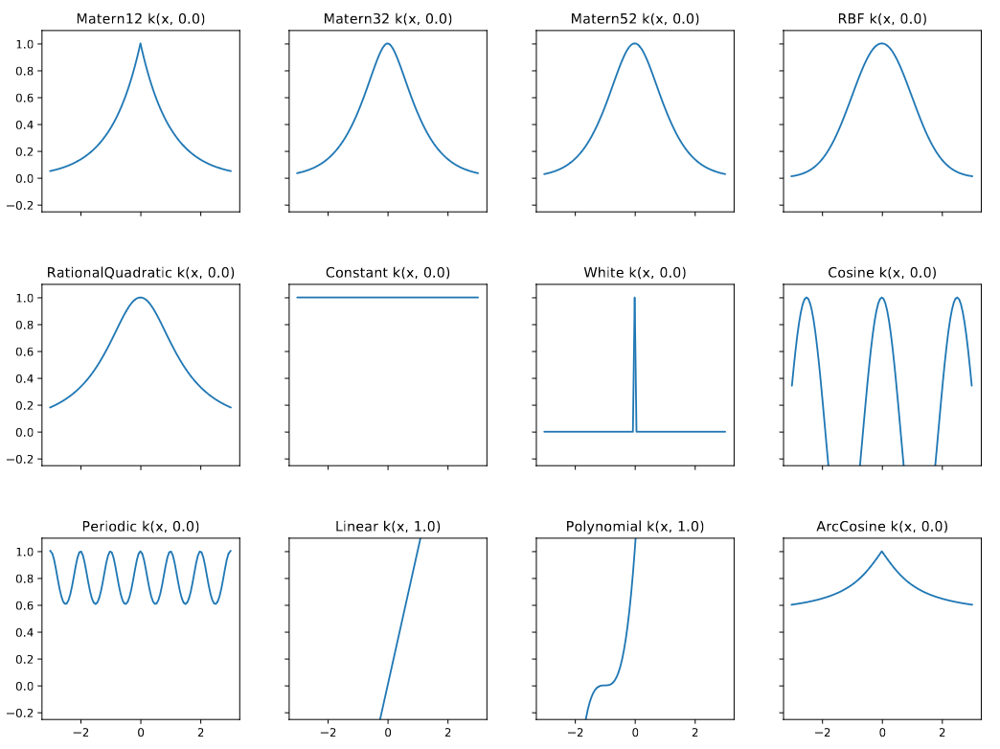
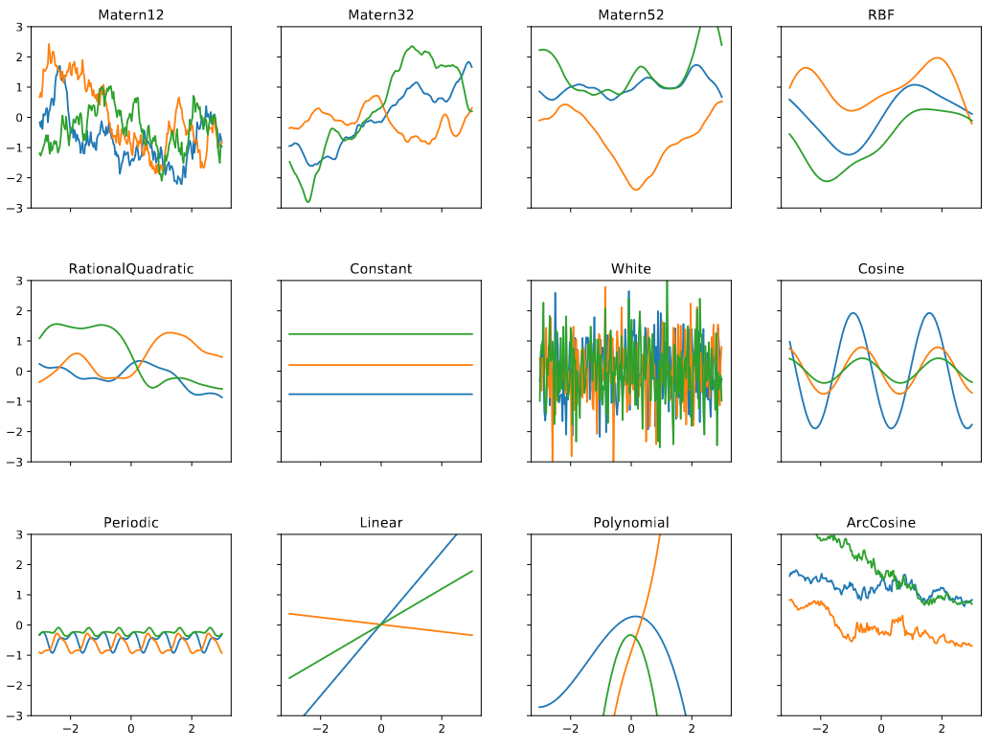
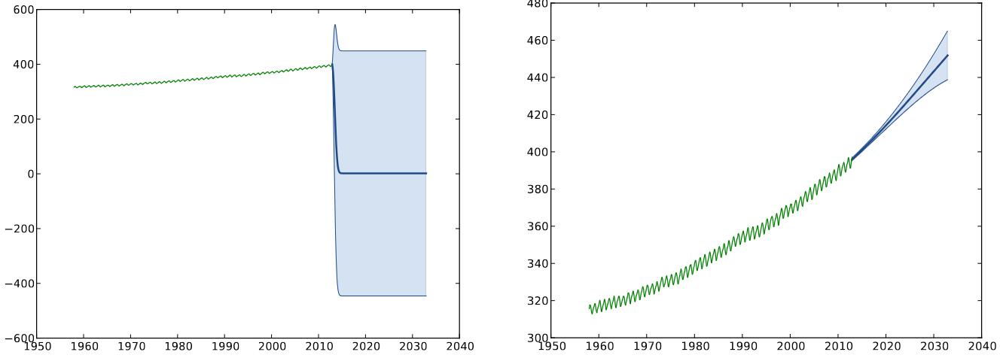
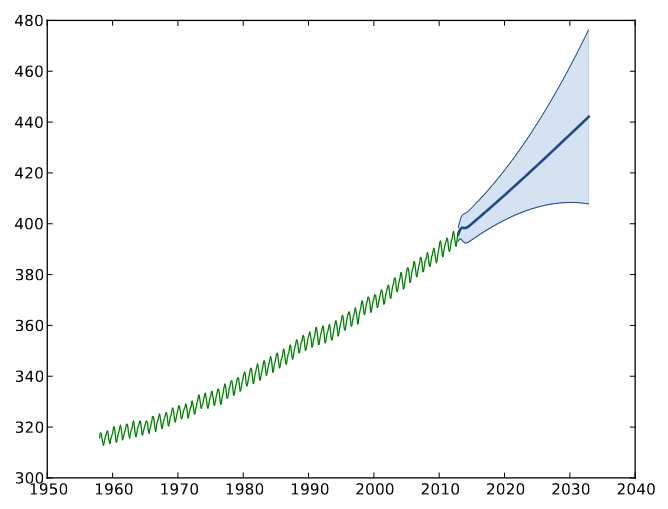
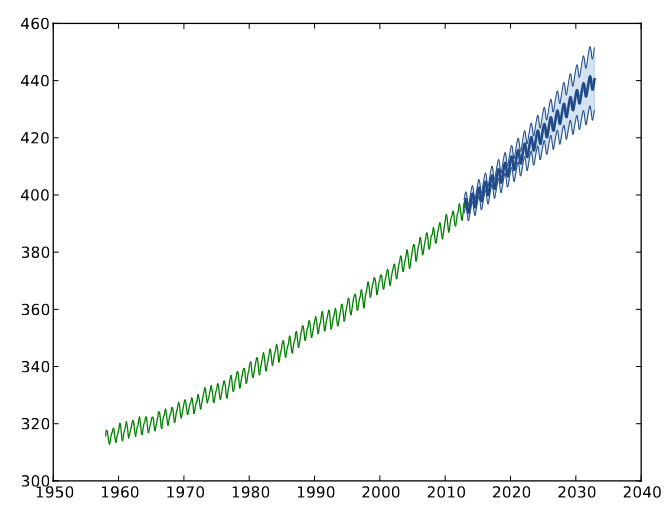

# Lecture 15, Apr 5, 2024

## Gaussian Processes -- Regression in Function-Space

* Gaussian processes are a kernelized version of Bayesian linear regression
	* Allows scaling to infinitely many basis functions
	* Priors over functions instead of parameters, which is a lot more powerful (e.g. allows specifying smoothness, periodicity, etc)
* We want to compute the posterior predictive distribution $p(y' | \bm y) = \frac{p(y', \bm y)}{\int p(y', \bm y)\,\dy'}$
	* $\bm y$ is the data we have, and $y'$ is the prediction we make about the future samples
* Derivation:
	* Since we assume both Gaussian weights and noise, the distribution of targets will also be Gaussian
	* $y = \bm w^T\bm\phi(\bm x) + \varepsilon \implies \alignedeqntwo[t]{p\left(\cvec{y'}{\bm y}\right)}{\mathcal N\left(\bm 0, \alpha\cvec{\bm\phi^T(\bm x')}{\bm\Phi}\rvec{\bm\phi(\bm x')}{\bm\Phi^T} + \sigma^2\bm 1\right)}{\mathcal N\left(\bm 0, \alpha\mattwo{\bm\phi^T(\bm x')\bm\phi(\bm x')}{\bm\phi^T(\bm x')\bm\Phi^T}{\bm\Phi\bm\phi(\bm x')}{\bm\Phi\bm\Phi^T} + \sigma^2\bm 1\right)}$
		* $\bm x'$ is the test point and $y'$ is our prediction for it
		* Note $\bm w \sim \mathcal N(\bm 0, \alpha\bm 1)$ is our prior (regularization) and $\varepsilon \sim \mathcal N(0, \sigma^2)$ is the noise
	* Let the Gram matrix $\bm K_{\bm X, \bm X} = \alpha\bm\Phi\bm\Phi^T \in \reals^{N \times N}$, where entry $ij$ is $\alpha\bm\phi^T(\bm x^{(i)})\bm\phi(\bm x^{(j)}) = k(\bm x^{(i)}, \bm x^{(j)})$, where $k \colon \mathcal X \times \mathcal X \mapsto \reals$ is the kernel
	* Let $\bm k_{\bm X, \bm x'} = \rvec{k(\bm x^{(1)}, \bm x')}{k(\bm x^{(2)}, \bm x')}{\dots}{k(\bm x^{(N)}, \bm x')}^T$
	* Then $p\left(\cvec{y'}{\bm y}\right) = \mathcal N\left(\bm 0, \mattwo{k_{\bm x', \bm x'}}{\bm k_{\bm x', \bm X}}{\bm k_{\bm X, \bm x'}}{\bm K_{\bm X, \bm X}} + \sigma^2\bm 1\right)$
		* The Gram matrix is a covariance matrix
		* Here we have implicitly marginalized out $\bm w$
	* Therefore $p(y' | \bm y) = \mathcal N(\mu _p, \sigma _p^2)$ where:
		* $\mu _p = \bm k_{\bm x', \bm X}(\bm K_{\bm X, \bm X} + \sigma^2\bm 1)^{-1}\bm y$
		* $\sigma _p^2 = k_{\bm x', \bm x'} - \bm k_{\bm x', \bm X}(\bm K_{\bm X, \bm X} + \sigma^2\bm 1)^{-1}\bm k_{\bm X, \bm x'} + \sigma^2$
		* We have written the posterior predictive distribution entirely in terms of the kernel
		* Note this is equivalent to what we derived for a GLM, with squared error, $l_2$ regularization and $\lambda = \frac{\sigma^2}{\alpha}$
	* This is known as *Gaussian process regression*
* We have developed a kernelized version of Gaussian linear regression, similar to kernelized GLMs
	* The kernels we can use for this are the same as the ones for kernelized GLMs
* Compare the time and memory requirements:
	* With normal Bayesian linear regression, i.e. GP regression in weight-space, we need an expensive matrix inversion for $\bm\Phi^T\bm\Phi$ and also to store these matrices
		* $\mathcal O(NM^2 + M^3)$ time
		* $\mathcal O(NM + M^2)$ memory
	* With the kernelized , i.e. GP regression in function-space, the cost is independent of $M$
		* $\mathcal O(N^3)$ time
		* $\mathcal O(N^2)$ memory
	* Similar to kernelized GLMs, using GP in function space is much more efficient when we have $M \gg N$

{width=65%}

{width=65%}

* Kernel selection is very important; changing the kernel drastically impacts the model, since it changes our assumptions about what possible models look like, including smoothness, periodicity, etc
	* As always kernels need to be positive definite
* We can compose new kernels from multiple kernels, by adding them together, multiplying them together, or by composing with a function as $k(x, y) = k_1(f(x), f(y))$; all these will preserve positive definiteness
	* e.g. if the data has both long-term trends and short-term trends (e.g. Mauna Loa dataset), we can add together a kernel with a large lengthscale and a kernel with a small one, to produce a better kernel overall

{width=75%}

{width=35%}

{width=35%}

* Kernels also have hyperparameters, e.g. in Gaussian kernel $k(x, y) = \sigma^2e^{-\frac{(x - y)^2}{2\theta}}$ the output variance $\sigma^2$ and lengthscale $l = 1/\theta$ are important hyperparameters
* These hyperparameters can be selected through a number of means, like with Bayesian linear regression, e.g. prior knowledge, cross validation, full Bayesian inference and type-II maximum likelihood
	* Recall that in type-II maximum likelihood we try to maximize $p(\bm y | \bm X)$ as a function of hyperparameters
	* $\log p(\bm y | \bm X, \alpha, \sigma^2) = -\frac{N}{2}\log\alpha - \frac{N}{2}\log(\sigma^2) - \frac{1}{2\sigma^2}\bm y^T\bm y + \frac{1}{2}\bm\mu^T\bm\Sigma^{-1}\bm\mu + \frac{1}{2}\log\det(\bm\Sigma) - \frac{N}{2}\log(2\pi)$
		* Used for weight space
	* $\log(\bm y | \bm X, \alpha, \sigma^2) = -\frac{N}{2}\log(2\pi) - \frac{1}{2}\log\det(\bm K_{\bm X, \bm X} + \sigma^2\bm 1) - \frac{1}{2}\bm y^T(\bm K_{\bm X, \bm X} + \sigma^2\bm 1)^{-1}\bm y$
		* Used for function space

## Approximate Bayesian Methods

* Generally, given a set of observed evidence, $X_E$ and a set of unobserved variables that we want to infer, $X_F$, a general class of problems is computing $p(X_F | X_E) = \frac{p(X_E, X_F)}{p(X_E)}$
	* Often we know the joint distribution, but not the conditional distribution, because finding $p(X_E)$ is difficult or impractical
	* This is is a generalization of Bayesian inference estimation of $p(\bm w | \mathcal D) = \frac{p(\mathcal D | \bm w)p(\bm w)}{p(\mathcal D)}$
		* In this case we know $p(\mathcal D | \bm w)$ from our model setup + noise, and $p(\bm w)$ from our prior on the parameters
* Since we often have $p(X_E, X_F)$, we know $p(X_F | X_E)$ up to a normalization constant, which is intractable to compute due to having to integrate $p(X_E) = \int p(X_E, X_F)\,\dd X_F$
* We can try to estimate the $p(X_E)$ integral through quadrature numerical integration, but the number of points we need to sample increases exponentially with the dimensionality of $X_F$, making this impractical in most cases
* The *Laplace approximation* finds a Gaussian approximation of the posterior, based on a second-order Taylor approximation at the MAP
	* Let $X_F = \bm z$, then $p(\bm z | X_E) = \frac{1}{Z}p(X_E, \bm z) = \frac{1}{Z}\tilde p(\bm z)$
	* Consider the MAP, $\hat{\bm z}_\text{MAP} = \argmax _{\bm z} \log\tilde p(\bm z)$; this must be a critical point of $\log \tilde p(\bm z)$, so the gradient is zero
	* The second-order Taylor expansion is then $\log p(\bm z | X_E) \approx \log \tilde p(\hat{\bm z}_\text{MAP}) - \frac{1}{2}(\bm z - \hat{\bm z}_\text{MAP})^T\bm A(\bm z - \hat{\bm z}_\text{MAP})$
		* $\bm A = -\del^2\log\tilde p(\bm z)$ is the (negative) Hessian, evaluated at $\hat{\bm z}_\text{MAP}$
			* Note we define $\bm A$ with a negative sign, since the Hessian at a maximum is negative-definite, but we need a positive-definite matrix later to be the covariance
		* The first-order term is zero here because the gradient is zero at a critical point
	* Exponentiate the approximation, then $p(\bm z | X_E) \approx \mathcal N(\bm z | \hat{\bm z}_\text{MAP}, \bm A^{-1})$
* The Laplace approximation is often used due to its simplicity; we only need to estimate the MAP, then approximate and invert the Hessian at the MAP
	* However, it often does a poor job
	* The main limitation is that it only approximates the posterior around the MAP and doesn't account for global properties
* We will introduce another method, based on Monte Carlo expectation approximation
	* $\mathbb E_{x \sim p(x)}[f(x)] \approx \frac{1}{M}\sum _{i = 1}^M f(\bm x^{(i)})$ is the Monte Carlo approximation for the expectation of $f(x)$, given a distribution $p(x)$, for $M$ samples chosen independently from $p(x)$
	* It is an unbiased estimator and has variance proportional to $\frac{1}{\sqrt{M}}$
	* Important, the accuracy of the Monte Carlo estimate is independent of the dimensionality of $x$, making it much more useful in high-dimension contexts

