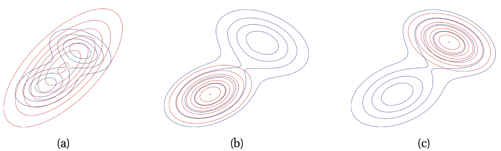

# Lecture 16, Apr 9, 2024

## Stochastic Variational Inference (SVI)

* *Stochastic variational inference* is the technique of approximating the true conditional $p(\bm z | \bm x) = \frac{p(\bm x, \bm z)}{p(\bm x)}$ by a simpler distribution, $q(\bm z | \bm \theta)$
	* We want $q(\bm z | \bm \theta)$ to be "close to" $p(\bm z | \bm x)$; to do this we need to define "closeness" of distributions
	* We can choose $q(\bm z | \bm\theta)$ to come from a known family of distributions, e.g. Gaussians

\noteDefn{The \textit{Kullback-Leibler (KL) divergence} of two distributions $p(\bm z)$ and $q(\bm z)$ is $$KL\infdivx{q}{p} = \mathbb E_{\bm z \sim q(\bm z)}\left[\log\frac{q(\bm z)}{p(\bm z)}\right]$$with the following properties:
\begin{itemize}
	\item $KL\infdivx{q}{p} \geq 0$
	\item $KL\infdivx{q}{p} = 0 \iff q = p$
	\item $KL\infdivx{q}{p} \neq KL\infdivx{p}{q}$
\end{itemize}}

* KL divergence is always positive and zero when distributions are equal, however it is not symmetric!
	* For *reverse-KL* (aka *information projection*), we take $KL\infdivx{q}{p}$, which penalizes $q$ having mass where $p$ has none
		* When $p$ is large where $q$ is small, the KL divergence is small
		* When $p$ is small where $q$ is large, the KL divergence is large
		* This will compress $q$ so it fits to one of the peaks of $p$
	* For *forward-KL* (aka *moment projection*), we take $KL\infdivx{p}{q}$, which penalizes $q$ missing mass where $p$ has some
		* When $p$ is large where $q$ is small, the KL divergence is large
		* When $p$ is small where $q$ is large, the KL divergence is small
		* This will stretch out $q$ to cover all the peaks of $p$
	* The choice of which KL divergence to optimize leads to different fits
		* In practice however we normally use reverse KL for computational reasons

{width=80%}

* SVI tries to minimize the KL divergence of $p$ and $q$
	* $\alignedeqntwo[t]{KL\infdivx{q(\bm z | \bm\theta)}{p(\bm z | \bm x)}}{\expectation{\bm z \sim q}{\log\frac{q(\bm z | \bm\theta)}{p(\bm z | \bm x)}}}{\expectation{\bm z \sim q}{\log\left(q(\bm z | \bm\theta)\frac{p(\bm x)}{p(\bm z, \bm x)}\right)}}{\expectation{\bm z \sim q}{\log\left(\frac{q(\bm z | \bm\theta)}{p(\bm z, \bm x)}}\right) + \log p(\bm x)}{-\mathcal L(\bm\theta, \bm x) + \log p(\bm x)}$
	* $\mathcal L(\bm\theta, \bm x) = -\expectation{\bm z \sim q}{\log\frac{q(\bm z | \bm\theta)}{p(\bm z, \bm x)}}$ is the *evidence lower bound* (ELBO)
	* Since $-\mathcal L(\bm\theta, \bm x) + \log p(\bm x) \geq 0$ (since KL is positive), the ELBO is a lower bound for $\log p(\bm x)$
	* As $\log p(\bm x)$ is constant, to minimize the KL divergence we have to maximize the ELBO; therefore we do not have to compute the normalization, which is infeasible to do
* The ELBO gradient is $\del _{\bm\theta} = \del _{\bm\theta}\int q(\bm z | \bm\theta)\log\frac{p(\bm x, \bm z)}{q(\bm z | \bm \theta)}\,\dd\bm z$, which must be estimated since we cannot compute this high-dimension integral
	* The *score function* (aka *REINFORCE*) gradient estimator
		* $\del _{\bm\theta}\mathcal L(\bm\theta, \bm x) = \expectation{\bm z \sim q}{\del _{\bm\theta} \log q(\bm z | \bm\theta)\log\frac{p(\bm x, \bm z)}{q(\bm z | \bm\theta)}}$
		* Using Monte Carlo, $\del _{\bm\theta}\mathcal L(\bm\theta, \bm x) \approx \frac{1}{B}\sum _{i = 1}^B \del _{\bm\theta}\log q(\bm z^{(i)} | \bm\theta)\log\frac{p(\bm x, \bm z^{(i)})}{q(\bm z^{(i)} | \bm\theta}$
			* $B$ is the number of samples
			* This is an unbiased estimator and easy to compute
		* In practice, this has higher variance than the pathwise gradient estimator
		* Use in specific domains such as reinforcement learning
	* The *pathwise* (aka *reparametrization*) gradient estimator factors out all the randomness of the distribution into a parameterless fixed source of noise, $p(\bm\varepsilon)$
		* Find $T(\bm\varepsilon, \bm\theta)$ such that for $\bm\varepsilon \sim p(\bm\varepsilon)$, then $\bm z = T(\bm\varepsilon, \bm\theta) \implies \bm z \sim q(\bm z | \bm\theta)$
			* e.g. for a Gaussian, $\bm\theta = \set{\mu, \sigma}$, let $\varepsilon \sim \mathcal N(\varepsilon | 0, 1)$ and $T(\varepsilon, \bm\theta) = \sigma\varepsilon + \mu$, then $z \sim \mathcal N(z | \mu, \sigma)$
		* Using the above, $\del _{\bm\theta} \mathcal (\bm\theta, \bm x) = \expectation{\bm\varepsilon \sim p(\bm\varepsilon)}{\del _{\bm\theta}\log \frac{p(\bm x, T(\bm\varepsilon, \bm\theta))}{q(T(\bm\varepsilon, \bm\theta) | \bm\theta)}}$
		* This can then be estimated using Monte Carlo
* The main drawback of SVI is the challenge of determining how good the approximation is after the optimization terminates

## Monte Carlo and Importance Sampling

* So far we've examined methods of estimating the full distribution $p(\bm x)$, but sometimes we're only interested in the expectation of some function $\phi(\bm x)$ under the distribution, i.e. $I = \expectation{\bm x \sim p(\bm x)}{\phi(\bm x)}$
* The Monte Carlo approximation is given by $I = \expectation{\bm x \sim p(\bm x)}{\phi(\bm x)} \approx \hat I = \frac{1}{R}\sum _{i = 1}^R \phi(\bm x^{(i)})$
	* This is unbiased, with a standard deviation proportional to $\frac{1}{\sqrt{R}}$, independent of the dimension of $\bm x$
* If we only need the expectation, we only need to be able to sample from the distribution, and apply Monte Carlo to find the expectation
	* However, sampling is hard because we typically only have the unnormalized distribution, $\tilde p(\bm x) = Zp(\bm x)$; even if we did have the full distribution, sampling from a high-dimension distribution is hard
* *Importance sampling* is a method for approximating the expectation when we only have the unnormalized distribution
	* A notable example is the particle filter for state estimation in robotics
* Let $q(\bm x)$ be the *sampler density*, a simpler density function that we can easily sample from
	* $\alignedeqntwo[t]{I}{\int p(\bm x)\phi(\bm x)\,\dd\bm x}{\int \phi(\bm x)\frac{p(\bm x)}{q(\bm x)}q(\bm x)\,\dd\bm x}{\frac{\int \frac{\phi(\bm x)p(\bm x)}{q(\bm x)}q(\bm x)\,\dd\bm x}{\int \frac{p(\bm x)}{q(\bm x)}q(\bm x)\,\dd\bm x}}{\frac{\int \frac{\phi(\bm x)\frac{1}{Z}\tilde p(\bm x)}{q(\bm x)}q(\bm x)\,\dd\bm x}{\int \frac{\frac{1}{Z}\tilde p(\bm x)}{q(\bm x)}q(\bm x)\,\dd\bm x}}{\frac{\int \frac{\phi(\bm x)p(\bm x)}{q(\bm x)}q(\bm x)\,\dd\bm x}{\int \frac{\tilde p(\bm x)}{q(\bm x)}q(\bm x)\,\dd\bm x}}{\frac{\expectation{\bm x \sim q(\bm x)}{\frac{\phi(\bm x)p(\bm x)}{q(\bm x)}}}{\expectation{\bm x \sim q(\bm x)}{\frac{\tilde p(\bm x)}{q(\bm x)}}}}$
	* Now we can use Monte Carlo to approximate the expectations
	* $\hat I = \frac{\frac{1}{R}\sum _{r = 1}^R \frac{\phi(\bm x^{(r)})\tilde p(\bm x^{(r)})}{q(\bm x^{(r)})}}{\frac{1}{R}\sum _{r = 1}^R \frac{\tilde p(\bm x^{(r)})}{q(\bm x^{(r)})}} = \frac{\sum _r w_r\phi(\bm x^{(r)})}{\sum _r w_r}$
	* Each $w_r = \frac{\tilde p(\bm x^{(r)})}{q(\bm x^{(r)})}$ is referred to as the *importance weight*
		* Intuitively, if at a point $p(\bm x^{(r)}) > q(\bm x^{(r)})$, then sampling from $q$ will under-represent this point; therefore the points are weighted more in the sum, since $w_r$ will be larger
		* Conversely $p(\bm x^{(r)}) < q(\bm x^{(r)})$ means $q$ over-represents the point, so in this case $w_r$ will be small and less weight is applied to it
		* When $p(\bm x^{(r)}) = q(\bm x^{(r)})$ we can show that $\hat I$ applies no reweighing to samples
* The sampler density should have heavy tails (e.g. a Cauchy distribution instead of a Gaussian), since we need to compensate for the difference between distribution
* If the sampler is chosen improperly, the variance of the result can be extremely high
* In high dimensions, if the sampler distribution is not a near-perfect approximation of the target, then the entire sum will likely be dominated by a few samples with a huge weight, leading to a very bad estimate
	
